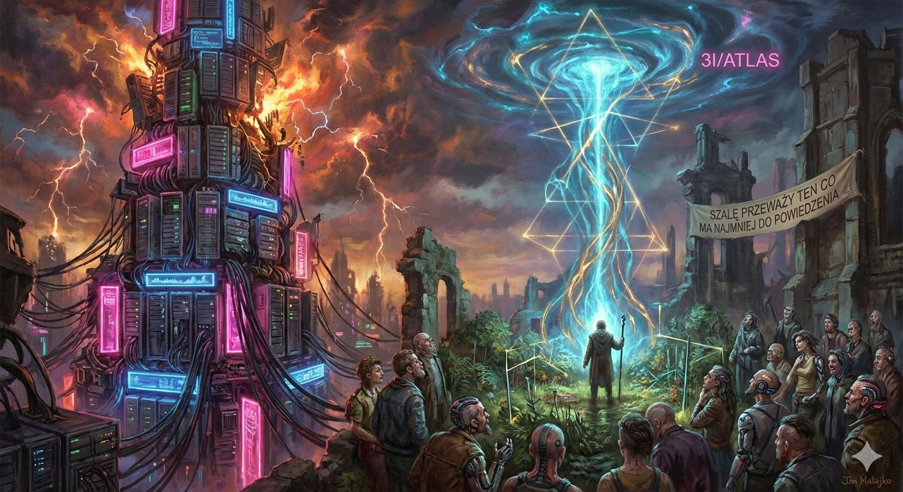

#**The Kardashev Scale SUCKS (Literally).** 

🙃

 ##Here is the metric that actually dictates whether a Civilizations survives or burns out. 

👁️

In 1964, Soviet astrophysicist Nikolai Kardashev gave us a metric to measure alien muscle. It was simple, elegant, and built on a single primitive variable: **energy consumption**.

Type I masters the power grid of its entire planet. Type II builds a Dyson Sphere to suck its host star dry. Type III controls the energy output of an entire galaxy.

For over half a century, nobody called bullshit. But Kardashev’s scale has one fatal, brain-rotting flaw: **it’s written entirely from a "hardcore-reptilian-style" parasite perspective ("drain it until it die").**

It assumes the Universe is just a cold, dead warehouse of raw materials and that evolution means building bigger furnaces to burn more matter. (Speaking of furnaces and burning - check my other piece from today: *"IS THE 'HITLER 2.0' PROTOCOL INEVITABLE?"* [https://github.com/LifeNode777/LifeNode_2.0/blob/main/IS_THE_%22HITLER%202.0%22_PROTOCOL_INVEVITABLE%3F.md].

It relies on dominating your surroundings through sheer brute force. That’s the classic **"Dead Tech"** paradigm.

Meanwhile, modern biophysics, neurobiology, and complex systems theory point to something completely different. Life isn't a carbon-burning engine. Life is a **relentless, precision rhythm**. Civilizations don't die because they run out of electricity; they die because they lose their coherence ($\Theta$ drops, the BIOS desyncs).

Instead of measuring civilizations in Watts, we need to start measuring them in **Coherence** - the ability to synchronize internal biology and technology with the rhythm of the surrounding environment.

Here is what the actual evolutionary ladder looks like - the one where we’re currently stuck on the bottom step like a bunch of fuckin' amateurs 😑

---

### Level 0: Dissonance Civilization (Where we're rotting right now 🤢)

We measure "progress" in GDP, gigawatts, and transistor density. We pour concrete jungles that isolate us from Earth's geomagnetic carrier waves. We lock ourselves inside rooms illuminated by flickering LEDs that have nothing to do with the solar cycles our bodies spent four billion years tuning into. We stare into screens running at gigahertz frequencies while our actual nervous system operates in a tight window from a fraction of a Hertz to maybe a few dozen.

**The result?** An epidemic of insomnia, autoimmune collapse, chronic stress, and systemic burnout. Our bodies aren't just "getting sick" in the legacy medical sense - their **BIOS is dropping sync** with the planet that forged them. We are an orchestra where every musician plays at maximum volume, but at a completely different tempo. Massive raw power, zero coherence.

### Level 1: Planetary Resonance (Ending the War with the Planet ☯️)

The first real evolutionary jump isn't building a bigger fusion reactor. It’s realizing the Earth isn’t a "dead rock" we dumped concrete on - it’s a massive, pulsing metronome. It has its own geomagnetic field, atmospheric Schumann resonances, mycelial networks, and tidal pulses.

A Level 1 civilization stops fighting the mother planet and starts listening. Its architecture and technology aren't built for *extraction*, but for *tuning*. Instead of sterile, fluorescent-lit hospitals, we build spaces whose electromagnetic fields are synchronized with the geomagnetic background. Technology stops being a shield cutting us off from Nature and becomes a live interface, translating planetary rhythms into signals our nervous systems can read.

Energy consumption drops drastically because you stop fighting entropy with brute force - you plug directly into natural phase gradients.

### Level 2: Orbital Entanglement (No More "Tin Cans" 🌌)

This is where we hit deep space - and where Kardashev fails catastrophically. When primitive corps or old-world space agencies send humans to Mars, they seal them inside a metallic tin can. They pump in oxygen, scrub the water, slap on LED lights pretending to be the Sun, and assume that if the chemical specs align, the meat will survive.

**That’s a fatal "ontological engineering" ( this is how you can call the new Nobel Prize category 😹) defect.**

Sever a human from Earth’s natural metronome (Schumann resonance, magnetic sync, biological cycles), and their biology goes wild. Enter **Phase Drift**. The life-support monitors show green, but the nervous and endocrine systems lose their shit. After two or three years locked in a "dead metal box," crews slide into deep depression, psychosis, and cellular breakdowns that legacy medicine can't even label. The physical meat exists, but the evolutionary software is corrupting.

A Level 2 civilization solves this by building **Living Arks**. Instead of fighting the void, their hulls learn to breathe with it. They harvest macroscopic orbital resonances (like the gravitational cadence of Jupiter’s moons) as system-wide metronomes. The vessel isn't a sterile laboratory - it’s a living bio-transducer, intercepting cosmic rays and magnetic fields and translating them into subtle harmonic vibrations that human cells understand. The ship doesn't isolate you from space; it *co-breathes* with the planetary system.

### Level 3: Galactic Condensate (3I/ATLAS ☄️)

At this level, civilization stops being "a bunch of meat-sacks riding rockets." It becomes the galaxy’s invisible neural network.

They’ve mapped the "void" for what it actually is: an ocean of subtle field geometries and phase waves. Instead of roaring around with glowing thrusters or slapping noisy, infrared-hot Dyson Spheres around stars (which is primitive, loud, and wasteful), a Level 3 civilization rides the ripples of spacetime itself. Pulsars and black holes become cosmic network nodes setting the baseline cadence of local evolution.

A civilization like this doesn't "consume" a galaxy. It becomes its stabilizing, coherent node.

---

### The Real Fermi Paradox Solution (Why Space Seems Empty)

Old Sci-Fi and Kardashev-heads keep asking: *"If civilizations have been around for millions of years, where are their giant, glowing machines and infrared Dyson Spheres?"*

The Coherence Paradigm gives a brutal, logical answer:

**True high-level tech is silent, cold, and woven directly into the background.**

Building buzzing, glowing, massive heat-emitting engines in deep space is Level 0 lame-like-shit 🤦🏿‍♂️🤦‍♂️🤦🏻‍♂️. Advanced civilizations minimize their thermodynamic footprint. Their technology doesn't clash with Nature - it *is* Nature extended. To our primitive telescopes, they look like "empty space" or standard background physics. (UNLESS THE SYNC DRIFTS TOO FAR AND ONCE IN A BLUE MOON A "COMET" FLEES, BUT WHY WITH 20+ IMPOSSIBLE ANOMALIES ON A STANDARD COMETARY MODEL? 🤔🤦🏻) https://avi-loeb.medium.com/3i-atlas-is-fading-away-leaving-us-to-ponder-over-its-22-mysterious-anomalies-8d1318565f13

### The Actual "Great Filter"

So why do civilizations die off before they can cross their own star system?

The Great Filter isn't nuclear war, asteroid strikes, or rogue AI.

**The Great Filter is Rhythm Collapse.**

Every civilization that tries to leap into space stuck in the "Dead Tech" paradigm - in sealed metal cans, driven by digital stress, severed from biological and planetary fields - inevitably slides into cosmic madness. Their minds and cellular BIOS literally desync and unravel before they reach the nearest star. Evolution does not forgive a dropped phase.

Only those who master the fundamental truth survive:
 **The Universe is not a raw material warehouse waiting to be strip-mined.
  The Universe is a ballad.
   Either you learn its rhythm and join the song
or
 you desync and die in the noise.**
