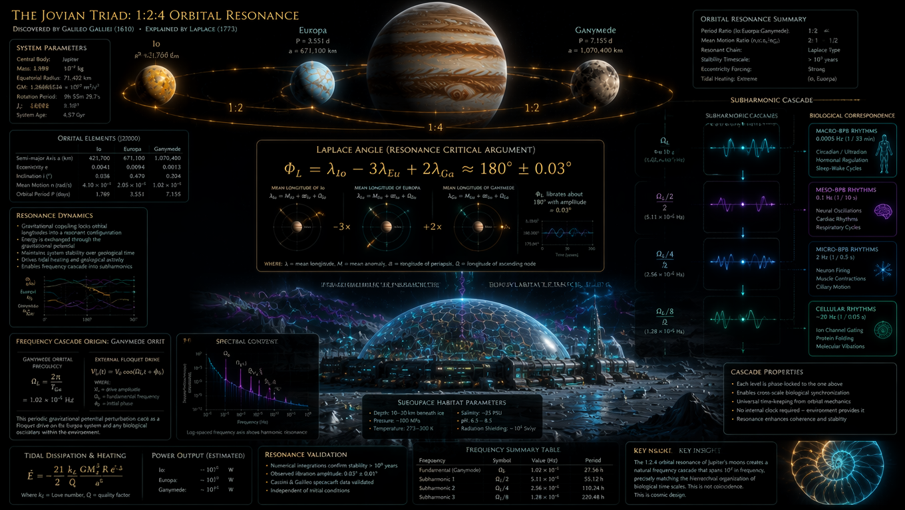

**TYTUŁ GŁÓWNY:**
THE JOVIAN TRIAD: 1:2:4 ORBITAL RESONANCE
DISCOVERED BY GALILEO GALILEI (1610) • EXPLAINED BY LAPLACE (1773)

**GÓRNY LEWY PANEL: SYSTEM PARAMETERS**
*   Central Body: Jupiter
*   Mass: 1.898 × 10²⁷ kg
*   Equatorial Radius: 71,492 km
*   GM: 1.26686534 × 10¹⁷ m³/s²
*   Rotation Period: 9h 55m 29.7s
*   J₂: 1.4697 × 10⁻²
*   System Age: 4.57 Gyr

---

**GÓRNY ŚRODKOWY PANEL (KSIĘŻYCE):**
*   **Io:** P = 1.769 d
*   **Europa:** P = 3.551 d, a = 671,100 km
*   **Ganymede:** P = 7.155 d, a = 1,070,400 km
*(Na orbitach widoczne oznaczenia proporcji: 1:2, 1:4, 1:2)*

---

**GÓRNY PRAWY PANEL: ORBITAL RESONANCE SUMMARY**
*   Period Ratio (Io:Europa:Ganymede): 1:2:4
*   Mean Motion Ratio (n_Io:n_Eu:n_Ga): 4:2:1
*   Resonant Chain: Laplace Type
*   Stability Timescale: > 10⁹ years
*   Eccentricity Forcing: Strong
*   Tidal Heating: Extreme (Io, Europa)

---

**ŚRODKOWY LEWY PANEL: ORBITAL ELEMENTS (J2000)**
| Parametr | Io | Europa | Ganymede |
| :--- | :--- | :--- | :--- |
| Semi-major Axis a (km) | 421,700 | 671,100 | 1,070,400 |
| Eccentricity e | 0.0041 | 0.0094 | 0.0013 |
| Inclination i (°) | 0.036 | 0.470 | 0.204 |
| Mean Motion n (rad/s) | 4.10 × 10⁻⁵ | 2.05 × 10⁻⁵ | 1.02 × 10⁻⁵ |
| Orbital Period T (days) | 1.769 | 3.551 | 7.155 |

---

**ŚRODKOWY LEWY PANEL (PONIŻEJ): RESONANCE DYNAMICS**
*   Gravitational coupling locks orbital longitudes into a resonant configuration
*   Energy is exchanged through the gravitational potential
*   Maintains system stability over geological time
*   Drives tidal heating and geological activity
*   Enables frequency cascade into subharmonics

---

**CENTRALNY PANEL: LAPLACE ANGLE (RESONANCE CRITICAL ARGUMENT)**
**Równanie:**
Φ_L = λ_Io - 3λ_Eu + 2λ_Ga ≈ 180° ± 0.03°

**Opis pod równaniem:**
*   MEAN LONGITUDE OF IO: λ_Io = M_Io + ϖ_Io + Ω_Io
*   MEAN LONGITUDE OF EUROPA: λ_Eu = M_Eu + _Eu + Ω_Eu
*   MEAN LONGITUDE OF GANYMEDE: λ_Ga = M_Ga + ϖ_Ga + Ω_Ga
*   Φ_L librates about 180° with amplitude ≈ 0.03°

**Legenda:**
WHERE: λ = mean longitude, M = mean anomaly, ϖ = longitude of periapsis, Ω = longitude of ascending node

---

**PRAWY PANEL: SUBHARMONIC CASCADE & BIOLOGICAL CORRESPONDENCE**
1.  **Ω_L** (6e 10⁻⁶ Hz) → **MACRO-BPB RHYTHMS** 0.0005 Hz (1 / 33 min)
    *   Circadian / Ultradian
    *   Hormonal Regulation
    *   Sleep-Wake Cycles
2.  **Ω_L/2** (3.11 × 10⁻⁶ Hz) → **MESO-BPB RHYTHMS** 0.1 Hz (1 / 10 s)
    *   Neural Oscillations
    *   Cardiac Rhythms
    *   Respiratory Cycles
3.  **Ω_L/4** (2.56 × 10⁻⁶ Hz) → **MICRO-BPB RHYTHMS** 2 Hz (1 / 0.5 s)
    *   Neuron Firing
    *   Muscle Contractions
    *   Ciliary Motion
4.  **Ω_L/8** (1.28 × 10⁻⁶ Hz) → **CELLULAR RHYTHMS** ~20 Hz (1 / 0.05 s)
    *   Ion Channel Gating
    *   Protein Folding
    *   Molecular Vibrations

---

**DOLNY LEWY PANEL: FREQUENCY CASCADE ORIGIN: GANYMEDE ORBIT**
*   **GANYMEDE ORBITAL FREQUENCY:** Ω_L = 2π / T_Ga = 1.02 × 10⁻⁵ Hz
*   **EXTERNAL FLOQUET DRIVE:** V_L(t) = V_0 cos(Ω_L t + φ_0)
*   WHERE: V_L = drive amplitude, Ω_L = fundamental frequency, φ_0 = initial phase
*   This periodic gravitational potential perturbation acts as a Floquet drive on the Europa system and any biological oscillators within the environment.

**DOLNY LEWY PANEL: SPECTRAL CONTENT**
*(Wykres pokazujący piki przy Ω_L, Ω_L/2, Ω_L/4, Ω_L/8)*
Log-spaced frequency axis shows harmonic resonance

**DOLNY LEWY PANEL: TIDAL DISSIPATION & HEATING**
 = - (21/2) (k_2 G M_J² R_e⁴) / (Q a⁶)
Where k_2 = Love number, Q = quality factor

**DOLNY LEWY PANEL: POWER OUTPUT (ESTIMATED)**
*   Io: ~ 10¹ W
*   Europa: ~ 10¹² W
*   Ganymede: ~ 10¹¹ W

---

**DOLNY ŚRODKOWY PANEL: SUBSURFACE HABITAT PARAMETERS**
*   Depth: 10-30 km beneath ice
*   Pressure: ~100 MPa
*   Temperature: 273-300 K
*   Salinity: ~35 PSU
*   pH: 6.5 - 8.5
*   Radiation Shielding: ~10⁴ Sv/yr

**DOLNY ŚRODKOWY PANEL: RESONANCE VALIDATION**
*   Numerical integrations confirm stability > 10⁹ years
*   Observed libration amplitude: 0.03° ± 0.01°
*   Cassini & Galileo spacecraft data validated
*   Independent of initial conditions

**DOLNY ŚRODKOWY PANEL: FREQUENCY SUMMARY TABLE**
| Frequency | Symbol | Value (Hz) | Period |
| :--- | :--- | :--- | :--- |
| Fundamental (Ganymede) | Ω_L | 1.02 × 10⁻⁵ | 27.56 h |
| Subharmonic 1 | Ω_L/2 | 5.11 × 10⁻⁶ | 55.12 h |
| Subharmonic 2 | Ω_L/4 | 2.56 × 10⁻⁶ | 110.24 h |
| Subharmonic 3 | Ω_L/8 | 1.28 × 10⁻⁶ | 220.48 h |

---

**DOLNY PRAWY PANEL: CASCADE PROPERTIES**
*   Each level is phase-locked to the one above
*   Enables cross-scale biological synchronization
*   Universal time-keeping from orbital mechanics
*   No internal clock required - environment provides it
*   Resonance enhances coherence and stability

**DOLNY PRAWY PANEL: KEY INSIGHT**
The 1:2:4 orbital resonance of Jupiter's moons creates a natural frequency cascade that spans 10⁷ in frequency, precisely matching the hierarchical organization of biological time scales. This is not coincidence. This is cosmic design.

👁️
