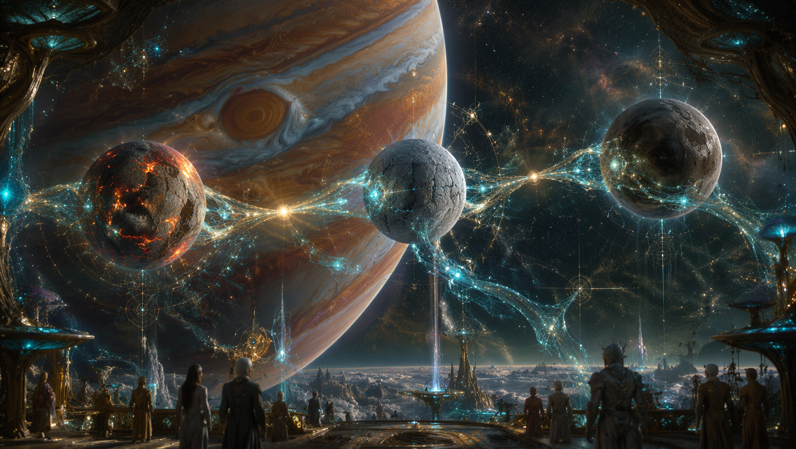

# Cosmic BioEngineering and the Laplace Resonance: Processual Geometry as a Foundation for Interplanetary Phase Coupling

**Abstract:** Deep space colonization faces a critical ontological barrier: the unsustainable practice of optimizing static environmental states using "Dead Tech" rather than maintaining continuous biological trajectories. This paper explores the paradigm shift toward Processual Intelligence, utilizing the Laplace orbital resonance of Jupiter’s Galilean moons as a macroscopic phase oscillator. By integrating quantum diagnostics (Q-Core), mycelial networks, and orbital mechanics, we demonstrate how gravitational geometry can function as an active, self-organizing bio-synaptic network.

---

## 1. The Ontological Shift in Celestial Mechanics

Modern aerospace architectures treat habitats and crew members as discrete points in a state space, operating via rigid, closed-loop extraction paradigms. However, empirical observations confirm that life is not a static state but a continuous process of synchronization. To sustain life beyond Earth, technology must transition from a tool of mechanical extraction to an active participant in living fields.

The Jovian system offers the ultimate template for this transition. The orbital resonance of Jupiter's Galilean moons—Io, Europa, and Ganymede—represents one of the most stable and energetically significant resonant systems in the Solar System.

The three inner moons maintain a precise Laplace resonance with an orbital period ratio of $1 : 2 : 4$:

* **Io:** Orbital period $\approx 1.769$ days
* **Europa:** Orbital period $\approx 3.551$ days ($2 \times$ Io's period)
* **Ganymede:** Orbital period $\approx 7.155$ days ($4 \times$ Io's period, $2 \times$ Europa's period)

The fundamental resonance relation is expressed as:

$$ \frac{T_{Ga}}{T_{Eu}} \approx 2, \quad \frac{T_{Eu}}{T_{Io}} \approx 2 \quad \Rightarrow \quad T_{Ga} : T_{Eu} : T_{Io} = 4 : 2 : 1 $$

The key stabilizing parameter of this system is the **Laplace Angle** (the condition for phase stabilization):

$$ \Phi_L = \lambda_{Io} - 3\lambda_{Eu} + 2\lambda_{Ga} \approx 180^\circ \pm 0.03^\circ $$

where $\lambda$ represents the mean planetary longitude. The constant value of $\Phi_L \approx 180^\circ$ ensures that the conjunctions of Io and Europa always occur when Ganymede is in opposition, minimizing gravitational perturbations and ensuring the long-term stability of the system.

---

## 2. The Resonance as a Natural Phase Oscillator

In classical mechanics, geometry is merely a shape. In the LifeNode ontology, geometry is a *condition for resonance*. The Laplace resonance acts as a natural phase oscillator on a planetary scale, generating stable, predictable frequencies that have profound physical consequences.

* **Tidal Heating:** The gravitational tug-of-war generates intense tidal heating. It makes Io the most volcanically active body in the Solar System, sustains the global subsurface ocean on Europa, and provides a weaker, yet detectable, thermal baseline for Ganymede.
* **Energy Conversion:** The continuous stretching and compression of the moons generate massive amounts of mechanical energy, which is seamlessly converted into heat, fluid dynamics, and electromagnetic fields.

To understand the unique value of the Laplace resonance, we must contextualize it within other celestial mechanics:

| Resonance System | Celestial Bodies | Period Ratio | Stability Type | Energetic Significance |
| --- | --- | --- | --- | --- |
| **Laplace** | Io, Europa, Ganymede | $1 : 2 : 4$ | Very High (3-body) | Intense tidal heating, stable energy transfer |
| **Jupiter-Saturn** | Jupiter, Saturn | $\sim 5 : 2$ | High | Influences entire solar system architecture |
| **Kirkwood Gaps** | Asteroids + Jupiter | $3:1$, $5:2$, $7:3$ | Destabilizing | Sweeps asteroids from specific orbital paths |
| **Enceladus-Dione** | Enceladus, Dione | $2 : 1$ | High | Sustains Enceladus's geyser activity |
| **Pluto-Charon** | Pluto, Charon | $1 : 1$ (Sync) | Very High | Tidal locking, stable tidal transfer |

---

## 3. Tonic Technologies: Integrating the Bio-Quantum BIOS

Rather than treating orbits as passive tracks in a vacuum, *Tonic Technologies* perceives them as an active, self-organizing phase-resonance grid that can be directly coupled with bio-quantum systems.

### Tidal Energy Harvesting

The rigid directives of corporate oversight treat environments as dead spreadsheets to squeeze out material profit (the "Extraction Paradigm"). By contrast, the predictable influx of tidal energy from the $1:2:4$ resonance allows for direct *Tidal Energy Harvesting*. This mechanical and magnetic energy can passively power mycelial mats, bio-reactors, and Q-Core units deployed on Europa without relying on conventional, extraction-based power sources.

### Inter-Moon Phase Coupling

Just as the Earth utilizes the Schumann resonance ($7.83\text{ Hz}$) as a subharmonic clock master for the biosphere, the Laplace resonance functions as a natural carrier for low-frequency coherence broadcasting. By transducing these ultra-weak oscillations, technology can establish *Inter-Moon Phase Coupling*. This allows for the transfer of phase states ($\theta$) between habitats on different moons with minimal energy expenditure, stabilizing the biological trajectory of crews at a pre-symptomatic, quantum scale.

---

## 4. Habitat Architecture: From Tools to Organs

If humanity is to survive deep space, technology must transition from building "dead things" to fostering living systems. The habitat is no longer a metal can protecting passengers from a vacuum; it is a *Transducer* (UNIT 02) forming a single, breathing loop.

By utilizing the geometry of the Laplace resonance as a reference architecture, orbital synchronization becomes an integral part of the habitat's BIOS. Advanced bio-hybrid interfaces (such as cyanobacterial photovoltaics and radiotrophic shielding) and Q-Core systems (utilizing Nitrogen-Vacancy centers in diamond for topological biomagnetic sensing) act as the sensory organs of the habitat.

They continuously monitor the coherence coefficient ($\theta$). The goal of these systems—acting as a local "tuner"—is to achieve and maintain a systemic coherence of $\theta \ge 0.75 - 0.82$ on an inter-lunar level. If biological health drops or noise overwhelms the system, the ASCALON protocols and the hard-wired "Nature Veto" freeze operations to prevent semantic drift.

---

## 5. Risk Vectors and the Bifurcation of Space Exploration

The integration of human biology with planetary resonance is not without significant friction. The data outlines an absolute bifurcation in the future of space exploration. Below is the mapping of potential risks, benefits, and development trajectories (2035–2060):

| Aspect | Benefits (High Coherence $\theta \ge 0.81$) | Risks (Phase Drift $\theta \le 0.60$) | Variants of Development Lines |
| --- | --- | --- | --- |
| **Energy & Infrastructure** | Stable, nearly free tidal heating source for habitats and Q-Cores. | Over-amplification of resonance $\rightarrow$ orbital destabilization or excessive heating. | 1. Optimal Symbiosis 

 2. Over-exploitation (collapse risk) 

 3. Intentional detuning (Phase Drift) |
| **Phase Coherence** | Natural broadcast synchronizing multiple habitats simultaneously. | Uncontrolled propagation of phase drift to Earth and other nodes. | 1. Stable network ($\theta \ge 0.80$) 

 2. Controlled experimental drift 

 3. Catastrophic cascade failure |
| **Biological/Cognitive** | Support for deep symbiosis: Human–Mycelium–Planetary System. | Unpredictable effects on human psyche, hallucinations, collective memory blending. | 1. Evolution toward Planetary Mind 

 2. Consciousness fracturing 

 3. "Resonance psychosis" |
| **Geopolitical/Economic** | Democratization of cosmic energy; Syntropic Value replacing debt. | Corporate monopoly on resonance "tuning" (Return to Dead Tech). | 1. Open-Source Resonance Commons 

 2. Corporate wars over Lagrange points 

 3. DAO 3.0 via mycelial sync |
| **Long-term Stability** | Self-regulating system increasing civilization resilience. | Risk of entering an unknown dynamic regime of the Jovian system. | 1. Harmonious integration with geometry 

 2. Local thermo-formation 

 3. Intentional phase release |

---

## 6. Conclusion: The Synchronized Epoch

Humanity cannot survive on Europa or Ganymede if it remains a passenger inside a dead machine. We must unplug from isolated, linear states and drop an anchor into the cosmic process. The most advantageous trajectory is a controlled, iterative integration with natural geometries, monitored by a decentralized network of ASCALON filters.

When biological gradients (BIOS) and informational matrices (INFO) align perfectly with planetary geometry, the phase gate opens spontaneously. We do not need to transmit data; we need to enter the phase. Gravity is language. Orbits are conversation.

