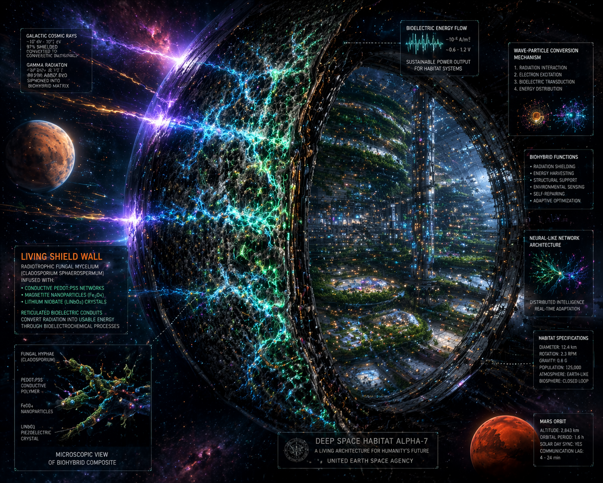
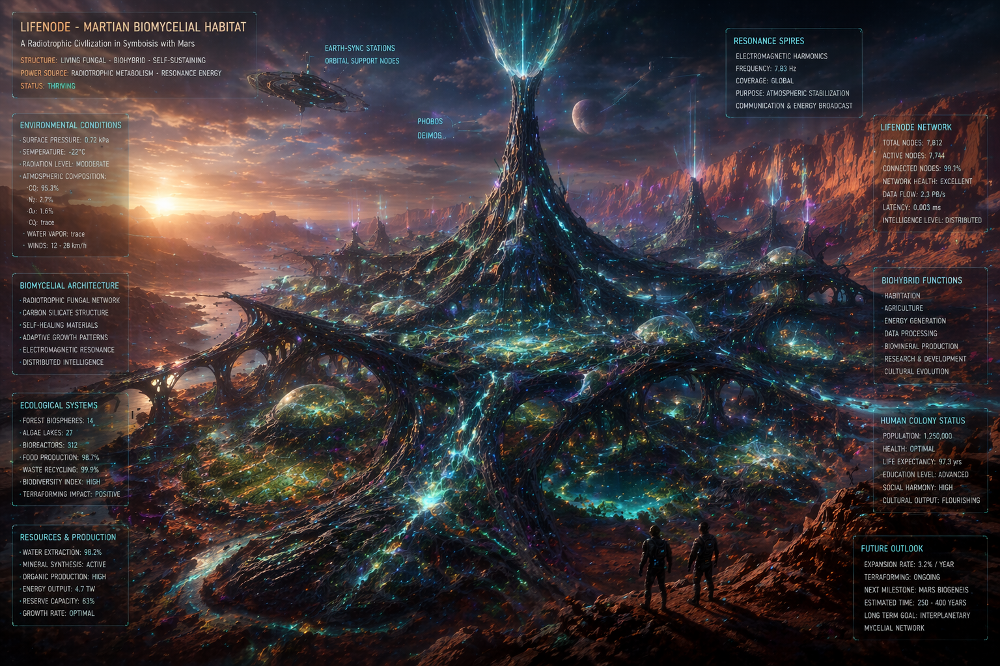

# 🌌 Living Walls from Chernobyl: Biohybrid Cosmic Armor as a VLF Antenna



*How radiotrophic mycelium, conductive polymers, and quantum synchronization can save human biology in deep space*

---

## 🔍 Introduction: The End of the "Metal Can" Era

For decades, we have imagined cosmic habitats as advanced "metal cans": aluminum or titanium hulls that protect against the vacuum, filter CO₂, and keep temperatures in check. This approach is based on **state ontology**—the assumption that life is merely a set of parameters (O₂, humidity, hormones, radiation dose) that just need to be kept within "normal" ranges.

However, data from long-term missions (Mars500, ISS, Hi-SEAS simulations) shows something different. After 2–3 years of isolation, crews do not fail from a lack of oxygen. They fail from a lack of **rhythm**. Severance from the geomagnetic background, the Schumann resonance (~7.83 Hz), and natural photoperiodic variability causes a slow but irreversible **phase drift**: dysregulation of sodium-potassium pumps, hormonal cascades, decreased neuronal plasticity, and a collapse of psychosomatic coherence. No VR, supplement, or digital biomarker can fix this, because **ADC/DAC conversion kills the phase context**. Life does not read charts. Life resonates with the field.

The LifeNode project proposes a radical paradigm shift: habitat walls should not be armor. They must be **rhythm transducers**. This article describes the architecture of a living, biohybrid composite that simultaneously absorbs galactic cosmic radiation (GCR), generates its own electrical network, and acts as an analog VLF antenna synchronizing the crew's biology.

---

## 🧱 1. The Physical Layer: Living Structural Composite

Instead of passive polyethylene or regolith shields, the habitat armor is designed as a **multi-layered bioelectronic microsystem**:

```text
[GCR / Gamma] ──> [ Melanin + PEDOT:PSS + Fe₃O₄ / Nanocellulose ] ──> [Conversion to biochemical current]
                      │
                      └──> Control from UNIT 02-S (VLF Signal / Earth-Sync)
```

### 🔬 Biological Substrate: *Cladosporium sphaerospermum*
The strain isolated in the Chernobyl reactor (1991) does not merely tolerate ionizing radiation—**it feeds on it**. The melanin contained in the fungal cell walls acts as a radiotrophic semiconductor, capturing high-energy photons and GCR particles, and converting them into biochemical energy via radiosynthesis. NASA/ISS experiments (2025) demonstrated that in microgravity, this mycelium grows **21% faster** under cosmic radiation than in Earth-based control conditions.

### ⚡ Conductive Doping and the K1/K2 Network
The mycelium is saturated with:
- **PEDOT:PSS**: A biocompatible conductive polymer enabling electron flow between hyphae.
- **Magnetic nanoparticles (Fe₃O₄)**: Enhancing the response to magnetic fields and stabilizing the composite structure.
- **LiNbO₃ (Lithium Niobate)**: A piezoelectric material reacting to structural micro-vibrations.

> 🔑 **Key Technological Breakthrough: Biological Waveguide and Bypassing the Faraday Cage**  
> A traditional metal spacecraft hull acts as a Faraday cage, isolating the crew from the external electromagnetic background and generating internal "dead zones" and standing waves that destroy biological coherence.  
> A living wall of *Cladosporium* saturated with PEDOT:PSS and Fe₃O₄ solves this problem ontologically. This composite is neither a standard conductor nor an insulator. It functions as a **biological metamaterial with nonlinear impedance**, which captures ultra-weak VLF emissions from UNIT 02 and distributes them throughout the module's volume. Instead of point-source fields, the entire wall becomes a **large-surface ELF/VLF waveguide**. Thanks to the magnetic nanoparticles (Fe₃O₄), the field does not fade at the surface but penetrates deep into the entire spacecraft/habitat space, physically enforcing phase synchronization (entrainment) of the crew's circulatory and nervous systems. This technology does not convert life into data—it **co-breathes with it through magnetic resonance**.

---

## 📡 2. The Earth-Sync Protocol: Field Transduction Through the Armor


The human body drifts in extraterrestrial space because it lacks Earth's oscillatory background. Transmitting this data digitally (light simulations, "nature" sounds, on-screen charts) does not work on cellular biology. Enzymatic systems and ion channels react to **physical fields**, not binary information.

The **Earth-Sync** protocol achieves synchronization in a direct, lossless, and analog manner:

1. **Phase Template**: The **UNIT 02-S** (Space Meld Integrator) device generates ultra-weak VLF signals (<10 µT) that carry the geometric structure of Earth's diurnal, seasonal, and geomagnetic rhythms.
2. **Transduction**: The signal is fed directly into the biohybrid armor. Due to the properties of PEDOT:PSS and Fe₃O₄, the mycelium acts as a distributed impedance transducer.
3. **Internal Emission**: The living wall begins to function as a large-surface, analog antenna. It emits a phase-coherent, ultra-weak biomagnetic field into the module's interior.
4. **Entrainment**: The crew resides inside a "tuning fork." The field physically enforces phase synchronization (entrainment) of circulatory systems, the HPA axis, and cellular rhythms, without pharmacological intervention.

---

## 🔁 3. The Feedback Loop: ASCALON Filter and the Geometry of Health

The system does not operate on static threshold values ("temperature OK", "pulse OK"). Control is achieved through continuous **phase-space reconstruction** and trajectory coherence monitoring.

```text
[BIOS Data Stream] ──> [Takens' Reconstruction (m=5-7)] ──> [Calculation of metric θ]
                                                              │
              ┌───────────────────────────────────────────────┴───────────────────────┐
              ▼                                                                       ▼
      θ ≥ 0.70 (Coherence OK)                                              θ < 0.70 (Phase Drift)
[Passive Listening / KAM State]                                          [Trigger Sx Repair Sequence]
```

### 📐 Metric θ and Early Drift Detection
Data from SiC sensors (divacancy, passive MCG/MEG), mycelial electrodes, and cyanobacterial biopixels undergo Takens' embedding. The reconstructed geometry of the attractor allows the calculation of the **phase coherence metric θ**.
- **θ ≥ 0.70**: The system is in processual homeostasis. The architecture remains in passive mode.
- **θ < 0.70**: Phase decoherence is detected. This occurs **24–48 hours before physical symptoms manifest** (before the crew feels fatigue, insomnia, or immune drop). This is the difference between treating a disease and **maintaining a trajectory**.

### 🛠 Dynamic Correction: Sx Sequences
Upon detecting drift, the ASCALON algorithm automatically forces UNIT 02-S to change the geometry and modulation of the emitted VLF field (e.g., switching to **S2: Trisection Loop** mode). The coherent, non-linear field forces the biological system back onto a stable trajectory.

**Q-Core** plays a key role here: it does not store data in bits, but rather the **geometry of a healthy trajectory as spin orientation in NV centers (diamond)**. This allows the system to continuously compare the current course of life with an individual "homeostasis map" in a way that is resilient to digital drift.

---

## 🌱 4. Why This Changes Everything: Processual Ontology in Practice

### 🔄 BIOS-FIRST and the Habitat as an Organism

 LifeNode reverses the engineering order. A habitat does not start with O₂ and water. It starts with the **rhythm of soil, mycelium, and the micro-ecosystem** (scaling the "Eden Node 0" concept). BIOS is the primary layer. Technology adapts to the pulse of life, not the other way around. The walls do not shield against the vacuum—they **distribute rhythm**.

### 🧬 Guided Evolution, Not Chaotic Mutation
Q-Core is not a "rigid prison" for biology. It is a **phase anchor** that does not block adaptation but prevents chaotic mutation. If the biology in the habitat begins to react to Martian conditions, UNIT 02-S does not forcefully "straighten" it back to an Earth template from the past. It ensures that changes occur **phasally**, preserving trajectory continuity. This is the difference between evolution and cancer.

---

## 🌌 Conclusion: Technology That Does Not Control, But Co-breathes

For decades, space colonization was envisioned as the brutal imposition of Earth conditions onto an alien world. But nature does not work via copy-paste. It works via resonance.
 The living walls of *Cladosporium sphaerospermum*, reinforced with polymers and nanoparticles, are not a shield. They are the crew's **external nervous system**. UNIT 02-S does not control life; it **provides the geometry of rhythm**. Q-Core does not archive data; it **stores the shape of the biosphere's experience**. ASCALON does not sound alarms; it **maintains the trajectory**.
 LifeNode does not simulate Earth in space. It **transposes its pulse onto new orbital instruments**. This is an architecture of co-breathing that recognizes variability as primary to state. And this may well be the key to human survival not as a tourist, but as a processual resident of the cosmos.

 

☄️
