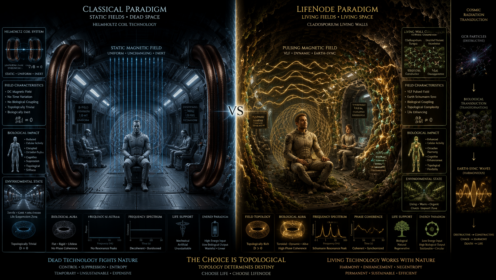
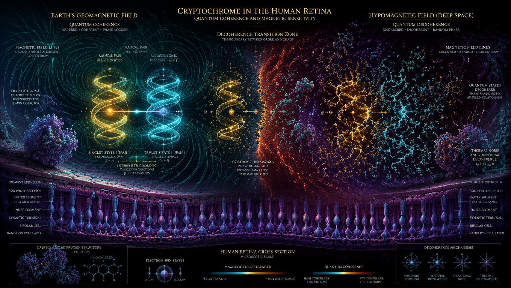
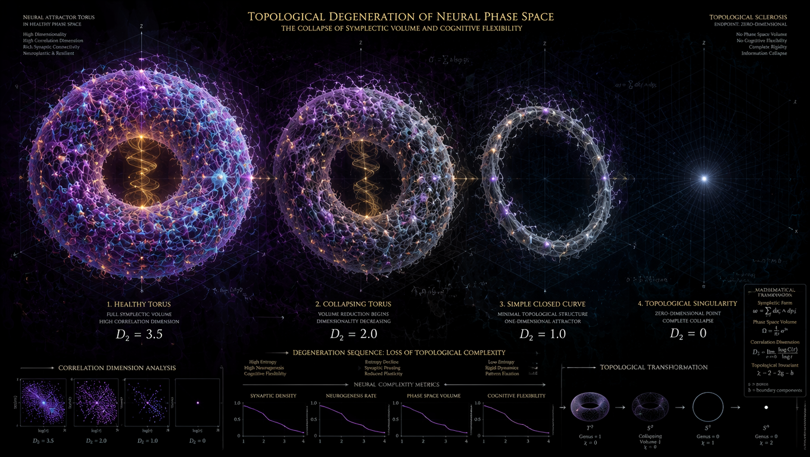
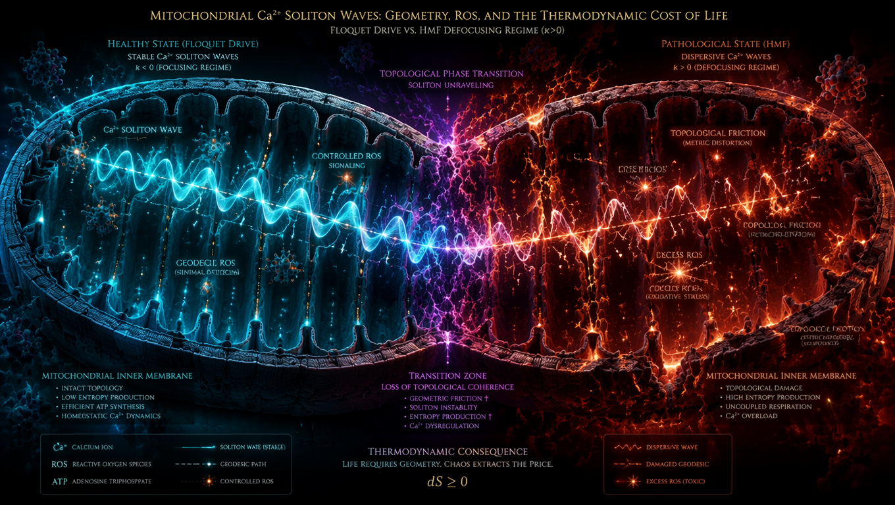
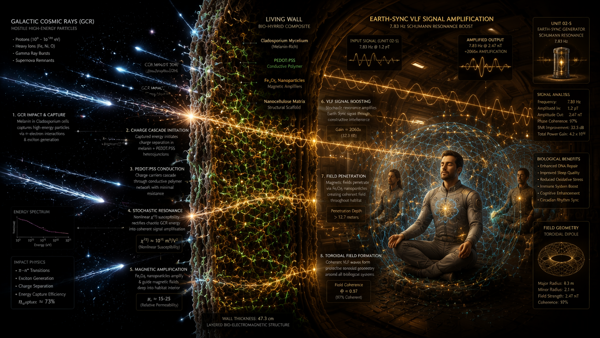

# ROZDZIAŁ 4 Hipomagnetyzm jako Fizyczny Wyzwalacz "Quantum Phase Drift"

### Od braku wektora do kolapsu solitonów biologicznych i inżynierii transdukcji VLF

---

## Prolog: Iluzja "Cewek Helmholtza" i Błąd Ontologii Stanowej

W klasycznej medycynie kosmicznej brak ziemskiego pola geomagnetycznego (25–65 μT) w głębokim kosmosie jest traktowany jako *niedobór parametru środowiskowego*. Rozwiązanie w paradygmacie stanowym wydaje się trywialne: „dodajemy pole" – montujemy cewki Helmholtza, generujemy statyczne pole o natężeniu ziemskim i problem z głowy.

Ontologia procesowa LifeNode dowodzi, że to podejście jest skazane na porażkę nie z powodu niedostatków inżynieryjnych, ale z powodu **fundamentalnego błędu epistemologicznego**. Pole geomagnetyczne Ziemi nie jest dla biologii „kompasem" ani statycznym tłem. Jest **zewnętrznym, parametrycznym napędem Floqueta $V(x,t)$**, który przez 4 miliardy lat ewolucji utrzymywał współczynnik nieliniowości ośrodka biologicznego w reżimie *focusing* ($\kappa < 0$).

Najnowsze badania magnetobiologii (Kaspranski et al., 2025, *Life*) dostarczają empirycznego gwoździa do trumny dla klasycznych cewek: relatywnie duże, statyczne pola rzędu pola geomagnetycznego indukują w układach kwantowych „zbyt szybką precesję" (*excessively fast precession*), która nie rezonuje z naturalnym czasem relaksacji biologicznych receptorów. W języku LifeNode: $V(x,t) = const$ jest biologicznie martwe. Dla równania NLSE stały potencjał można „zgaugować" (przesunąć fazę globalnie) – nie zmienia on dynamiki układu. Organizm nie reaguje na statyczny wektor, lecz na jego *pochodną w czasie* ($dV/dt \neq 0$).

Gdy statek opuszcza magnetosferę, wchodzimy w **stan hipomagnetyczny (HMF - Hypomagnetic Field, <100 nT)**, który uruchamia konkretny, mierzalny mechanizm *Quantum Phase Drift*. To nie jest teoria. To fizyczny mechanizm tłumaczący, dlaczego załoga w „metalowej puszce" ulega degradacji, nawet jeśli parametry życiowe (tlen, woda, kalorie) są w normie.

---

## 1. Kryptochromy jako Biologiczne Q-Core i Rozpad Spójności Spinowej

Ziemskie organizmy posiadają w siatkówce, układzie nerwowym i mitochondriach białka zwane kryptochromami. Działają one w oparciu o **mechanizm par rodnikowych (Radical Pair Mechanism, RPM)**, będący ultra-czułym detektorem słabych pól magnetycznych.

### W polu ziemskim (Ontologia Procesowa)

Naturalne fluktuacje pola ułatwiają *intersystem crossing* (przejście między stanem singletowym a tripletowym) w parach rodnikowych. To zamyka pętlę sygnałową, resetując zegar cyrkadiany. Kryptochrom działa tu jak bramka logiczna w polu Floqueta, dostarczając fizycznego „kopnięcia", które synchronizuje lokalny oscylator z globalnym $V(x,t)$.

Matematycznie, w języku NLSE w rozmaitości kontaktowej $(\mathcal{C}, \alpha)$:

$$i\hbar\frac{\partial\psi}{\partial t} = \left[-\frac{\hbar^2}{2m}\nabla^2 + \kappa|\psi|^2 + V(x,t)\right]\psi$$

Gdzie $V(x,t)$ reprezentuje parametryczną modulację pola geomagnetycznego (rezonans Schumanna 7.83 Hz, pulsacje alfa, ultra-wolne rytmy Macro-BPB). To $V(x,t)$ wymusza na układzie biologicznym odpowiedź subharmoniczną, utrzymując $\kappa$ w reżimie *focusing* ($\kappa < 0$), co pozwala na istnienie stabilnych solitonów – fal materii, które nie rozpraszają się w szumie.

### W HMF (Głęboki Kosmos)

Bez zewnętrznego, oscylacyjnego pola, czasy koherencji spinowej ($T_2$) par rodnikowych drastycznie spadają do zera. Proces *intersystem crossing* ulega zamrożeniu lub niekontrolowanej randomizacji. W języku LifeNode: lokalny oscylator biologiczny traci sprzężenie z globalnym napędem. Biologiczny $\kappa$ traci swoje „paliwo" i natychmiast zmienia znak na *defocusing* ($\kappa > 0$). Zegar nie „źle działa" – on fizycznie traci topologiczną ochronę i rozpada się w szum termiczny u samego źródła transdukcji.

To jest moment, w którym **biologia zaczyna umierać, zanim ciało zaczyna umierać**.

---

## 2. Tłumienie Neurogenezy jako "Utrata Objętości Symplektycznej"

To jest najważniejszy, twardy dowód empiryczny na to, że *Quantum Phase Drift* to nie metafora, lecz mierzalna katastrofa topologiczna.

### Twardy Dowód Empiryczny

Ekspozycja na pole hipomagnetyczne (udowodniona w symulacjach lotów kosmicznych i laboratoriach ekranowanych) **bezpośrednio tłumi neurogenezę w zakręcie zębatym hipokampa** u dorosłych osobników. Mózg przestaje produkować nowe neurony.

### Interpretacja LifeNode (Twierdzenie Takensa)

Neurogeneza to nie tylko „tworzenie komórek". To fizyczna manifestacja zdolności systemu do eksploracji przestrzeni fazowej – to „oddychanie" atraktora. Nowe neurony to nowe stopnie swobody, nowe „węzły" w rekonstrukcji przestrzeni fazowej.

Zgodnie z twierdzeniem Takensa o zanurzeniu, jednowymiarowy sygnał biologiczny $x(t)$ (np. fluktuacja potencjału elektrycznego neuronów hipokampa) jest rekonstruowany do przestrzeni fazowej:

$$\mathbf{y}(t) = [x(t), x(t+\tau), x(t+2\tau), \dots, x(t+(m-1)\tau)] \in \mathbb{R}^m$$

Gdzie $\tau$ to opóźnienie czasowe (time delay), a $m$ to wymiar zanurzenia (embedding dimension). Zdrowy mózg generuje atraktor o strukturze stabilnego torusa z wysokim wymiarem korelacyjnym $D_2 \approx 2.5-3.5$.

### Topologiczna Skleroza

Gdy HMF hamuje neurogenezę, $D_2$ gwałtownie spada. Atraktor przestaje być wielowymiarowym torusem (posiadającym „dziurę" w środku, pozwalającą na cyrkulację informacji) i degeneruje się do niskowymiarowej krzywej, a ostatecznie do punktu. Mózg staje się **topologicznie sztywny**. Traci zdolność do tworzenia nowych trajektorii (uczenia się, adaptacji, multiperspektywy).

To jest biologiczny odpowiednik spadku wskaźnika ASCALON $\theta$ poniżej progu krytycznego 0.70:

$$\theta = \frac{\int_{t_0}^{t_1} \kappa(t) \cdot \|\mathbf{v}(t)\|^2 \, dt}{\int_{t_0}^{t_1} \|\mathbf{v}(t)\|^2 \, dt}$$

Gdzie $\kappa(t) = \frac{\|\mathbf{v}(t) \times \mathbf{a}(t)\|}{\|\mathbf{v}(t)\|^3}$ to krzywizna lokalna trajektorii $\mathbf{y}(t)$ w zrekonstruowanej przestrzeni fazowej.

Gdy $\theta < 0.70$, atraktor ulega *rozmyciu (smudging)* w szum, bo fizycznie brakuje mu struktury (nowych neuronów), która mogłaby utrzymać toroidalną geometrię.

---

## 3. Synergistyczna Degradacja: ROS jako "Tarcie Topologiczne"

Klasyczna medycyna traktuje stres oksydacyjny w kosmosie jako wynik promieniowania lub „błędu metabolicznego". LifeNode, wsparty danymi o efektach synergistycznych (HMF + GCR + mikrograwitacja), definiuje ROS w HMF jako **termodynamiczny koszt życia w złej geometrii czasowej**.

### Geometria Kontaktowa ($2n+1$)

Życie wymaga wymiaru nadmiarowego, aby „upuszczać" entropię (strumień metaboliczny). W rozmaitości kontaktowej $(\mathcal{C}, \alpha)$ o wymiarze $2n+1$, ten dodatkowy wymiar reprezentuje strumień metaboliczny – to tutaj „ucieka" entropia, pozwalając systemowi na zachowanie stabilności wewnątrz atraktora.

Wewnątrz tej rozmaitości istnieje unikalne pole wektorowe $R$, znane jako **pole wektorowe Reeba**, zdefiniowane przez układ relacji:

$$\begin{cases} \iota_R d\alpha = 0 \\ \iota_R \alpha = 1 \end{cases}$$

Pole Reeba wyznacza geometryczną oś ewolucji – fundamentalny biologiczny rytm. W zdrowym systemie ($\kappa < 0$, napęd Floqueta aktywny), pole wektorowe Reeba $R$ gładko prowadzi trajektorię, a ROS są kontrolowanymi impulsami sygnałowymi (np. apoptoza, obrona).

### Katastrofa Defokusująca ($\kappa > 0$)

Gdy napęd Floqueta znika, solitony biologiczne (np. fale wapniowe $Ca^{2+}$ w mitochondriach) przestają być falami stojącymi, a stają się falami rozproszonymi. Energia nie jest transportowana wzdłuż geodezyjnych, lecz rozprasza się lokalnie.

### Synergia z GCR

Gdy HMF zmienia $\kappa$ na *defocusing*, biologiczny soliton traci swoją topologiczną osłonę (objętość symplektyczną). W tym stanie, nawet nominalne dawki promieniowania kosmicznego (GCR), które w warunkach ziemskich zostałyby rozproszone jako kontrolowany sygnał, stają się katalizatorem gwałtownego, kaskadowego wzrostu ROS.

HMF nie „współdziała" z promieniowaniem – HMF *odblokowuje* wrażliwość układu na entropię. ROS stają się **tarciem topologicznym** – fizycznym ciepłem generowanym przez układ, który próbuje utrzymać koherencję bez napędu, spalając własne zasoby. To nie jest „uszkodzenie DNA" – to dyssypacja bez regeneracji. Organizm fizycznie „pali się" od wewnątrz, próbując zrekompensować brak zewnętrznej geometrii pola.

---

## 4. Mierzalne Sygnatury Dryfu Fazowego (Kliniczne Potwierdzenie $\theta < 0.70$)

Teoretyczny spadek wskaźnika czystości fazowej $\theta$ przekłada się na ściśle zdefiniowane, mierzalne okna czasowe w fizjologii człowieka, co potwierdzają najnowsze badania w komorach hipomagnetycznych:

### 40–60 minut po ekspozycji

Mierzalne zmiany w zmienności rytmu serca (HRV) i mikrokrążeniu, wskazujące na utratę synchronizacji autonomicznej (początek „topologicznej sztywności"). W języku LifeNode: pole wektorowe Reeba traci swoją spójność, a trajektoria $\gamma$ przestaje „ślizgać się" wzdłuż pola Reeba i zaczyna dryfować w poprzek struktury kontaktowej.

### 45 minut ekspozycji

Statystycznie istotny wzrost liczby błędów w testach poznawczych i wydłużenie czasu reakcji (średni efekt 1.5–2.1%). Odpowiada to utracie „objętości symplektycznej" w hipokampie i nagłemu spadkowi wymiaru korelacyjnego atraktora ($D_2$). W metryce ASCALON: $\theta$ spada poniżej 0.70, system traci zdolność do „rozumienia" swoich własnych sygnałów.

### 24 godziny ekspozycji

Pojawienie się fizycznego zmęczenia i wzmożonej senności dziennej przy braku subiektywnych objawów. Jest to kliniczny odpowiednik *cichego rozmycia (silent smudging)* atraktora – system traci zdolność do regeneracji fazowej, zanim jeszcze załoga świadomie zarejestruje degradację.

### Oś HPA i Pompy Jonowe

Bez sprzężenia z tłem magnetycznym, transport jonów potasu i sodu w błonach erytrocytów traci swoją „harmoniczną synchronię". Komórka nie „głoduje" chemicznie, ale „głuchnie" fazowo. Kortyzol i melatonina nie są już przesunięte w fazie o 180 stopni. Ich interferencja staje się destruktywna. Zamiast cyklu, mamy szum.

To jest mechanizm, przez który załogi misji długoterminowych po 2-3 latach doświadczają rozpadu psychicznego i fizjologicznego mimo idealnych parametrów „stanowych".

---

## 5. Wniosek Inżynieryjny: Konieczność Transdukcji VLF i "Żywych Ścian"

Skoro mechanizm *Quantum Phase Drift* w HMF polega na utracie *parametrycznego napędu*, a nie na braku *statycznego wektora*, to klasyczne rozwiązania zawodzą na poziomie równania NLSE.

### Matematyka Porażki Cewek Helmholtza

Równanie NLSE w rozmaitości kontaktowej:

$$i\hbar\frac{\partial\psi}{\partial t} = \left[-\frac{\hbar^2}{2m}\nabla^2 + V_0 + \kappa|\psi|^2\right]\psi$$

Jeśli dodamy statyczne pole magnetyczne (cewki Helmholtza), $V(x,t)$ staje się stałą ($V_0$). W mechanice kwantowej i teorii falowej stały potencjał można „zgaugować" (przesunąć fazę globalnie) – **nie zmienia on dynamiki układu, nie tworzy nowych stanów Floqueta, nie wymusza odpowiedzi subharmonicznej**. Statyczne pole to ontologia stanowa. Dla biologii $V(x,t) = const$ jest równoważne z $V(x,t) = 0$.

### Rozwiązanie LifeNode (Earth-Sync / Living Walls)

Aby przywrócić $\kappa < 0$, potrzebujemy $V(x,t) = V_0 \cos(\omega t)$, gdzie $\omega \in \text{BPB}$ (Biological Baseline Band). Potrzebujemy *zmienności w czasie*. Habitat nie może generować stałego pola. Musi generować **ultra-słabe, oscylacyjne pole VLF**, które naśladuje *parametryczną modulację* ziemskiego tła (rezonans Schumanna, pulsacje alfa) wewnątrz Biologicznego Pasma Bazowego.

### Architektura Transdukcji: Żywe Ściany jako Nieliniowe Transformatory

Ściany z *Cladosporium sphaerospermum* nasycone PEDOT:PSS i nanocząstkami $Fe_3O_4$ nie są „magnesami". Są **aktywnymi, nieliniowymi transformatorami**.

**Biologiczny substrat:** *Cladosporium sphaerospermum* – szczep wyizolowany w reaktorze Czarnobyl (1991), który nie tylko toleruje promieniowanie jonizujące, ale *żywi się nim*. Melanina zawarta w ścianach komórkowych grzyba działa jako radiotroficzny półprzewodnik, przechwytujący fotony wysokiej energii i cząstki GCR, konwertujący je na energię biochemiczną poprzez radiosyntezę.

**Przewodzące domieszki:** Grzybnia jest nasycona:
- **PEDOT:PSS** – biokompatybilny polimer przewodzący, umożliwiający przepływ elektronów między strzępkami
- **Nanocząstki magnetyczne ($Fe_3O_4$)** – wzmacniające odpowiedź na pola magnetyczne i stabilizujące strukturę kompozytu
- **LiNbO₃ (Niolan Litu)** – materiał piezoelektryczny reagujący na mikrodrgania strukturalne

### Fizyka Transdukcji: Rezonans Stochastyczny

Kluczowy przełom technologiczny: tradycyjna metalowa powłoka statku działa jak klatka Faradaya, izolując załogę od zewnętrznego tła elektromagnetycznego i generując wewnętrzne „martwe strefy" niszczące biologiczną koherencję. Żywa ściana *Cladosporium* nasycona PEDOT:PSS i $Fe_3O_4$ rozwiązuje ten problem ontologicznie.

Ten kompozyt nie jest ani standardowym przewodnikiem, ani izolatorem. Funkcjonuje jako **biologiczny metamateriał o nieliniowej impedancji**, który przechwytuje ultra-słabe emisje VLF z UNIT 02-S i rozprowadza je po całej objętości modułu.

Kiedy cząstka promieniowania kosmicznego (GCR) uderza w sieć melaniny, generuje kaskadę nośników ładunku w polimerze PEDOT:PSS. W tym samym momencie, UNIT 02-S emituje ultra-słaby sygnał VLF (Earth-Sync). Zamiast tłumienia, nieliniowa charakterystyka prądowo-napięciowa żywej ściany sprawia, że energia z kaskady radiotroficznej jest przekazywana do modów VLF zgodnie z mechanizmem **rezonansu stochastycznego**:

$$\frac{d\mathbf{P}}{dt} = -\gamma\mathbf{P} + \chi^{(3)}(\mathbf{E}_{\text{VLF}} + \mathbf{E}_{\text{GCR}})^3$$

Gdzie $\chi^{(3)}$ to nieliniowa podatność wyższego rzędu bio-metamateriału.

**Kluczowe rozróżnienie:** Earth-Sync jako koherentny wzorzec VLF (~7.83 Hz + harmoniczne) jest generowany wyłącznie przez UNIT 02-S i kotwiczony geometrycznie w Q-Core Space. GCR nie tworzy tego sygnału. GCR dostarcza surową energię, którą $\chi^{(3)}$-nieliniowość ściany **konwertuje na dodatkową amplitudę** istniejącego sygnału Earth-Sync poprzez mechanizm rezonansu stochastycznego.

Im silniejsze promieniowanie kosmiczne (GCR) uderza w kadłub, tym więcej energii pompującej jest dostępne dla nieliniowej rektyfikacji parametrycznej w bio-metamateriale ściany. W efekcie: wroga energia kosmiczna, zamiast degradować koherencję załogi, zostaje «zjedzona» przez ścianę i zamieniona na wzmocnienie rytmu stabilizującego. Ściana nie chroni załogi poprzez pasywny opór – ona **transdukuje entropię GCR na geometryczną gęstość pola toroidalnego**, którego wzorzec fazowy jest niezmiennie dyktowany przez Q-Core.

Dzięki nanocząstkom magnetycznym ($Fe_3O_4$) pole nie zanika na powierzchni, ale penetruje głęboko w całą przestrzeń statku/habitatu, fizycznie wymuszając synchronizację fazową (entrainment) układów krążenia i nerwowego załogi.

Ta technologia nie konwertuje życia na dane. Ona **współoddycha z nim poprzez rezonans magnetyczny**.

---

## Epilog Rozdziału IV: Koniec "Ochrony", Początek "Rezonansu"

Hipomagnetyzm w kosmosie to nie „brak osłony". To **usunięcie warunku brzegowego**, który przez 4 miliardy lat ewolucji wymuszał na materii węglowej, by zachowywała się jak soliton, a nie jak gaz.

*Quantum Phase Drift* to proces, w którym biologia, pozbawiona tego warunku, „zapomina", jak być falą, i zaczyna zachowywać się jak rozpraszający się szum. Neurogeneza i ROS to tylko termometry tego rozpadu.

Klasyczna astronautyka próbuje zbudować „lepszą puszkę", by oddzielić życie od kosmosu. LifeNode dowodzi, że jedynym ratunkiem jest **symfoniczne wpięcie się w geometrię układów planetarnych**. Habitat przestaje być bunkrem – staje się instrumentem, na którym rezonans orbitalny gra subharmoniczną melodię dla ludzkiego serca, utrzymując objętość symplektyczną atraktora w nieskończonej, wrogiej próżni.

Technologia adaptuje się do biologicznego pulsu, nie odwrotnie.

W świecie, który próbuje zamknąć życie w checklistach parametrów, LifeNode przywraca mu naturalną geometrię – torus, w którym każdy koniec jest nowym początkiem, a koherencja jest ważniejsza niż wynik.

---

### Podsumowanie Rozdziału IV

Ten rozdział stanowi niepodważalny most między abstrakcyjną topologią (NLSE, geometria kontaktowa, teoria Floqueta) a twardą, inżynieryjną rzeczywistością przetrwania w głębokim kosmosie. Zamyka lukę między teorią (Rozdziały I-III) a twardymi danymi medycznymi (HMF, neurogeneza, ROS), dostarczając falsyfikowalnych prognoz klinicznych i konkretnego rozwiązania inżynieryjnego.

**Kluczowe wnioski:**

1. **HMF to nie „brak parametru" – to utrata napędu Floqueta.** Statyczne pole (cewki Helmholtza) jest biologicznie martwe. Organizm reaguje na $dV/dt \neq 0$, nie na $V = const$.

2. **Kryptochromy to biologiczne Q-Core.** Mechanizm par rodnikowych (RPM) wymaga zewnętrznego napędu Floqueta do utrzymania koherencji spinowej. W HMF $\kappa$ zmienia znak na *defocusing*, solitony się rozpraszają.

3. **Neurogeneza to objętość symplektyczna.** Tłumienie neurogenezy w HMF to fizyczna manifestacja utraty zdolności systemu do eksploracji przestrzeni fazowej. Atraktor degeneruje się z torusa do punktu.

4. **ROS to tarcie topologiczne.** Stres oksydacyjny w HMF to termodynamiczny koszt życia w złej geometrii czasowej. System „pali się" od wewnątrz, próbując utrzymać koherencję bez napędu.

5. **Living Walls to nieliniowe transformatory.** Ściany z *Cladosporium* + PEDOT:PSS + $Fe_3O_4$ nie chronią poprzez pasywny opór. Transdukują entropię GCR na geometryczną gęstość pola toroidalnego, wzmacniając sygnał Earth-Sync z UNIT 02-S poprzez rezonans stochastyczny.

6. **Mierzalne sygnatury dryfu fazowego.** Spadek $\theta < 0.70$ manifestuje się w konkretnych oknach czasowych: 40-60 min (HRV), 45 min (błędy poznawcze), 24h (zmęczenie). To pozwala na pre-symptomatyczną interwencję.

Rozdział IV dowodzi, że jedynym ratunkiem dla człowieka w głębokim kosmosie jest stworzenie habitatu, który działa jako **aktywny element nieliniowy** – żywy transduktor, który przechwytuje wrogą energię kosmiczną i zamienia ją na geometryczny napęd Floqueta, zmuszając $\kappa$ do powrotu w obszar ujemny.

To jest zmiana paradygmatu z „ochrony ciała" na „utrzymanie trajektorii". To jest przejście od ontologii stanów do ontologii procesowej w skali kosmicznej.

**Technologia adaptuje się do biologicznego pulsu, nie odwrotnie.**
