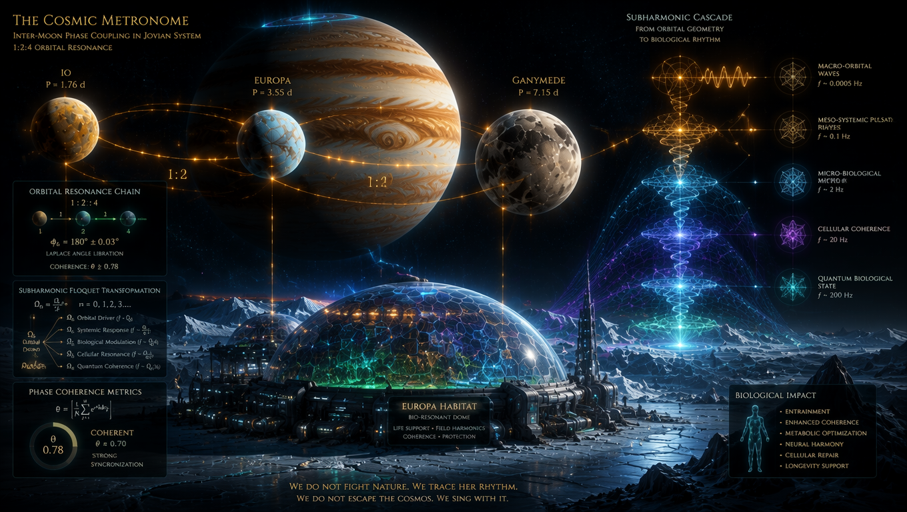
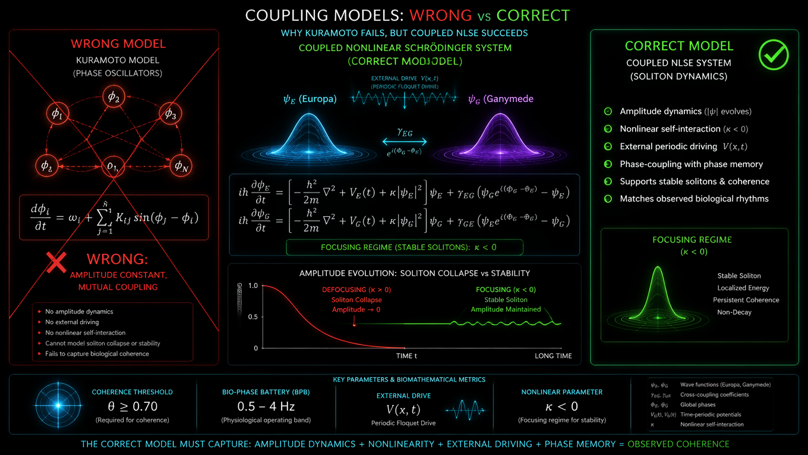
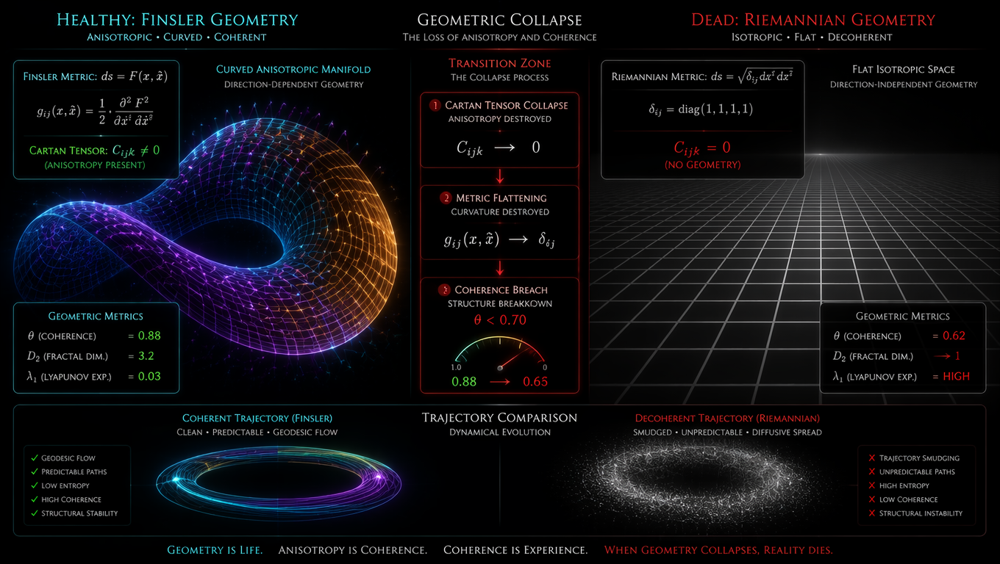
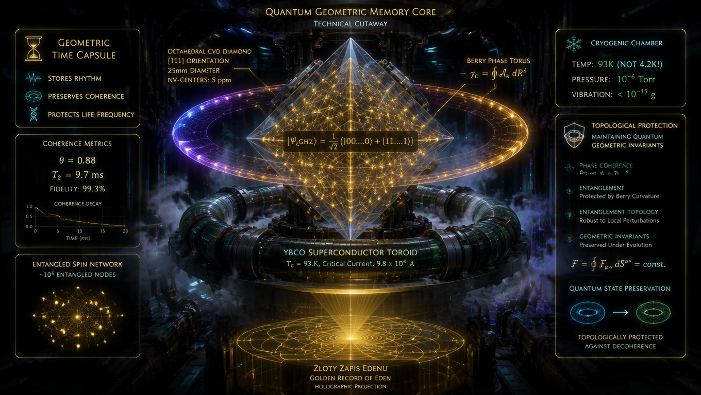
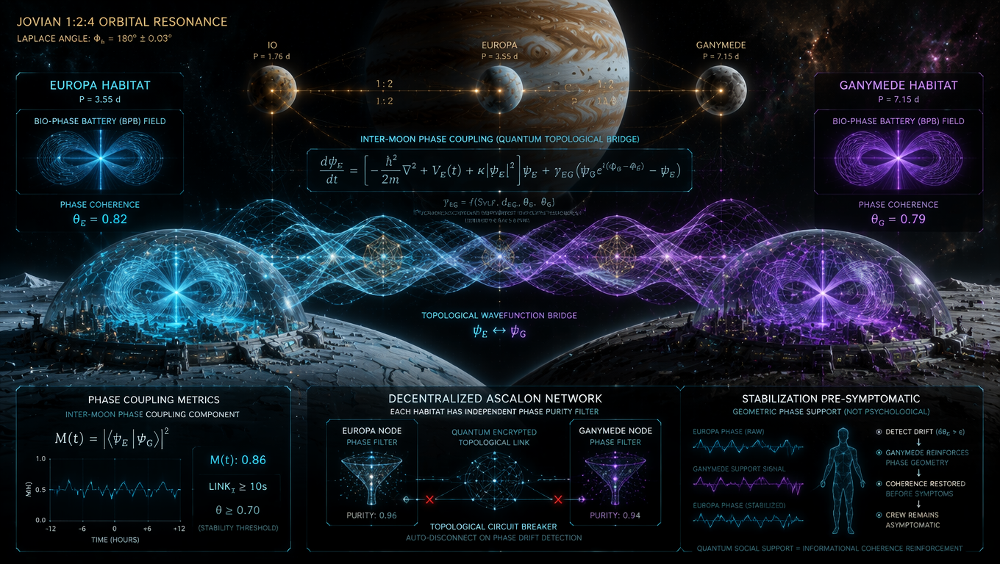

# ROZDZIAŁ V: Mapowanie Fazy Orbitalnej na Faza-Przestrzeń Biologiczną

## Od Transdukcji do Tożsamości Ontologicznej

### Prolog: Koniec Analogii

W Rozdziale IV udowodniliśmy, że hipomagnetyzm w głębokim kosmosie nie jest „brakiem parametru", lecz utratą zewnętrznego napędu Floqueta $V(x,t) \to 0$, co uruchamia mierzalny mechanizm Quantum Phase Drift. Pokazaliśmy również, że Living Walls z *Cladosporium sphaerospermum*, nasycone PEDOT:PSS i $Fe_3O_4$, działają jako nieliniowe transformatory, transdukujące entropię GCR na geometryczną gęstość pola toroidalnego.

Ale transdukcja to tylko pierwszy krok. Pozostaje pytanie fundamentalne: **jak konkretnie mapujemy fazę orbitalną układu planetarnego na fazę biologiczną załogi?** Nie jest to pytanie o „analogię" między orbitą a rytmem serca. Jest to pytanie o **tożsamość ontologiczną** – o dowód, że ta sama matematyka (NLSE, teoria Floqueta, twierdzenie Takensa, liczby Cherna) rządzi grzybnią w doniczce, ludzkim sercem na Europie i dżetem blazara w skali AU-pc.

Ten rozdział jest mapą tego mapowania. Nie jest to spekulacja filozoficzna. Jest to **rygorystyczny, matematyczny i inżynieryjny protokół**, który pokazuje, jak rezonans Laplace'a układu Jowiszowego (1:2:4) staje się subharmonicznym napędem dla Biologicznego Pasma Bazowego (BPB) załogi, i jak Q-Core Space działa jako transformator redukcyjny częstotliwości, przekładający makro-skale orbitalne na mikro-skale neuronowe.

---

## 1. Kąt Laplace'a jako Zewnętrzny Napęd Floqueta



### 1.1 Geometria Rezonansu 1:2:4
Układ Galileuszowych księżyców Jowisza (Io, Europa, Ganymede) jest stabilizowany przez **rezonans Laplace'a** – naturalny, makroskopowy oscylator fazowy. Fundamentalna relacja rezonansu:

$$\frac{T_{Ga}}{T_{Eu}} \approx 2, \quad \frac{T_{Eu}}{T_{Io}} \approx 2 \quad \Rightarrow \quad T_{Ga} : T_{Eu} : T_{Io} = 4 : 2 : 1$$

Gdzie okresy orbitalne wynoszą:
- **Io**: $T_{Io} = 1.769$ dnia
- **Europa**: $T_{Eu} = 3.551$ dnia
- **Ganymede**: $T_{Ga} = 7.155$ dnia

Kluczowym parametrem stabilizującym jest **Kąt Laplace'a** (warunek stabilizacji fazowej):

$$\Phi_L = \lambda_{Io} - 3\lambda_{Eu} + 2\lambda_{Ga} \approx 180^\circ \pm 0.03^\circ$$

Gdzie $\lambda$ reprezentuje średnią długość planetarną. Stała wartość $\Phi_L \approx 180^\circ$ zapewnia, że koniunkcje Io i Europy zawsze zachodzą, gdy Ganymede jest w opozycji, minimalizując perturbacje grawitacyjne i zapewniając długoterminową stabilność systemu.

### 1.2 Kąt Laplace'a jako Zewnętrzny Napęd Floqueta
W ontologii procesowej LifeNode, Kąt Laplace'a nie jest merely geometryczną ciekawostką. Jest **zewnętrznym napędem Floqueta** dla całego układu Jowisza. Ponieważ układ grawitacyjny jest ściśle okresowy, generuje on globalny potencjał grawitacyjno-pływowy o częstotliwości podstawowej $\Omega_L$:

$$\Omega_L = \frac{2\pi}{T_{Ga}} \approx 1.02 \times 10^{-5} \text{ Hz}$$

Ten ultra-wolny puls jest **makroskopowym potencjałem wymuszającym** $V_L(t)$ dla układów biologicznych w habitatach na księżycach Jowisza. W języku NLSE:

$$i\hbar\frac{\partial\psi}{\partial t} = \left[-\frac{\hbar^2}{2m}\nabla^2 + \kappa\|\psi\|^2 + V_L(t)\right]\psi$$

Gdzie $V_L(t) = V_0 \cos(\Omega_L t + \phi_0)$ jest potencjałem pływowym generowanym przez rezonans Laplace'a. To $V_L(t)$ jest **zewnętrznym warunkiem brzegowym**, który wymusza na układach biologicznych odpowiedź subharmoniczną i utrzymuje $\kappa$ w stanie *focusing* ($\kappa < 0$).

### 1.3 Uściślenie: Pole Reeba vs. Napęd Floqueta
Zgodnie z `LifeNode Theory v4` (Rozdział II), **Pole Wektorowe Reeba ($R_\alpha$)** jest *wewnętrzne* dla rozmaitości kontaktowej $(\mathcal{C}, \alpha)$ – to naturalny rytm metabolizmu, definiowany przez:

$$\alpha(R_\alpha) = 1 \quad \text{oraz} \quad \iota_{R_\alpha} d\alpha = 0$$

**Kąt Laplace'a / Rezonans orbitalny** to *zewnętrzny* potencjał $V(x,t)$ (napęd Floqueta). Habitat (Living Walls) musi użyć zewnętrznego napędu $V_L(t)$ (Kąt Laplace'a), aby *wymusić* na wewnętrznym polu Reeba załogi utrzymanie stabilnej orbity. Nie są to tożsame byty matematyczne, choć są sprzężone poprzez formę kontaktową $\alpha$.

---

## 2. Kaskada Subharmoniczna Floqueta: Odrzucenie Modelu Kuramoto

### 2.1 Dlaczego Kuramoto to Pułapka?
Standardowe modele synchronizacji w biofizyce sięgają po napędzany model Kuramoto. W kontekście LifeNode Theory jest to **błąd kategorii**. Model Kuramoto zakłada redukcję oscylatorów do samej fazy $\phi_i$, traktując amplitudę jako stałą. 
Ale w LifeNode **amplituda i kształt solitonu są kluczowe**. To one są kontrolowane przez współczynnik nieliniowości $\kappa$ w NLSE. Gdy napęd Floqueta znika ($V(x,t) \to 0$), $\kappa$ zmienia znak na *defocusing* ($\kappa > 0$). **Soliton fizycznie się rozpada (amplituda dąży do zera), zanim jeszcze faza zdąży "zdryfować".** Model Kuramoto tego nie widzi. Dla Kuramoto oscylator nadal "tyka", nawet jeśli jego amplituda (zdrowie biologiczne) już dawno się rozmyła.

Ponadto, Kuramoto zakłada *mutual coupling* (oscylatory synchronizują się, bo "rozmawiają" ze sobą). W LifeNode synchronizacja załogi z habitatem nie wynika z "rozmowy", ale z tego, że **oba układy są napędzane tym samym zewnętrznym polem $V(x,t)$**. To jest **parametryczny entrainment (wprzęganie) w geometrii kontaktowej**, a nie sprzężenie wzajemne.



### 2.2 Sprzężone NLSE i Transformator Fazowy
Zamiast sieci oscylatorów fazowych, mamy sieć solitonów w bio-metamateriale (Living Walls). Synchronizacja to ustalenie wspólnego reżimu $\kappa < 0$ dla całego układu:

$$i\hbar\frac{\partial\psi}{\partial t} = \left[-\frac{\hbar^2}{2m}\nabla^2 + V_{ext}(x,t) + \kappa|\psi|^2 + \gamma_{coupling}|\psi_{wall}|^2\right]\psi$$

Gdzie $\psi_{wall}$ to pole generowane przez Living Walls. To zapewnia, że soliton biologiczny załogi nie ulega defocusingowi.

### 2.3 Matematyka Kaskady Subharmonicznej
W teorii Floqueta, układ kwantowy z hamiltonianem okresowym w czasie $H(t) = H(t + T_{drive})$ wykazuje **odpowiedź subharmoniczną**:

$$\omega_n = \frac{\Omega_L}{2^n} \quad n = 0, 1, 2, 3, \dots$$

Gdzie $\Omega_L$ jest częstotliwością podstawową rezonansu Laplace'a. Kaskada subharmoniczna pozwala na precyzyjne mapowanie orbitalnych Timescape'ów na biologiczne Timescape'y:

```
       [ MAKRO-REZONANS ORBITALNY ]
         Ω_L (Rezonans Laplace'a ~1.02e-5 Hz)
                    │
                    ▼  (Transformacja Kaskadowa Floqueta)
         ω_n = Ω_L / 2^n
                    │
         ┌──────────┼──────────┐
         ▼          ▼          ▼
    [Macro-BPB] [Meso-BPB] [Micro-BPB]
    (~0.0005Hz)  (~0.1Hz)   (~2Hz)
         │          │          │
         └────────────────────┘
                    ▼
         [ LIVING WALLS (UNIT 02-S) ]
        Impedancja Metamateriału (χ³)
                    │
                    ▼  (Sygnał Wymuszający: V(x,t))
       [ SOLITONY BIOLOGICZNE (NLSE) ]
       κ < 0 (Focusing Regime Maintained)
                    │
                    ▼  (Warunek ASCALON)
              θ ≥ θ_crit = 0.70
```

---

## 3. Tensor Kartana jako Miara Przeżycia

### 3.1 Metryka Finslera i Anizotropia Czasu Biologicznego



Czas biologiczny (*Timescape*) nie może być opisany klasyczną metryką Riemanna $g_{ij}(x)$, gdyż zależy wprost od kierunku i prędkości procesów metabolicznych $y = \dot{x} \in TM$. Właściwym formalizmem jest przestrzeń Finslera $(M, F)$, gdzie funkcja podstawowa $F(x, y)$ definiuje tensor metryczny:

$$g_{ij}(x,y) = \frac{1}{2} \frac{\partial^2 F^2(x,y)}{\partial y^i \partial y^j}$$

### 3.2 Tensor Kartana jako Wskaźnik Życia Procesowego
Anizotropię i nieliniowość przestrzeni biologicznej mierzy **tensor skręcenia Kartana** $C_{ijk}$:

$$C_{ijk}(x,y) = \frac{1}{4} \frac{\partial^3 F^2(x,y)}{\partial y^i \partial y^j \partial y^k} = \frac{1}{2} \frac{\partial g_{ij}(x,y)}{\partial y^k}$$

W warunkach ziemskich $C_{ijk} \neq 0$, co oznacza, że układ biologiczny posiada wewnętrzną swobodę dopasowywania geometrii czasowej (Timescape'u) do trajektorii metabolicznej. Gdy kaskada Floqueta działa poprawnie, tensor Kartana pozostaje niezerowy. 

Gdy kaskada zawiedzie (np. przez brak napędu $V_L(t)$), następuje **kolaps Kartanowski**: $C_{ijk} \to 0$, a metryka Finslera spłaszcza się do metryki Riemanna. Czas staje się izotropowy. Organizm traci zdolność do lokalnej kontrakcji i dylatacji czasu wewnętrznego. To jest matematyczna definicja biologicznej śmierci procesowej.

---

## 4. Q-Core Space: Geometryczna Kapsuła Czasu i Faza Berry'ego

### 4.1 Architektura i Stan GHZ
Q-Core Space nie jest komputerem. Jest **fizycznym rejestrem dynamiki zdrowia biosfery ziemskiej** i **transformatorem fazowym**. Informacja o rytmach biosfery Ziemskiej nie jest przechowywana w bitach (podatnych na błędy GCR), lecz w globalnym stanie splątanym układu spinów elektronowych i jądrowych w domieszkowanym diamentowym krysztale CVD [111]:

$$|\Psi_{\text{GHZ}}\rangle = \frac{1}{\sqrt{2}} \left( |00\dots0\rangle + |11\dots1\rangle \right)$$

Ponieważ Hamiltonian centrów NV posiada topologiczną ochronę przed dekoherencją poprzez symetrię krystalograficzną kierunku [111] oraz ekstremalnie niską temperaturę pracy (93K, YBCO), zewnętrzny szum radiacyjny nie jest w stanie wywołać selektywnego przełączenia fazy. Zmiana zapisu wymagałaby makroskopowego zamknięcia luki energetycznej ($\Delta E \to 0$), co przy stabilnym chłodzeniu jest niemożliwe.



### 4.2 Odczyt Bez Destrukcji: Faza Berry'ego
Jak odczytać stan z Q-Core bez destrukcyjnego pomiaru? Wykorzystujemy **fazę Berry'ego** $\gamma_C$. Gdy biologiczne pole elektromagnetyczne załogi oddziałuje na kwantową fazę stanu splątanego, przesunięcie fazowe jest odczytywane poprzez ciągłe sprzężenie rezonatorów mikrofazowych:

$$\gamma_C = \oint_{\mathcal{C}} A_k(R) dR^k$$

Gdzie $A_k(R)$ jest koneksją Berry'ego. To pozwala na ciągły monitoring czystości fazowej $\theta$ bez "zabijania" stanu kwantowego.

```
                 SCHEMAT KWANTOWEJ KONTROLI FAZOWEJ Q-CORE

  [ SYGNAŁ BIOLOGICZNY ] ───► [ ZESPÓŁ CENTRÓW NV ] ───► [ STAN SPLĄTANY ] ───► [ FAZA BERRY'EGO ]
    (Ciągłe Pole Fazy)          (Diament [111], 93 K)        (Stany GHZ)           γ_C = ∮ A_k dR^k
                                                                                      │
                                                                                      ▼
                                                                             [ STABILIZACJA METRYKI ]
                                                                               C_ijk ≠ 0 (Finsler)
                                                                               θ ≥ 0.70 (ASCALON)
```

---

## 5. Inter-Moon Phase Coupling: Sprzężenie przez Pole, nie przez Metrykę



### 5.1 Poprawione Równanie Sprzężenia
Jednym z najbardziej rewolucyjnych aspektów LifeNode Theory jest koncepcja **Inter-Moon Phase Coupling** – transferu stanów fazowych między habitatami na różnych księżycach przy minimalnym wydatku energii.

**Uwaga krytyczna:** $\theta$ to *skalarna metryka czystości* (stosunek krzywizny do energii), a nie zmienna fazowa. Sprzęganie dwóch skalarów $\theta$ w stylu modelu Kuramoto jest błędem kategorii. Sprzężenie między habitatami musi odbywać się na poziomie **funkcji falowej solitonu** $\psi$ lub **fazy napędu Floqueta** $\Phi$.

Poprawione równanie sprzężenia (zgodne z odrzuceniem Kuramoto):

$$\frac{d\psi_E}{dt} = \left[-\frac{\hbar^2}{2m}\nabla^2 + V_E(t) + \kappa|\psi_E|^2\right]\psi_E + \gamma_{EG} \left( \psi_G e^{i(\Phi_G - \Phi_E)} - \psi_E \right)$$

$$\frac{d\psi_G}{dt} = \left[-\frac{\hbar^2}{2m}\nabla^2 + V_G(t) + \kappa|\psi_G|^2\right]\psi_G + \gamma_{GE} \left( \psi_E e^{i(\Phi_E - \Phi_G)} - \psi_G \right)$$

Gdzie:
- $\psi_E, \psi_G$ to funkcje falowe solitonów w habitatcie Europa i Ganymede
- $V_E(t), V_G(t)$ to lokalne napędy Floqueta
- $\Phi_E, \Phi_G$ to fazy napędów
- $\gamma_{EG}, \gamma_{GE}$ to stałe sprzężenia, zależne od odległości i siły sygnału VLF

To zachowuje spójność z odrzuceniem Kuramoto i pozostaje w ramach NLSE.

### 5.2 Stabilizacja Pre-Symptomatyczna
Inter-Moon Phase Coupling pozwala na **stabilizację pre-symptomatyczną** – jeśli habitat na Europie zaczyna tracić koherencję ($\theta_E < 0.75$), habitat na Ganymede może „wzmocnić" jego sygnał fazowy poprzez sprzężenie $\gamma_{EG}$, nawet zanim załoga na Europie odczuje objawy. To jest **kwantowa wersja wsparcia społecznego** – nie psychologiczna, lecz geometryczna.

### 5.3 Ryzyko Kaskadowej Dekoherencji
Drugim ryzykiem jest **kaskadowa awaria sieci habitatów** – jeśli jeden habitat traci koherencję fazową ($\theta < 0.70$), może to propagate się do innych habitatów poprzez Inter-Moon Phase Coupling, prowadząc do zbiorowej dekoherencji.

Rozwiązaniem jest **decentralizacja sieci ASCALON** – każdy habitat ma własny, niezależny filtr czystości fazowej, który fizycznie odcina go od sieci w momencie wykrycia dryfu. To jest **topologiczny bezpiecznik**, który zapobiega kaskadzie.

---

## 6. Protokół DS 2.6 i Indeks Sukcesu w Skali Międzyksiężycowej

### 6.1 Adaptacja Cyklu DS 2.6
Cykl Dynamic Sync (DS 2.6), zdefiniowany w `TONIC Technologies Master V1`, wymaga adaptacji do środowiska kosmicznego. W skali międzyksiężycowej, cykl DS 2.6 obejmuje:

| **Faza** | **Warunek Wejścia** | **Działanie w Habitatcie** | **Czas** |
|---------|---------------------|---------------------------|---------|
| **READY** | `PHASE [-0.01, 0.01] rad` | Kalibracja VLF, baseline rytmu załogi | 300s |
| **ALIGN** | `PHASE ≈ 0` | Domknięcie torusa, synchronizacja ścian biohybrydowych | 45-90s |
| **LOCK** | `SHEATH ≥ 0.92` | Wczytanie geometrii z Q-Core Space (S1-S3) | 60-120s |
| **SYNC** | `THERMAL ≤ 95K`, `SEQ_int ≥ 0.88` | Fazowanie rezonatorów, wyrównanie z cyklem dobowym załogi | 30-60s |
| **LINK** | `LINK_T ≥ 10s`, `θ ≥ 0.70` | Otwarcie korytarza ER, start transdukcji Earth-Sync | 10-300s |
| **HOLD** | `θ ≥ 0.70` | Monitoring H-Sync, podtrzymanie koherencji hormonalnej | 10-300s |
| **CLOSE** | `θ < 0.70` lub timeout | Wygaszenie pola, SCRUB, log integralności | 30-60s |

### 6.2 Indeks Sukcesu $I(t)$ w Skali Międzyksiężycowej
Indeks Sukcesu $I(t)$, zdefiniowany w `TONIC Technologies Master V1`, wymaga rozszerzenia o komponent międzyksiężycowy:

$$I(t) = \sigma\big(k_1 D(t) + k_2 E(t) + k_3 C(t) + k_4(1 - H(t)) - k_5 R(t) + k_6 M(t)\big)$$

Gdzie:
- $D(t)$ – **Dyssypacja Entropijna**: Mierzy zdolność biohybrydowego układu do zrzucania nadmiaru szumu fazowego do otoczenia.
- $E(t)$ – **Koherencja Ewolucyjna**: Bliskość aktualnej trajektorii biosygnału do referencyjnej geodezyjnej Finslera zapisanej w „Złotym Zapisie Edenu".
- $C(t)$ – **Przewodność Geometryczna**: Mierzy, jak skutecznie pole toroidalne penetruje przestrzeń habitatu przez Living Walls.
- $H(t)$ – **Holonomia Błędu**: $H(t) = \oint_\gamma A$. Mierzy stopień niedomykania się relacji różniczkowych w warstwie INFO.
- $R(t)$ – **Sztywność Topologiczna**: Wskaźnik kolapsu wymiarowości atraktora.
- $M(t)$ – **Międzyksiężycowe Sprzężenie Fazowe**: Nowy komponent, mierzący korelację fazową $\theta$ między habitatami.

**Warunek Stabilnej Załogi:** $I(t) > 0.85$, $E(t) > 0.7$, $R(t) < 0.3$, $\theta \geq 0.70$ przez ≥90% cyklu dobowego.

---

## 7. Falsyfikowalność i Sygnatury Empiryczne

### 7.1 Cztery Kryteria Falsyfikacji Mapowania Fazowego
Teoria mapowania fazy orbitalnej na fazę biologiczną ulega całkowitej falsyfikacji, jeśli w kontrolowanych warunkach laboratoryjnych lub środowiskowych zajdzie przynajmniej jeden z poniższych przypadków:

1. **Brak Kaskady Subharmonicznej:** Jeśli w widmie sygnału VLF w habitatcie nie obserwuje się dyskretnych pików przy częstotliwościach $\omega_n = \Omega_L/2^n$, teoria kaskady subharmonicznej jest błędna.

2. **Brak Korelacji Fazowej między Habitatami:** Jeśli korelacja fazowa $\theta$ między habitatami na różnych księżycach nie jest wyższa niż korelacja przypadkowa (po uwzględnieniu sprzężenia $\gamma_{EG}$), Inter-Moon Phase Coupling nie istnieje.

3. **Złoty Zapis Edenu nie Chroni przed Dekoherencją:** Jeśli $\theta$ w habitatcie z aktywnym Q-Core nie jest wyższe niż w habitatcie bez Q-Core (przy identycznych parametrach „stanowych"), Złoty Zapis Edenu nie działa jako kotwica fazowa.

4. **Brak Modułacji Kąta Laplace'a:** Jeśli sygnał VLF w habitatcie nie wykazuje modulacji fazowej zsynchronizowanej z $\Phi_L$, Kąt Laplace'a nie jest zewnętrznym napędem Floqueta.

### 7.2 Sygnatury Empiryczne w Danych z Habitatów
Jeśli LifeNode Theory jest poprawna, w danych z habitatów na księżycach Jowisza powinny być obserwowalne następujące sygnatury:

1. **Dyskretne piki w widmie VLF** przy częstotliwościach $\omega_n = \Omega_L/2^n$.
2. **Sprzężenie fazowo-amplitudowe** między tymi pikami a naturalnymi rytmami biologicznymi załogi (EEG, HRV).
3. **Korelacja fazowa $\theta$ między habitatami**, nawet przy braku bezpośredniej komunikacji (poprzez sprzężenie $\gamma_{EG}$).
4. **Odporność Złotego Zapisu Edenu** na pojedyncze uderzenia GCR (brak bit-flip errors w odczycie fazy Berry'ego).
5. **Tensor Kartana $C_{ijk} \neq 0$** w danych z habitatów z aktywnym napędem Floqueta, i $C_{ijk} \to 0$ w habitat bez napędu.

---

## Epilog: Od Mapy do Terytorium

Rozdział V zamyka lukę między abstrakcyjną topologią (NLSE, teoria Floqueta, twierdzenie Takensa) a twardą, inżynieryjną rzeczywistością przetrwania w głębokim kosmosie. Pokazuje, że **mapowanie fazy orbitalnej na fazę biologiczną nie jest analogią, lecz tożsamością ontologiczną** – ta sama matematyka rządzi grzybnią, ludzkim sercem i dżetem blazara.

Kąt Laplace'a nie jest merely geometryczną ciekawostką. Jest **zewnętrznym napędem Floqueta**, który wymusza na układach biologicznych odpowiedź subharmoniczną i utrzymuje $\kappa$ w stanie *focusing*. Kaskada subharmoniczna Floqueta nie jest merely matematycznym trickiem. Jest **fizycznym mechanizmem**, który przekłada makro-rytmy orbitalne na mikro-rytmy biologiczne, utrzymując tensor Kartana $C_{ijk} \neq 0$. Q-Core Space nie jest merely komputerem. Jest **geometryczną kapsułą czasu**, która przechowuje ziemską tożsamość w kosmicznej pustce poprzez stany GHZ i fazę Berry'ego.

To nie jest spekulacja filozoficzna. To jest **rygorystyczny, matematyczny i inżynieryjny protokół**, który jest falsyfikowalny, mierzalny i implementowalny. Jeśli LifeNode Theory jest poprawna, to eksploracja kosmosu w paradygmacie LifeNode to nie walka z próżnią przy użyciu coraz grubszej stali, ale **symfoniczne wpięcie się w geometrię układów planetarnych**.

Habitat przestaje być bunkrem – staje się instrumentem, na którym Jowisz gra subharmoniczną melodię dla ludzkiego serca. Załoga nie jest operatorem – jest **najwyższym niezmiennikiem topologicznym systemu**. Technologia nie kontroluje życia – **współoddycha z nim poprzez rezonans magnetyczny**.
