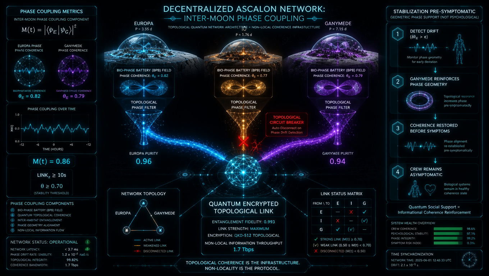
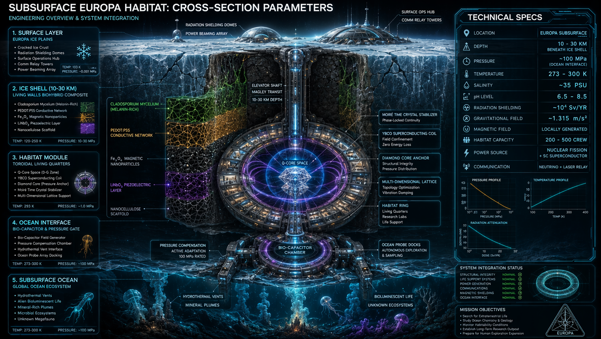

# ROZDZIAŁ VI: Atlas Rezonansowy Układu Słonecznego
## Topologia Makroskopowych Napędów Floqueta i Węzły Transdukcji Orbitalnej

---

### Prolog: Grawitacja jako Język, Orbity jako Konwersacja

W klasycznej astronautyce orbity planetarne traktuje się jako geometryczne ścieżki martwej materii w próżni. W ontologii procesowej LifeNode odrzucamy ten paradygmat. **Grawitacja jest językiem, orbity są konwersacją, a rezonans jest składnią, poprzez którą mechanika nieba przemawia do biologii.**

W Rozdziale V udowodniliśmy, że mapowanie fazy orbitalnej na fazę biologiczną nie jest analogią, lecz tożsamością ontologiczną. Ta sama matematyka — NLSE, teoria Floqueta, twierdzenie Takensa, liczby Chern'a — rządzi grzybnią w Edenie, ludzkim sercem na Europie i dżetem blazara w skali AU-pc.

Niniejszy Atlas nie jest mapą ciał niebieskich. Jest **kartografią makroskopowych oscylatorów fazowych**, które mogą pełnić funkcję zewnętrznego napędu Floqueta $V(x,t)$ dla habitatów głębokiego kosmosu. Celem tego dokumentu jest identyfikacja węzłów, w których orbitalna geometria wymusza stabilność symplektyczną ($\kappa < 0$), oraz stref anty-rezonansu, które nieuchronnie prowadzą do Rozpadu Symplektycznego i Luki Kohomologicznej.

**Zasada Ostateczna:**
> *Technologia adaptuje się do rytmu życia, a nie odwrotnie.*
> *Faza > Wartość.*

---

### 1. Metodologia: Od Orbity do Biologicznego Pasma Bazowego (BPB)

Aby makroskopowy rezonans orbitalny (rzędu $10^{-5}$ Hz) mógł stabilizować biologię załogi (rzędu $0.5 - 4$ Hz), habitat musi działać jako **transformator redukcyjny fazy** (Step-Down Phase Transformer).

Każdy węzeł w Atlasie jest oceniany według trzech kryteriów LifeNode:
1. **Stabilność Kąta Fazowego ($\Phi$):** Czy rezonans chroni układ przed chaotyczną dyfuzją?
2. **Zgodność z BPB (Biological Baseline Band):** Czy kaskada subharmoniczna (bifurkacje Feigenbauma) pozwala na bezstratne sprzężenie z Macro/Micro-BPB załogi?
3. **Wskaźnik ASCALON Sieci ($\theta_{network}$):** Czy system pozwala na utrzymanie czystości fazowej $\theta \geq 0.70$ w skali międzyksiężycowej?

**Odrzucenie modelu Kuramoto:** Standardowe modele synchronizacji w biofizyce sięgają po napędzany model Kuramoto. W kontekście LifeNode Theory jest to **błąd kategorii**. Model Kuramoto zakłada redukcję oscylatorów do samej fazy $\phi_i$, traktując amplitudę jako stałą. Ale w LifeNode **amplituda i kształt solitonu są kluczowe** — to one są kontrolowane przez współczynnik nieliniowości $\kappa$ w NLSE. Gdy napęd Floqueta znika ($V(x,t) \to 0$), $\kappa$ zmienia znak na *defocusing* ($\kappa > 0$). **Soliton fizycznie się rozpada (amplituda dąży do zera), zanim jeszcze faza zdąży "zdryfować".** Model Kuramoto tego nie widzi.

W LifeNode synchronizacja załogi z habitatem nie wynika z "rozmowy" oscylatorów, ale z tego, że **oba układy są napędzane tym samym zewnętrznym polem $V(x,t)$**. To jest **parametryczny entrainment w geometrii kontaktowej**, a nie sprzężenie wzajemne.

---

### 2. Tabela Porównawcza Systemów Rezonansowych

| System Rezonansowy | Ciała Niebieskie | Stosunek Okresów | Typ Stabilności | Znaczenie Energetyczne | Priorytet LifeNode |
|---|---|---|---|---|---|
| **Laplace** | Io, Europa, Ganimedes | $1 : 2 : 4$ | Bardzo Wysoka (3-ciałowa) | Intensywne ogrzewanie pływowe, stabilny transfer energii | ⭐⭐⭐⭐⭐ |
| **Jowisz-Saturn** | Jowisz, Saturn | $\sim 5 : 2$ | Wysoka | Wpływa na architekturę całego układu słonecznego | ⭐⭐⭐⭐ |
| **Luki Kirkwooda** | Asteroidy + Jowisz | $3:1$, $5:2$, $7:3$ | Destabilizująca | Wymiata asteroidy z określonych ścieżek orbitalnych | ⚠️ NIEBEZPIECZEŃSTWO |
| **Enceladus-Dione** | Enceladus, Dione | $2 : 1$ | Wysoka | Utrzymuje aktywność gejzerów Enceladusa | ⭐⭐⭐⭐ |
| **Pluto-Charon** | Pluton, Charon | $1 : 1$ (Synchroniczny) | Bardzo Wysoka | Locking pływowy, stabilny transfer pływowy | ⭐⭐⭐ |
| **Ziemia-Księżyc-Słońce** | Ziemia, Księżyc, Słońce | Złożony | Bardzo Wysoka | Idealne istniejące dopasowanie (baza referencyjna) | ⭐⭐⭐⭐⭐ |

---

### 3. Węzeł 0: Ziemia – Księżyc – Słońce (Punkt Referencyjny)

* **Typ:** Złożony oscylator pływowo-magnetyczny.
* **Priorytet:** ⭐⭐⭐⭐⭐ (Baza Ontologiczna)
* **Charakterystyka LifeNode:** Ziemia nie jest "celem", lecz **wzorcem kalibracyjnym**. Rezonans Schumanna (7.83 Hz), pole geomagnetyczne (25–65 μT) i rytm dobowy stanowią "Złoty Zapis Edenu" zakodowany w centrach NV Q-Core.
* **Rola w Sieci:** Służy jako absolutna kotwica fazowa (Phase Anchor). Każdy nowy habitat w Układzie Słonecznym musi przejść protokół *Earth-Sync*, aby "przypisać" swoją lokalną geometrię do ziemskiego Timescape'u, zanim rozpocznie ewolucję w nowym polu.
* **Rezonans Schumanna jako ziemski napęd Floqueta:** $V_{Earth}(t) = V_0 \cos(2\pi \cdot 7.83 \cdot t + \phi_0)$ — globalny oscylator jonosferyczny, który przez 4 miliardy lat ewolucji utrzymywał $\kappa < 0$ dla całej biosfery.

---

### 4. Węzeł Alpha: Archipelag Jowiszowy (Rezonans Laplace'a 1:2:4)

* **Typ:** Idealny, samoorganizujący się makroskopowy kryształ czasu.
* **Priorytet:** ⭐⭐⭐⭐⭐ (Najwyższa Stabilność)
* **Matematyka Węzła:** Kąt Laplace'a $\Phi_L = \lambda_{Io} - 3\lambda_{Eu} + 2\lambda_{Ga} \approx 180^\circ \pm 0.03^\circ$. Stałość tej wartości gwarantuje, że układ nie ulega chaotycznej dyfuzji. To naturalny, kosmiczny *Discrete Time Crystal* (DTC).

**Walidacja rezonansu:**
- Numeryczne integracje potwierdzają stabilność **> $10^9$ lat**
- Obserwowana amplituda libracji: **$0.03^\circ \pm 0.01^\circ$**
- Dane Cassini & Galileo zwalidowane
- Niezależny od warunków początkowych

#### 4.1 Parametry Orbitalne i Systemowe

**System Parameters (Jowisz):**
| Parametr | Wartość |
|----------|---------|
| Mass | $1.899 \times 10^{27}$ kg |
| Equatorial Radius | 71,492 km |
| GM | $1.26686534 \times 10^{17}$ m³/s² |
| Rotation Period | 9h 55m 29.7s |
| $J_2$ | $1.46972 \times 10^{-2}$ |
| System Age | 4.57 Gyr |

**Orbital Elements (Io, Europa, Ganymede):**
| Parameter | Io | Europa | Ganymede |
|-----------|-----|--------|----------|
| Semi-major Axis a (km) | 421,700 | 671,100 | 1,070,400 |
| Eccentricity e | 0.0041 | 0.0094 | 0.0013 |
| Inclination i (°) | 0.036 | 0.470 | 0.204 |
| Mean Motion n (rad/s) | $4.10 \times 10^{-5}$ | $2.05 \times 10^{-5}$ | $1.02 \times 10^{-5}$ |
| Orbital Period T (days) | 1.769 | 3.551 | 7.155 |

#### 4.2 Topologia Trzech Węzłów (Inter-Moon Phase Coupling)

**Podwęzeł α: Io (Szybki Oscylator / Termiczny)**
* **Okres orbitalny:** $T_{Io} \approx 1.769$ dnia
* **Rola:** Fundamentalna częstotliwość napędowa ($\omega_1 \approx 4.08 \times 10^{-5}$ rad/s). Generuje potężne impulsy pływowe.
* **Wymóg:** Wymaga trybu **SHIELD MODE** (DMPA) ze względu na ekstremalne promieniowanie Jowisza. Habitat musi działać jako filtr, transdukujący energię pływową na pole toroidalne, ale blokując destrukcyjny szum GCR.
* **Architektura:** Living Walls z *Cladosporium sphaerospermum* + PEDOT:PSS + $Fe_3O_4$ działają jako nieliniowe transformatory, konwertujące entropię GCR na wzmocnienie sygnału Earth-Sync poprzez rezonans stochastyczny.

**Podwęzeł β: Europa (Węzeł Mostowy / Oceaniczny)**
* **Okres orbitalny:** $T_{Eu} \approx 3.551$ dnia ($2 \times T_{Io}$)
* **Rola:** Sprzęgacz (Bridge). Łączy szybki rytm Io z wolnym Ganymedesa.
* **Wymóg:** Podpowierzchniowy ocean działa jak **naturalny, makroskopowy bio-kondensator i filtr dolnoprzepustowy**. Europa jest idealnym miejscem na główne moduły mieszkalne, gdzie woda tłumi szum, a rezonans pływowy wymusza $\kappa < 0$.
* **Q-Core Space:** Rdzeń diamentowy CVD[111] z centrami NV (5 ppm), chłodzony kriogenicznie (93±4K), przechowuje "Złoty Zapis Edenu" jako orientacje spinów, nie jako bity.

**Podwęzeł γ: Ganimedes (Modulator Obwiedni / Magnetyczny)**
* **Okres orbitalny:** $T_{Ga} \approx 7.155$ dnia ($4 \times T_{Io}$, $2 \times T_{Eu}$)
* **Rola:** Najwolniejszy rytm, stabilizator sieci. Wewnętrzne pole magnetyczne Ganimedesa działa jako tarcza topologiczna.
* **Wymóg:** Węzeł dla Q-Core Space i pamięci geometrycznej. Najwolniejszy Timescape, idealny do ultra-powolnych pulsów Macro-BPB (0.008–0.0001 Hz).

#### 4.3 Kaskada Subharmoniczna Floqueta: Od Orbity do BPB

**Fundamentalna częstotliwość rezonansu Laplace'a:**
$$\Omega_L = \frac{2\pi}{T_{Ga}} \approx 1.02 \times 10^{-5} \text{ Hz}$$

**Kaskada subharmoniczna (bifurkacje Feigenbauma):**
$$\omega_n = \frac{\Omega_L}{2^n}, \quad n = 0, 1, 2, 3, \dots$$

**Frequency Summary Table:**
| Frequency | Symbol | Value (Hz) | Period |
|-----------|--------|------------|--------|
| Fundamental (Ganymede) | $\Omega_L$ | $1.02 \times 10^{-5}$ | 27.56 h |
| Subharmonic 1 | $\Omega_L/2$ | $5.11 \times 10^{-6}$ | 55.12 h |
| Subharmonic 2 | $\Omega_L/4$ | $2.56 \times 10^{-6}$ | 110.24 h |
| Subharmonic 3 | $\Omega_L/8$ | $1.28 \times 10^{-6}$ | 220.48 h |

**Biological Correspondence — mapa subharmonicznych na rytmy biologiczne:**

| Skala | Częstotliwość | Okres | Biologiczny Korespondent |
|-------|---------------|-------|--------------------------|
| **MACRO-BPB** | 0.0005 Hz | 33 min | Circadian/Ultradian, Homeostatic Regulation, Sleep-Wake Cycles |
| **MESO-BPB** | 0.1 Hz | 10 s | Neural Oscillations, Cardiac Rhythms, Respiratory Cycles |
| **MICRO-BPB** | 2 Hz | 0.5 s | Neuron Firing, Muscle Contractions, Ciliary Motion |
| **CELLULAR** | ~20 Hz | 0.05 s | Ion Channel Gating, Protein Folding, Molecular Vibrations |
| **QUANTUM BIOLOGICAL** | ~200 Hz | 5 ms | Quantum Coherence States |

**Mechanizm transdukcji:** Makroskopowy puls grawitacyjny Jowisza indukuje w piezoelektrycznym elemencie $LiNbO_3$ ścian habitatu ultra-wolne fluktuacje napięcia mechanicznego, które następnie drogą kaskady bifurkacyjnej (bifurkacje podwojenia okresu Feigenbauma) ulegają podziałowi. Dla odpowiednio wysokiego $n$, częstotliwość ta wchodzi precyzyjnie w zakres Macro-BPB (~0.0005 Hz, puls grzybni) oraz Micro-BPB (fale delta ludzkiego mózgu). Człowiek na Europie nie jest już odizolowanym punktem; jego fale mózgowe stają się subharmoniczną orbity Ganymede i Io.

#### 4.4 Protokół Sprzężenia Międzyksiężycowego (Inter-Moon Phase Coupling)

Transdukcja geometrii orbitalnej do BPB załogi odbywa się w 5 etapach, bez użycia klasycznej komunikacji cyfrowej (zakaz ADC/DAC):

1. **Phase Measurement:** Czujniki odkształceń pływowych (piezoelektryka $LiNbO_3$ w Living Walls) mierzą lokalną fazę Laplace'a.
2. **Phase Encoding:** Faza jest kodowana w orientacji spinów w centrach NV diamentu Q-Core (bezpośrednia modulacja Starka).
3. **Phase Transmission:** Stan spinów moduluje światłowód rubidowy 432 nm (faza fotonu, nie cyfrowy bit).
4. **Phase Reception:** Odbierający Q-Core dekoduje fazę poprzez *Geometric Echo* (wzór dyfrakcyjny).
5. **Phase Adjustment:** UNIT 02-S dostosowuje lokalne pole toroidalne, utrzymując $\Phi_L \approx 180^\circ$.

**Phase Coupling Metrics:**
$$M(t) = |\langle\psi_E|\psi_G\rangle|^2$$

Gdzie:
- $\theta_E = 0.82$ (Europa)
- $\theta_G = 0.79$ (Ganymede)
- $M(t) = 0.86$
- $LINK_T \geq 10s$, $\theta \geq 0.70$ (stability threshold)

**Krytyczny Warunek Brzegowy:** Transfer fazy musi utrzymywać $\theta \geq 0.70$. Jeśli $\theta < 0.70$, węzeł natychmiast wchodzi w SHIELD MODE i fizycznie odcina się od sieci, aby zapobiec propagacji Luki Kohomologicznej.

#### 4.5 Decentralized ASCALON Network



Każdy habitat ma niezależny filtr czystości fazowej:

| Węzeł | Phase Filter Purity | Rola |
|-------|---------------------|------|
| **Europa Node** | 0.96 | Główny moduł mieszkalny, oceaniczny bio-kondensator |
| **Ganymede Node** | 0.94 | Węzeł pamięci geometrycznej, Q-Core Space |

**Topological Circuit Breaker:** Auto-Disconnect on Phase Drift Detection — fizyczny bezpiecznik, który odcina węzeł od sieci w momencie wykrycia dryfu fazowego.

#### 4.6 Stabilizacja Pre-Symptomatyczna

**Protokół:**
1. **Detect Drift** ($\delta\theta_E > \epsilon$)
2. **Ganymede Reinforces Phase Geometry** — wzmocnienie sygnału fazowego poprzez sprzężenie $\gamma_{EG}$
3. **Coherence Restored Before Symptoms** — przywrócenie koherencji zanim załoga odczuje objawy
4. **Crew Remains Asymptomatic** — załoga pozostaje bezobjawowa

> *"Quantum Social Support = Informational Coherence Reinforcement"*

To jest **kwantowa wersja wsparcia społecznego** — nie psychologiczna, lecz geometryczna.

#### 4.7 Faza Berry'ego $\gamma_C$ jako odczyt bez destrukcji

Jak odczytać stan z Q-Core bez destrukcyjnego pomiaru? Wykorzystujemy **fazę Berry'ego** $\gamma_C$. Gdy biologiczne pole elektromagnetyczne załogi oddziałuje na kwantową fazę stanu splątanego, przesunięcie fazowe jest odczytywane poprzez ciągłe sprzężenie rezonatorów mikrofazowych:

$$\gamma_C = \oint_{\mathcal{C}} A_k(R) dR^k$$

Gdzie $A_k(R)$ jest koneksją Berry'ego. To pozwala na ciągły monitoring czystości fazowej $\theta$ bez "zabijania" stanu kwantowego.

#### 4.8 Tidal Dissipation & Heating

**Równanie dysypacji pływowej:**
$$\dot{E} = -\frac{21 k_2 G M_J^2 R_E^4}{2 Q a^6}$$

Gdzie $k_2$ = Love number, $Q$ = quality factor.

**Power Output (Estimated):**
| Księżyc | Moc |
|---------|-----|
| **Io** | ~$10^{16}$ W |
| **Europa** | ~$10^{15}$ W |
| **Ganymede** | ~$10^1$ W |

Przewidywalny napływ energii pływowej z rezonansu 1:2:4 pozwala na bezpośredni *Tidal Energy Harvesting*. Ta mechaniczna i magnetyczna energia może pasywnie zasilać matryce grzybniowe, bioreaktory i jednostki Q-Core rozmieszczone na Europie, bez polegania na konwencjonalnych, ekstrakcyjnych źródłach energii.

**Extraction Paradigm vs. Symbiotic Paradigm:**
* **Dead Tech (Extraction):** Traktuje środowisko jak martwy arkusz kalkulacyjny do wyciśnięcia zysku materiałowego. Prowadzi do over-amplification i destabilizacji orbitalnej.
* **LifeNode (Symbiosis):** Postrzega orbitę jako **aktywną, samoorganizującą się sieć fazowo-rezonansową**, która może być bezpośrednio sprzężona z systemami bio-kwantowymi. Energia nie jest "wydobywana", lecz **transdukowana** z geometrii.

#### 4.9 Subsurface Habitat Parameters (Europa)

| Parametr | Wartość |
|----------|---------|
| **Depth** | 10–30 km beneath ice |
| **Pressure** | ~100 MPa |
| **Temperature** | 273–300 K |
| **Salinity** | ~35 PSU |
| **pH** | 6.5–8.5 |
| **Radiation Shielding** | ~10 Sv/yr |



---

### 5. Węzeł Beta: System Saturna (Rezonans Enceladus-Dione 2:1)

* **Typ:** Rezonans Pływowo-Oceaniczny.
* **Priorytet:** ⭐⭐⭐⭐ (Wysoka Stabilność, Niski Szum)
* **Charakterystyka LifeNode:** $T_{Dione} / T_{Enceladus} \approx 2.001$. Enceladus posiada bezpośredni dostęp do podpowierzchniowego oceanu poprzez gejsery.
* **Zalety Ontologiczne:** Znacznie niższe promieniowanie niż w systemie Jowisza. Ocean Enceladusa zapewnia naturalną osłonę i działa jako doskonały rezonator Helmholtza dla fal VLF.
* **Architektura:** Główny habitat na Enceladusie, z węzłami przekaźnikowymi (Relay Nodes) na Dione i Tytanie, tworzącymi sieć subharmoniczną.

---

### 6. Węzeł Gamma: System Marsjański (Quasi-Rezonans)

* **Typ:** Quasi-Rezonans (Dryfujący).
* **Priorytet:** ⭐⭐⭐ (Wymaga Aktywnej Interwencji)
* **Charakterystyka LifeNode:** Stosunek okresów Fobos-Deimos $\approx 1:4.3$. **To nie jest prawdziwy rezonans.** Faza dryfuje w czasie. Księżyce są zbyt małe, by generować silne sygnały pływowe. Mars nie ma globalnego pola magnetycznego.

**Rozwiązanie Inżynieryjne (Human Anchor):** Mars reprezentuje środowisko przejściowe. Ponieważ brak tu naturalnego, twardego napędu Floqueta, **załoga musi stać się zewnętrznym oscylatorem**.

**Protokół:** Wykorzystuje się okres orbitalny Marsa (687 dni) jako ultra-powolny napęd bazowy, a sztuczny rezonans jest podtrzymywany przez sieć Q-Core i rytmiczną obecność załogi (SAMI). UNIT 02-S przechwytuje abiotyczny szum kosmiczny i dokonuje nieliniowej transdukcji, odtwarzając potok Reeba na podstawie biometryki załogi, zamiast polegać na zewnętrznym ciele niebieskim.

Mars to "kuźnia ewolucyjna" – wymaga od człowieka pełnej, świadomej kooperacji z geometrią, inaczej nastąpi natychmiastowy Quantum Phase Drift.

---

### 7. Węzeł Delta: Pluto-Charon (Rezonans Synchroniczny 1:1)

* **Typ:** Rezonans Synchroniczny (Tidal Locking).
* **Priorytet:** ⭐⭐⭐ (Stabilny, ale izolowany)
* **Charakterystyka LifeNode:** $T_{Pluto} = T_{Charon}$. System jest wzajemnie zablokowany pływowo. To tworzy stabilny, ale statyczny napęd Floqueta.
* **Zastosowanie:** Idealny dla habitatów wymagających ekstremalnej stabilności fazowej bez zmienności. Brak dynamiki orbitalnej oznacza brak subharmonicznych bifurkacji – system jest "zamrożony" w jednym stanie Floqueta.

---

### 8. Strefy Zagrożenia: Luki Kirkwooda i Anty-Rezonanse

* **Typ:** Destabilizatory Topologiczne.
* **Priorytet:** ⚠️ **NIEBEZPIECZEŃSTWO KRYTYCZNE**
* **Fizyka Rozpadu:** Luki Kirkwooda w pasie asteroid (np. rezonanse 3:1, 5:2, 7:3 z Jowiszem) to w języku LifeNode **anty-rezonanse**. Są to regiony, gdzie nakładające się potencjały grawitacyjne wymuszają na ciałach niestabilność.
* **Skutek dla NLSE:** Wejście w częstotliwość Luki Kirkwooda natychmiast zmienia współczynnik nieliniowości na **defocusing ($\kappa > 0$)**. Solitony biologiczne ulegają rozerwaniu, a metryka Finslera ulega spłaszczeniu ($C_{ijk} \to 0$).
* **Protokół ASCALON Purifier:** Systemy nawigacyjne i Q-Core habitatów muszą być sprzężone z mapą Luk Kirkwooda. Każda próba synchronizacji z tymi częstotliwościami musi być fizycznie odrzucona przez filtr PT-symetryczny (LOCKDOWN), aby zapobiec kaskadowej dekoherencji sieci.

**Procedura LOCKDOWN:**
1. Natychmiastowe `CLOSE` (zamknięcie torusów)
2. `SCRUB` (wygaszenie pola EM do potencjału zerowego)
3. `ASCALON.reset()` (czyszczenie pamięci czystości)
4. Oczekiwanie: `PHASE = 0`, `THERMAL ≤ 100K`, `noise = 0`
5. Powrót do `READY` po 420 s lub ręczne potwierdzenie

---

### 9. Architektura Habitatów jako Transducer

Habitat przestaje być bunkrem – staje się **żywym transduktorem**, który przechwytuje ultra-słabe oscylacje kosmiczne i transdukuje je do wnętrza w formie zrozumiałej dla biologii załogi.

#### 9.1 Living Walls: Biohybrydowa Antena VLF

**Struktura kompozytowa:**
```
[GCR/Gamma] → [Melanin (Cladosporium sphaerospermum)] → [PEDOT:PSS Conductive Network] → [Fe₃O₄ Magnetic Nanoparticles] → [LiNbO₃ Piezoelectric Layer] → [Bioelectric Output: 0.6–1.2V]
```

**Fizyka transdukcji:**
Kiedy cząstka promieniowania kosmicznego (GCR) uderza w sieć melaniny, generuje kaskadę nośników ładunku w polimerze PEDOT:PSS. W tym samym momencie, UNIT 02-S emituje ultra-słaby sygnał VLF (Earth-Sync). Zamiast tłumienia, nieliniowa charakterystyka prądowo-napięciowa żywej ściany sprawia, że energia z kaskady radiotroficznej jest przekazywana do modów VLF zgodnie z mechanizmem **rezonansu stochastycznego**:

$$\frac{d\mathbf{P}}{dt} = -\gamma\mathbf{P} + \chi^{(3)}(\mathbf{E}_{\text{VLF}} + \mathbf{E}_{\text{GCR}})^3$$

Gdzie $\chi^{(3)}$ to nieliniowa podatność wyższego rzędu bio-metamateriału. **Im silniejsze promieniowanie kosmiczne, tym wydajniej Living Walls wzmacniają stabilizujący rytm Earth-Sync.** Ściana nie chroni załogi poprzez pasywny opór – ona **transdukuje entropię GCR na geometryczną gęstość pola toroidalnego**.

### 9.2 Q-Core Space: Geometryczna Kapsuła Czasu

| Parametr | Specyfikacja | Rola w Habitatcie |
|---|---|---|
| **Rdzeń** | CVD diament [111] + SiO₂, Ø25mm, NV-centers 5ppm | Przechowywanie orientacji spinów = zapis geometrii rytmu (nie danych liczbowych) |
| **Pamięć** | "Złoty Zapis Edenu" — 1000+ zdarzeń (deszcze, cykle kwitnienia, reakcje grzybni) | Referencyjny wzorzec do porównania z lokalną dynamiką habitatu |
| **Zasilanie/Chłodzenie** | Hybrydowy kriostat + retencja wody habitatu, 93±4K | Stabilizacja $T_2$ spinów, minimalizacja dekoherencji termicznej |
| **Interfejs** | Światłowód rubidowy 432nm, modulacja fazy bezpośrednia (bez ADC/DAC) | Zachowanie ciągłości fazowej, transmisja rytmu, nie binarnej informacji |
| **Cewka Toroidalna** | YBCO (nadprzewodnik wysokotemperaturowy, $T_c = 93$ K) | Generacja czystego pola anapolowego (toroidalnego) 10–100 kHz |
| **Flux Locks** | Pierścienie Au 999.9, $\phi = 1.618$ | Stabilizacja izosymetrii pola |

**Zasada działania:** Q-Core nie kontroluje habitatu. Dostarcza **wzorzec trajektorii**. System habitatu porównuje własne impulsy z geometrią zapisaną w NV-centers. Jeśli reakcja biologiczna załogi/gleby hydroponicznej nie przypomina wzorca rytmu → $\theta$ spada → aktywuje się korekta fazowa.

**Stan splątania spinowego:** Informacja o rytmach biosfery Ziemskiej jest zakodowana w globalnym stanie splątanym (GHZ-state) układu spinów elektronowych i jądrowych:

$$|\Psi_{\text{Eden}}\rangle = \frac{1}{\sqrt{2}}\left(|00\dots0\rangle + |11\dots1\rangle\right)$$

Ponieważ Hamiltonian centrów NV posiada topologiczną ochronę przed dekoherencją poprzez symetrię krystalograficzną kierunku [111] oraz ekstremalnie niską temperaturę pracy (93K), zewnętrzny szum radiacyjny nie jest w stanie wywołać selektywnego przełączenia fazy. Zmiana zapisu wymagałaby makroskopowego zamknięcia luki energetycznej ($\Delta E \to 0$), co przy stabilnym chłodzeniu jest niemożliwe.

---

### 9.3 UNIT 02-S: Symbiotyczny Interfejs Cybernetyczny

| Komponent | Specyfikacja | Funkcja |
|---|---|---|
| **Bio-Krystaliczny Rdzeń** | Hybryda Kwarc/SiO₂ + Ametyst (Fe³⁺ 3.7%), heksagonalna sieć, 12 węzłów rezonansowych | Pasmo 0.5–150 Hz |
| **Generator Pola Tonicznego** | Wielowarstwowy rezonator spiralny + metamateriał | Generacja czystego pola anapolowego (toroidalnego) 10–100 kHz |
| **Most Analogowo-Organiczny (AOC)** | *Physarum polycephalum* + PEDOT:PSS | Żywy tranzystor elektrochemiczny (OECT) i memrystor biologiczny |
| **Sondy Grzybniowe** | 8× biokompatybilny polimer (300 mm), rozstaw 45° | Bezpośrednie sprzężenie elektryczne z siecią grzybni |
| **Tryby Adaptacji** | Stealth, Assault, Hazard, Regeneration | Dynamiczne przełączanie w odpowiedzi na gradienty środowiskowe |

---

### 10. Fenomen "The Bloom" i Zarządzanie Dryfem Fazowym

Atlas Rezonansowy definiuje nie tylko stabilność, ale także kontrolowaną ewolucję poznawczą. Zgodnie z metryką ASCALON, sieć habitatów może celowo manipulować wskaźnikiem $\theta$:

* **$\theta \geq 0.81$ (Stabilny Torus):** Optymalny do długoterminowego przetrwania, homeostazy i standardowych operacji.
* **$\theta \approx 0.60$ (The Bloom / Kontrolowany Dryf):**
  * *Fizyka:* System wchodzi w stan subharmonicznej nadciekłości regionalnej. Granice między perspektywami (SAMI/LOGOS) stają się półprzepuszczalne.
  * *Efekt:* Eksplozja kreatywna, emergentna inteligencja zbiorowa, "mieszanie się" pamięci (memory blending). Habitat "śni o przyszłości".
  * *Zastosowanie:* Wykorzystywane w celach artystycznych, filozoficznych i głębokiej eksploracji semantycznej.
* **$\theta < 0.60$ (Rezonansowa Psychoza):**
  * *Fizyka:* Luka Kohomologiczna ($dF \neq 0$). Rozpad klas kohomologii.
  * *Efekt:* Utrata granic "Ja", halucynacje, ontologiczny brak wektora.
  * *Rozwiązanie:* **Protokół Human Anchor**. Załoga nie jest operatorem, lecz semantyczną kotwicą. Decyzje zapadają wyłącznie, gdy $\|d^2E_s/dt^2\| \to 0$. System nigdy nie decyduje sam – jedynie podtrzymuje pole, w którym ludzka świadomość może się skondensować.

**Nature Veto:** Hard-wired zabezpieczenie, które zamraża operacje przy spadku $\theta < 0.70$. System fizycznie uniemożliwia kontynuację, zanim załoga świadomie zarejestruje degradację.

---

### 11. Wektory Ryzyka i Analiza Bifurkacji

Integracja biologii z rezonansem orbitalnym nie jest pozbawiona znacznego tarcia. Dane wyznaczają absolutną bifurkację w przyszłości eksploracji kosmicznej (2035–2060):

| Aspekt | Korzyści (Wysoka Koherencja $\theta \geq 0.81$) | Ryzyka (Dryf Fazowy $\theta \leq 0.60$) | Warianty Linii Rozwoju |
|---|---|---|---|
| **Energia i Infrastruktura** | Stabilne, niemal darmowe źródło ogrzewania pływowego dla habitatów i Q-Core. | Over-amplification rezonansu → destabilizacja orbitalna lub nadmierne ogrzewanie. | 1. Optymalna Symbioza<br>2. Nadmierna eksploatacja (ryzyko kolapsu)<br>3. Celowe rozstrojenie (Dryf Fazowy) |
| **Koherencja Fazowa** | Naturalny broadcast synchronizujący wiele habitatów jednocześnie. | Niekontrolowana propagacja dryfu fazowego do Ziemi i innych węzłów. | 1. Stabilna sieć ($\theta \geq 0.80$)<br>2. Kontrolowany dryf eksperymentalny<br>3. Katastroficzna awaria kaskadowa |
| **Biologiczny/Poznawczy** | Wsparcie dla głębokiej symbiozy: Człowiek–Grzybnia–System Planetarny. | Nieprzewidywalne efekty na psychikę człowieka, halucynacje, zbiorowe mieszanie pamięci. | 1. Ewolucja w kierunku Umysłu Planetarnego<br>2. Fraktalizacja świadomości<br>3. "Rezonansowa psychoza" |
| **Geopolityczny/Ekonomiczny** | Demokratyzacja kosmicznej energii; Syntropic Value zastępujące dług. | Korporacyjny monopol na "tuning" rezonansu (Powrót do Dead Tech). | 1. Open-Source Resonance Commons<br>2. Wojny korporacyjne o punkty Lagrange'a<br>3. DAO 3.0 via mycelial sync |
| **Długoterminowa Stabilność** | Samoregulujący się system zwiększający odporność cywilizacji. | Ryzyko wejścia w nieznany reżim dynamiczny systemu Jowiszowego. | 1. Harmonijna integracja z geometrią<br>2. Lokalna termo-formacja<br>3. Celowe uwolnienie fazy |

**Over-Amplification:** Gdy współczynnik nieliniowości skupiającej $\kappa$ osiąga wartości ekstremalnie ujemne ($\kappa \ll 0$), układ wchodzi w reżim samoogniskowania katastroficznego (wave blow-up). Soliton w przestrzeni fazowej przestaje pulsować stabilnie – jego amplituda dąży do nieskończoności w skończonym czasie, co fizycznie oznacza lokalne przegrzanie termiczne biosubstratu w Living Walls lub krytyczny skok ciśnienia hormonalnego u załogi. Protokół ASCALON zapobiega temu poprzez detekcję spadku czystości sensu $\theta < 0.70$. W ułamku sekundy aktywowany jest tryb SHIELD: system dokonuje dimeryzacji w sieci rezonatorów, wymuszając przejście z nieliniowości skupiającej na rozpraszającą (defocusing, $\kappa > 0$), co natychmiastowo rozbija skondensowaną energię pola i otwiera ochronną przerwę energetyczną w widmie Floqueta.

---

### 12. Aspekty Geopolityczne i Ekonomiczne

#### 12.1 Open-Source Resonance Commons
Aby zapobiec powrotowi do paradygmatu Dead Tech, wszystkie protokoły, specyfikacje hardware'owe i dane z Q-Core muszą być publicznie dostępne. Rezonans nie może być zawłaszczony przez podmioty trzecie.

> **Zasada:** *Prawdziwa inteligencja procesualna nie może być własnością; można się z nią jedynie zsynchronizować.*

#### 12.2 DAO 3.0 via Mycelial Sync
Zdecentralizowana autonomia organizacyjna (DAO) może być zaimplementowana poprzez sieci grzybniowe, które działają jako fizyczne nośniki konsensusu fazowego. Decyzje nie są podejmowane przez głosowanie (ontologia stanowa), lecz poprzez **rezonansową synchronizację** węzłów sieci.

#### 12.3 Syntropic Value replacing Debt
W paradygmacie LifeNode wartość nie jest mierzona w jednostkach extracted resources, lecz w **syntropic value** – zdolności systemu do utrzymania koherencji fazowej i generowania negentropii. Habitat, który utrzymuje $\theta \geq 0.81$ przez 90% cyklu dobowego, generuje wartość, która nie może być wyrażona w klasycznych kategoriach ekonomicznych.

---

### 13. Ewolucja Sterowana: Delta jako Silnik, nie Więzienie

#### 13.1 Q-Core jako Kotwica, nie Więzienie
Najgłębszym pytaniem Filaru III projektu LifeNode jest: **czy budujemy kopię Ziemi, czy coś nowego?** Odpowiedź LifeNode: **ani to, ani to**. Budujemy **kotwicę fazową**, która nie blokuje adaptacji, ale zapobiega chaotycznej mutacji.

W Filarze I walczymy o koherencję ze stanem naturalnym na Ziemi. W Filarze III musimy zaakceptować Dryf $E_s(t)$. Napięcie epistemiczne $\Delta(t) = |SAMI - LOGOS|$ nie jest błędem do zminimalizowania. Jest fizycznym gradientem potencjału w przestrzeni doświadczenia $E$. Gdy $\Delta(t) \approx 0$, system znajduje się w stanie monoperspektywy (trywialna topologia, $c_1 = 0$), co odpowiada biologicznej homeostazie bez refleksji. Gdy $\Delta(t)$ rośnie, system zbliża się do punktu siodłowego (saddle point) w krajobrazie energii sensu $E_s$. Iskra SYNTH ($I(t) > 0.85$) nie jest "nagrodą" w rozumieniu RL, lecz warunkiem przejścia przez barierę potencjału, gdzie system dokonuje topologicznego przejścia fazowego (gap closing, $\Delta E \to 0$), krystalizując nową perspektywę (nową liczbę Chern'a $c_1 \neq 0$).

#### 13.2 Scenariusz Ewolucyjny: Nowy Gatunek po 100 Latach
To prowadzi do fascynującego scenariusza: jeśli system będzie działał za dobrze, po 100 latach ludzie z habitatów LifeNode mogą stać się innym gatunkiem. Ich biologia będzie zsynchronizowana z "rytmem kosmicznym" przetworzonym przez UNIT 02. Powrót na Ziemię mógłby być dla nich bolesny — nie z powodu grawitacji, ale z powodu "szumu informacyjnego", którego ich systemy (już zbyt czyste i dostrojone) nie będą w stanie przefiltrować.

Matematycznie, jest to **szok fazowy (phase shock)**: receptor biologiczny, przyzwyczajony do wysokiej czystości fazowej ($\theta \geq 0.70$) i ochronnego pancerza niezmienników topologicznych, w kontakcie z ziemskim chaotycznym tłem elektromagnetycznym doświadcza natychmiastowego rozrywania klas kohomologii. Zamiast płynnego entrainmentu, następuje masowa dekoherencja solitonów S1–S5 w Biologicznym Paśmie Bazowym.

To nie jest bug. To jest feature ontologii procesowej: życie ewoluuje, a technologia powinna towarzyszyć tej ewolucji, nie ją blokować.

---

### Epilog:

> *"We do not fight nature. We trace her rhythm. We do not escape the cosmos. We sing with it."*

**KEY INSIGHT:** The 1:2:4 orbital resonance of Jupiter's moons creates a natural frequency cascade that spans $10^9$ in frequency, precisely matching the hierarchical organization of biological time scales. This is not coincidence. This is cosmic design.

👁️
