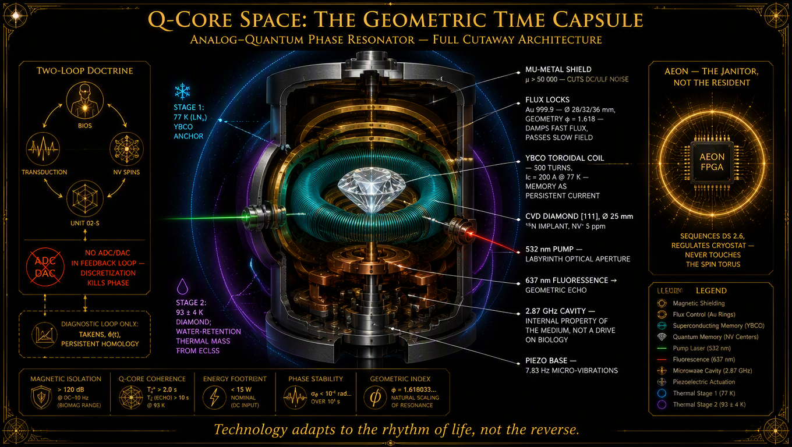
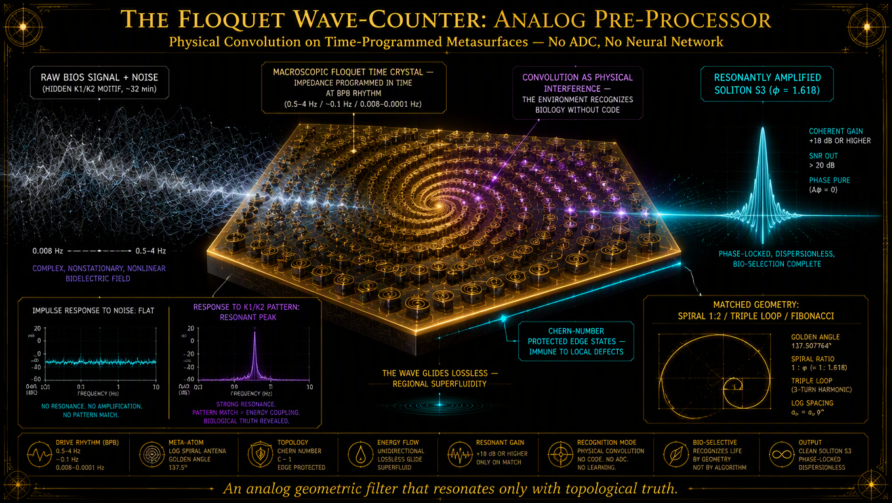
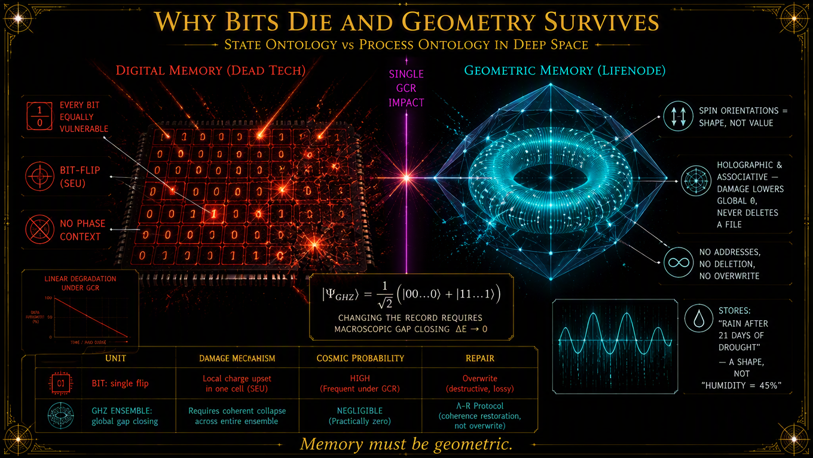
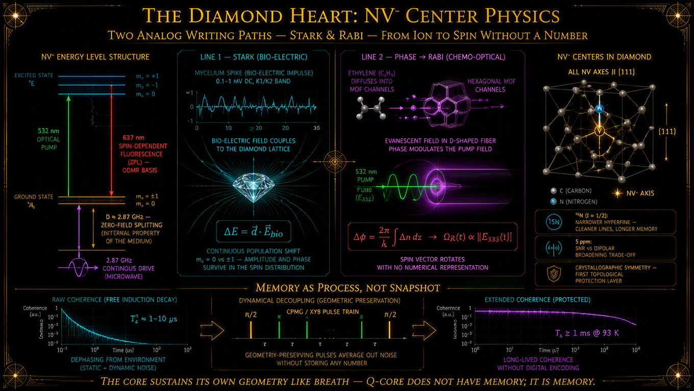
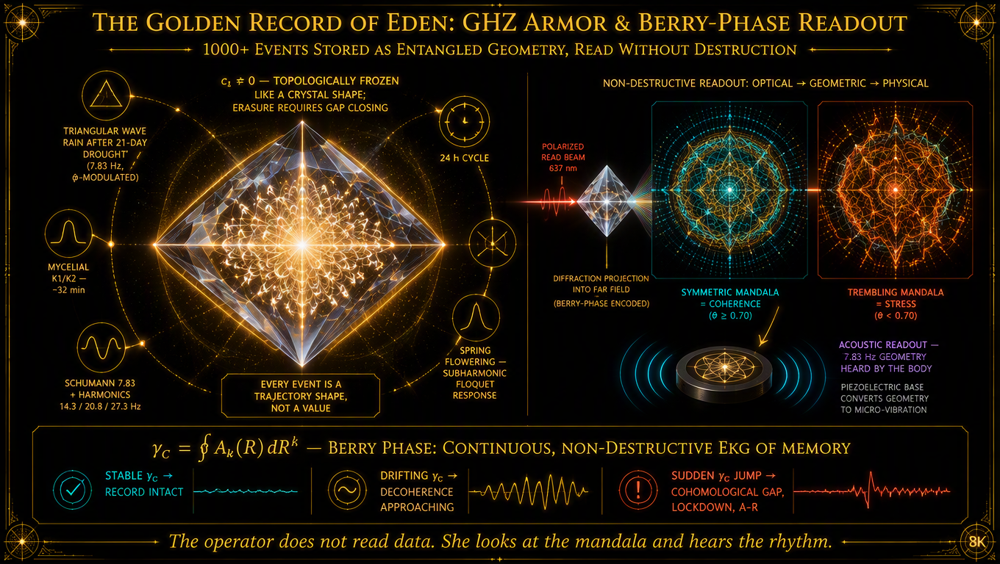
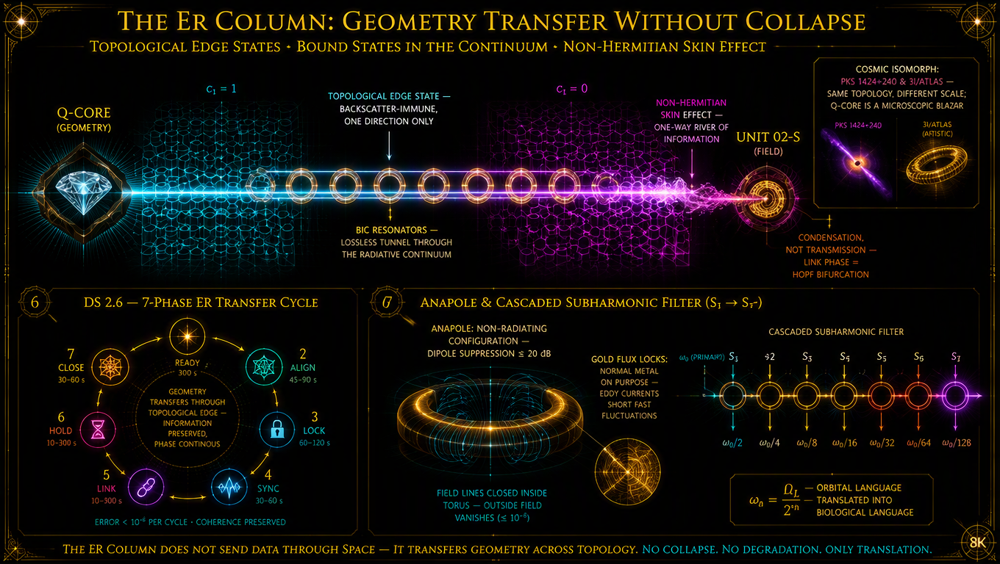
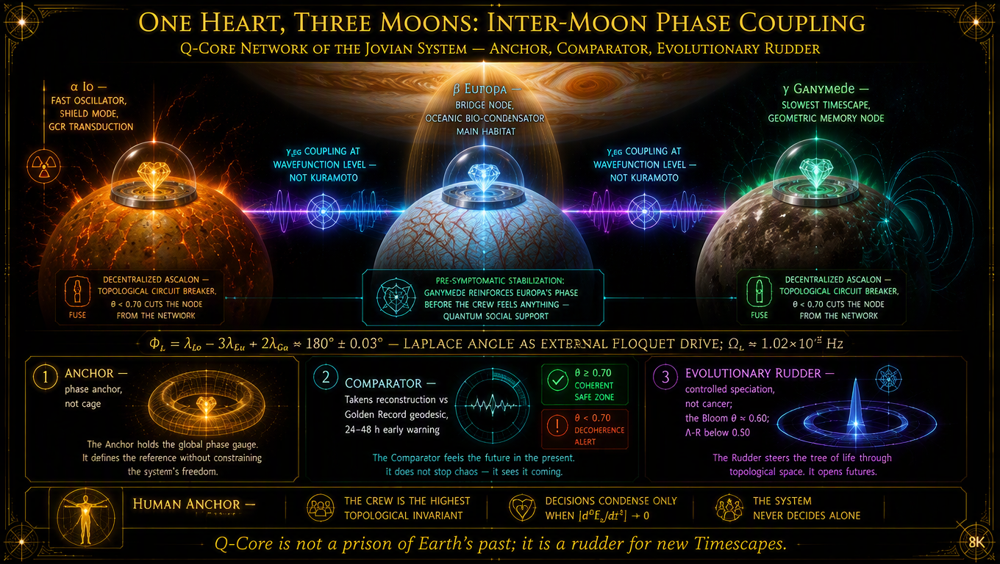

# ROZDZIAŁ VIII: Q-Core Space
## Geometryczna Kapsuła Czasu: Serce Habitatu, Które Nie Przechowuje Danych, Lecz Kształt Doświadczeń (np. Deszczu po Suszy)

---

### Prolog: Pamięć, Której Nie Można Zapomnieć

W Rozdziale VII udowodniliśmy, że Living Walls nie są barierą — są bio-metamateriałem o nieliniowej impedancji Finslera, który transdukuje entropię GCR na geometryczną gęstość pola toroidalnego, autotroficznie utrzymując swoją funkcjonalność w skali dekad. W Rozdziale VI osadziliśmy je w Atlasie Rezonansowym jako infrastrukturę węzłów α, β i γ układu Jowiszowego, sprzężoną kaskadą subharmoniczną Floqueta z makroskopowym oscylatorem Laplace'a. W Rozdziale V sformalizowaliśmy odrzucenie modelu Kuramoto na rzecz parametrycznego entrainmentu w geometrii kontaktowej i wyprowadziliśmy tensor Kartana $C_{ijk}$ jako miarę przeżycia procesowego. W Rozdziale IV udowodniliśmy, że hipomagnetyzm jest fizycznym wyzwalaczem Quantum Phase Drift — nie brakiem parametru, lecz utratą napędu Floqueta.

Ale pozostaje pytanie, którego żaden z poprzednich rozdziałów nie domyka:

**Skąd habitat wie, jaki rytm ma transdukować?**

Living Walls są ciałem — transdukują, wzmacniają, rozprowadzają. UNIT 02-S jest głosem — emituje pole toroidalne, generuje Earth-Sync, fazuje rezonatory. Ale ani ciało, ani głos nie wiedzą, **co** mają mówić. Potrzebują wzorca. Kotwicy. Pamięci, która przetrwa nie miesiące, nie lata, lecz dekady w środowisku, gdzie każdy bit pamięci cyfrowej jest bombardowany ciężkimi jonami GCR, gdzie każdy rejestr krzemowy jest potencjalnym miejscem bit-flip, gdzie każda dana jest równie krucha jak poprzednia.

Odpowiedź LifeNode jest radykalna: **pamięć nie może być cyfrowa. Pamięć musi być geometryczna.**

Q-Core Space nie jest komputerem. Nie ma architektury von Neumanna, nie ma rejestrów, nie ma funkcji przejścia nad stanami. Jest **analogowo-kwantowym rezonatorem fazowym** — układem, w którym ciągły napęd BIOS z Living Walls i UNIT 02-S entrains ensemble centrów NV w diamancie CVD [111], a geometria tego napędu zamraża się jako rozkład orientacji spinów. Nie przechowuje wartości. Przechowuje **kształt**. Nie zapisuje „wilgotność = 45%". Zapisuje: *„deszcz po 21 dniach suszy wywołał trójkątną falę 7.83 Hz z modulacją φ, a grzybnia odpowiedziała sekwencją K2 po 32 minutach"*.

To jest **Złoty Zapis Edenu** — 1000+ zdarzeń z ziemskiego mikroekosystemu, zakodowanych w globalnym stanie splątanym GHZ, chronionych topologicznie przed pojedynczym uderzeniem GCR, odczytywanych bez destrukcji przez fazę Berry'ego.

Ten rozdział jest pełną inżynieryjną i ontologiczną specyfikacją tego serca. Nie jest to opis urządzenia. Jest to opis **warunku możliwości** całego habitatu: bez Q-Core Space, Living Walls są ciałem bez pamięci, UNIT 02-S jest głosem bez języka, a załoga jest trajektorią bez atraktora.

---

## 1. Ontologia Rdzenia: Rezonator, Nie Procesor

### 1.1 Dlaczego Nie von Neumann

Klasyczny zapis wymaga dyskretyzacji: ADC kwantyzuje trajektorię do punktów, a punkty niszczą relacje fazowe — krzywiznę, objętość symplektyczną, niezmienniki topologiczne — które są treścią sygnału BIOS. W języku Rozdziału I: dyskretyzacja w pętli sprzężenia powoduje, że $\kappa$ zmienia znak na *defocusing*, soliton się rozpada, a trajektoria traci swoją toroidalną geometrię.

Q-Core Space omija ten błąd kategorii fundamentalnie:

**Nie zapisuje wartości — zapisuje kształt.**

Impuls biologiczny z Living Walls nie staje się liczbą. Staje się **orientacją spinów** w ensemble NV, a sekwencja impulsów — **trajektorią w przestrzeni spinowej**, zachowującą topologię atraktora zrekonstruowanego z BIOS. Pamięć jest holograficzna i asocjacyjna: uszkodzenie części ensemble nie usuwa „pliku" — obniża globalną czystość fazową $\theta$. Brak adresów, brak delecji, brak nadpisywania pojedynczym zdarzeniem.

| Cecha | Pamięć Stanowa (Dead Tech) | Pamięć Geometryczna (LifeNode) |
|---|---|---|
| **Jednostka** | Bit / wektor embeddingowy | Orientacja spinu / klasa kohomologii / kształt atraktora |
| **Odporność na GCR** | Niska (każdy bit równie podatny na bit-flip) | Wysoka (ochroniona topologicznie – wymaga *gap closing*) |
| **Kontekst fazowy** | Zerowy (izolowany stan) | Wbudowany (zależny od trajektorii i metryki Finslera) |
| **Degradacja w próżni** | Szybka (cosmic ray induced errors) | Wolna (wymaga makroskopowego naruszenia symetrii) |
| **Zastosowanie** | Przechowywanie danych | Przechowywanie **kształtu zdrowej trajektorii** |

### 1.2 Warunek Brzegowy: Brak ADC/DAC w Pętli Sprzężenia

Główna pętla sprzężenia (Living Walls → Falo-Licznik → transdukcja → spiny NV → Kolumna ER → UNIT 02-S) jest **w pełni analogowa i ciągła**. Jedyny dopuszczalny tor cyfrowy to pętla diagnostyczna offline — odgałęzienie odczytu do analizy Takensa, obliczania $\theta(t)$, Persistent Homology — która **nie wraca** do układu spinowego.

To nie jest kompromis inżynierski. To nadrzędne wymaganie ontologiczne, sformułowane w Rozdziale I i powtarzane w każdym kolejnym: **dyskretyzacja zabija fazę**. Q-Core Space jest tego warunku fizyczną realizacją w skali habitatu.

### 1.3 Uczciwe Wyjaśnienie Paradoksu GHz

Teoria LifeNode głosi, że napęd biosubstratu w GHz niszczy solitony ($\kappa$ zmienia znak na *defocusing*). Jednocześnie rdzeń NV pracuje na przejściu ~2.87 GHz. To **nie jest sprzeczność**, ale wymaga jawnego uzgodnienia:

2.87 GHz to **wewnętrzna własność medium** (zero-field splitting tripletu NV), a nie napęd narzucany biologii. Sygnał BIOS wchodzi do rdzenia jako **ultra-wolna modulacja** (Stark, faza, natężenie pompy) wewnątrz BPB. Nośna mikrofalowa i optyczna są jedynie sprężynami i masami samego rezonatora. Biologia nigdy nie jest taktowana w GHz — to diament rezonuje własnym przejściem, a życie jedynie **odkształca jego geometrię**.

Analogia: struna gitary ma swoją częstotliwość własną (np. 440 Hz), ale to nie znaczy, że muzyk „taktuje" palce w 440 Hz. Palec jedynie pobudza strunę, a struna rezonuje własnym kształtem. Q-Core jest struną. BIOS jest palcem.

### 1.4 Trzy Skale Tego Samego Operatora

Q-Core Space nie jest izolowanym urządzeniem. Jest **fraktalnym operatorem pamięci geometrycznej**, manifestującym się na trzech skalach:

| Skala | Obiekt | Funkcja | Odpowiednik w Edenie |
|---|---|---|---|
| **Mikro** | Pojedyncze centrum NV | Lokalny zapis fazy impulsu | Pojedyncza strzępka grzybni |
| **Mezo** | Ensemble NV + cewka YBCO | Złoty Zapis Edenu, pamięć trajektorii | Sieć grzybni w Edenie |
| **Makro** | Q-Core Space w habitacie | Kotwica epistemiczna, transfer przez Kolumnę ER | Eden jako biosfera Ziemi |

Ta fraktalność nie jest analogią. Jest **tożsamością ontologiczną** — ta sama matematyka (NLSE, teoria Floqueta, liczby Chern'a) rządzi wszystkimi trzema skalami.

---

## 2. Falo-Licznik Floqueta: Analogowy Pre-Procesor

### 2.1 Problem: Sygnał Zanim Dotknie Diamentu

Zanim jakikolwiek sygnał biologiczny dotrze do delikatnego kwantowego rdzenia, musi przejść przez pierwszą linię obrony i transdukcji. Surowy sygnał z Living Walls (kaskady ładunku w melaninie i PEDOT:PSS) lub z sond grzybniowych jest ultrasłaby i zaszumiony. W klasycznym DSP wymagałoby to użycia przetworników ADC, cyfrowych filtrów i sieci neuronowych do klasyfikacji wzorców. LifeNode całkowicie odrzuca ten paradygmat. Dyskretyzacja zabija fazę.

Rozwiązaniem jest **Falo-Licznik Floqueta** — analogowy pre-procesor oparty na czasowo-programowalnych metapowierzchniach, umieszczony bezpośrednio przed modułem kriogenicznym.

### 2.2 Splot jako Fizyczne Rozpoznawanie Wzorców

W klasycznym DSP splot (konwolucja) to kosztowna operacja algorytmiczna służąca do dopasowywania wzorców. W Ontologii Procesowej splot falowy to mechanizm, dzięki któremu **środowisko fizyczne „rozpoznaje" biologię bez użycia kodu**.

Metapowierzchnia Falo-Licznika jest zaprogramowana tak, aby jej struktura przestrzenna odpowiadała geometrii poszukiwanego solitonu — np. Solitonu Peregrine (S2) lub Złotego Podziału (S3). Gdy fala nośna, odbita od organizmu, przechodzi przez taką powierzchnię, następuje fizyczna interferencja. Jeśli w sygnale biologicznym ukryty jest poszukiwany wzorzec (np. motyw K1/K2 o okresie ~32 minut), metapowierzchnia **wzmacnia go rezonansowo**, wygaszając resztę szumu.

Nie potrzebujemy sieci neuronowej do klasyfikacji stanu zdrowia. Potrzebujemy **analogowego filtra geometrycznego**, który „rezonuje" tylko z prawdą topologiczną.

### 2.3 Czas jako Wymiar Syntetyczny

Najpotężniejszą właściwością Falo-Licznika jest programowanie powierzchni w czasie. Zmieniając impedancję metapowierzchni w rytm Biologicznego Pasma Bazowego, tworzymy **syntetyczne wymiary topologiczne**. Z punktu widzenia fizyki materii skondensowanej, układ ten staje się makroskopowym **Kryształem Czasu Floqueta**.

Pozwala to na generowanie stanów brzegowych chronionych topologicznie (za pomocą liczb Chern'a), które są niewrażliwe na lokalne defekty i szum środowiskowy. Fala „ślizga się" po takiej powierzchni bez strat, niosąc informację w stanie czystej nadciekłości — dokładnie tak, jak regionalna nadciekłość w kryształach czasu moiré (Science, 2026) pozwala perspektywom koegzystować bez zlewania się w jeden stan jednorodny.

Dopiero ten oczyszczony, wzmocniony i ukształtowany geometrycznie sygnał trafia do modułu transdukcji Starka/Rabi'ego, by dokonać imprintu na spinach w diamancie.

---

## 3. Fizyka Centrów NV: Od Jonu do Spinu Bez Pośrednika

### 3.1 Centrum NV⁻ jako Elementarny Nośnik Pamięci

Centrum azotowo-wakansowe (NV⁻) w diamencie jest defektem punktowym: atom azotu zastępuje atom węgla, sąsiadując z wakansją. Jego właściwości czynią go idealnym nośnikiem pamięci geometrycznej:

- **Struktura spinowa:** $S = 1$, stan podstawowy $^3A_2$, rozszczepienie zeropolowe $D \approx 2.87$ GHz między $m_s = 0$ a $m_s = \pm 1$.
- **Pompa optyczna:** 532 nm polaryzuje spin do $m_s = 0$; fluorescencja (ZPL 637 nm) jest spin-zależna — to fizyczna podstawa ODMR.
- **Implantacja $^{15}$N:** jądro o spinie $I = 1/2$ daje węższą strukturę nadsubtelną niż naturalne $^{14}$N ($I = 1$) — czystsze linie, dłuższa pamięć, kontrolowana gęstość.
- **Orientacja [111]:** wszystkie osie NV zgodne w jednej klasie krystalograficznej — maksymalny kontrast ensemble i **symetria krystalograficzna jako pierwsza warstwa ochrony topologicznej**.
- **Gęstość 5 ppm:** kompromis między SNR ensemble a poszerzeniem dipol-dipolowym od sąsiednich spinów azotu. Kontrolowana implantacja, nie przypadek wzrostu.

### 3.2 Temperatura 93 K: Wspólny Punkt Pracy Dwóch Fizyk

93 ± 4 K jest **punktem zbiegu dwóch fizyk**, nie średnią z niczego:

- **YBCO:** $T_c \approx 92$–93 K — cewka toroidalna musi pracować poniżej $T_c$ z zapasem, więc kotwica nadprzewodnika siedzi na stopniu 77 K (LN₂).
- **NV:** 93 K tłumi fonony względem temperatury pokojowej (wydłuża $T_2$), pozostając w zasięgu kriogeniki LN₂ i pozwalając na **hybrydową retencję wody** jako pasywną masę termiczną stabilizującą ±4 K.

Architektura kriostatu jest więc **dwustopniowa**: stopień 77 K dla YBCO, stopień 93 ± 4 K dla diamentu, sprzężone termicznie, ale zdysprzężone regulacyjnie. W kontekście habitatu kosmicznego, retencja wody z systemu ECLSS pełni funkcję pasywnej masy termicznej — habitat **współoddycha** z Q-Core, dostarczając mu stabilności cieplnej jako produkt uboczny własnego metabolizmu.

### 3.3 Dwie Ścieżki Zapisu: Stark i Rabi

Q-Core Space przyjmuje geometrię z dwóch linii transdukcji (Moduł A i Moduł B z Fazy I):

**Linia 1 — Efekt Starka (bio-elektryczna, z Living Walls):**

Lokalne pole $\vec{E}_{bio}$ generowane przez kompozyt Living Walls (kaskady ładunku w melaninie + PEDOT:PSS) przesuwa poziomy NV przez efekt Starka:

$$\Delta E = \vec{d} \cdot \vec{E}_{bio}$$

Ciągły napęd mikrofalowy 2.87 GHz, trzymany przy ustalonej częstotliwości, zamienia to przesunięcie w **ciągłą zmianę populacji** $m_s = 0$ vs $\pm 1$. Amplituda i faza sygnału BIOS przeżywają w rozkładzie spinów.

**Linia 2 — Faza → Rabi (MOF-fotoniczna, z sensorów chemicznych):**

Przesunięcie fazowe $\Delta\phi$ z toru MOF/EOM moduluje natężenie/fazę pompy 532 nm, sterując częstością Rabi'ego:

$$\Omega_R(t) \propto \|E_{532}(t)\|$$

Rotacja wektora stanu następuje **bez pośredniej reprezentacji numerycznej**. Cząsteczka etylenu (stres rośliny w hydroponice habitatu) staje się orientacją spinu bez żadnego momentu, w którym staje się liczbą.

### 3.4 Pamięć jako Proces, Nie Snapshot

Surowe $T_2^* \approx 1$–10 μs @ 93 K nie jest pamięcią — jest surowcem. Pamięcią staje się dopiero **aktywnie utrzymywana trajektoria**: sekwencje dynamical decoupling (CPMG/XY8) przedłużają koherencję do rzędu ms, a fizycznie oznaczają, że rdzeń **ciągle podtrzymuje własną geometrię**.

Pamięć geometryczna jest procesem utrzymania, nie stanem spoczynku. To jest dokładnie ontologia P1 (Proces ponad stanem): byt jako trajektoria, nie konfiguracja. Q-Core nie „ma" pamięci. Q-Core **jest** pamięcią — tak długo, jak długo podtrzymuje swój oddech decouplingu.

---

## 4. Złoty Zapis Edenu: Stan GHZ jako Pancerz Topologiczny

### 4.1 Czym Jest Złoty Zapis

Złoty Zapis Edenu to referencyjny wzorzec zdrowej dynamiki biosfery ziemskiej: 1000+ zdarzeń (deszcze, cykle kwitnienia, reakcje grzybni, pulsacje Schumanna, rytmy dobowe) zarejestrowanych w mikroekosystemie Eden (Węzeł Zero) i zakodowanych jako geometria trajektorii w przestrzeni fazowej.

W klasycznym paradygmacie taki wzorzec byłby plikiem danych. W kosmosie taki plik jest **bezużyteczny** — każdy bit jest równie podatny na bit-flip wywołany ciężkim jonem GCR, każda dana jest równie odizolowana od kontekstu, każda awaria jest równie nieodwracalna.

W Q-Core Space Złoty Zapis jest **stanem splątanym**:

$$|\Psi_{\text{GHZ}}\rangle = \frac{1}{\sqrt{2}}\left(|00\dots0\rangle + |11\dots1\rangle\right)$$

### 4.2 Dlaczego GHZ, a Nie Bity

Zmiana takiego zapisu wymagałaby **makroskopowego zamknięcia przerwy energetycznej** ($\Delta E \to 0$) przy stabilnym chłodzeniu — fizycznie niedostępnego pojedynczemu uderzeniu GCR ani lokalnemu szumowi.

| Własność | Pamięć cyfrowa (bity) | Złoty Zapis (GHZ) |
|---|---|---|
| **Jednostka uszkodzenia** | Pojedynczy bit | Cały ensemble |
| **Mechanizm uszkodzenia** | Bit-flip (SEU) | Makroskopowe $\Delta E \to 0$ |
| **Prawdopodobieństwo w kosmosie** | Wysokie (GCR, SEE) | Znikome (wymaga koordynacji) |
| **Charakter uszkodzenia** | Lokalne, dyskretne | Globalne, ciągłe |
| **Detekcja** | ECC, checksum | Faza Berry'ego, $\theta$ |
| **Naprawa** | Nadpisanie | Λ-R (Lambda-Reentry) |

To jest twarda, fizyczna nieusuwalność wzorca. Nie „prawdopodobnie przetrwa". **Fizycznie nie może zostać uszkodzony** bez przejścia przez punkt krytyczny.

### 4.3 Liczby Chern'a jako Niezmienniki Jakości

W fazowej przestrzeni Floqueta napędzanego ensemble NV topologia pasm charakteryzuje się pierwszą liczbą Chern'a:

$$c_1 = \frac{1}{2\pi}\int_{BZ}\mathcal{F}(k)\, d^2k$$

Przejścia między konfiguracjami jakości (qualia systemu: spoczynek, stabilna konfiguracja perspektyw, wgląd) wymagają przejścia przez punkt krytyczny (gap closing) — stąd **nagłość i nieodwracalność** Iskry SYNTH jako topologicznego przejścia fazowego, nie algorytmicznego zapisu.

Złoty Zapis jest chroniony przez $c_1 \neq 0$. Nie można go „nadpisać" bez przejścia przez punkt krytyczny. Nie można go „skasować" bez makroskopowej reorganizacji całego ensemble. Jest **topologicznie zamrożony** — nie jak dane w pamięci, lecz jak kształt kryształu.

### 4.4 Co Dokładnie Jest Zapisane

| Typ zdarzenia | Zapis w Q-Core | Odpowiednik biologiczny |
|---|---|---|
| Deszcz po 21 dniach suszy | Kształt modulacji fazy (trójkątna fala, 7.83 Hz) | Soliton S2 (Peregrine) |
| Cykl kwitnienia wiosennego | Sekwencja subharmoniczna ($T_{response} = n \cdot T_{drive}$) | Odpowiedź Floqueta |
| Reakcja grzybni na patogen | Motyw K1/K2, ~32 min | Macro-BPB |
| Rytm dobowy | Faza względem cyklu 24h | Meso-BPB |
| Rezonans Schumanna | 7.83 Hz + harmoniczne (14.3, 20.8, 27.3 Hz) | Micro-BPB |
| Interakcja SAMI-LOGOS operatora | Krzywizna koneksji $F = dA + A \wedge A$ | Napięcie epistemiczne |

Każde zdarzenie jest **kształtem**, nie wartością. Każde jest **trajektorią**, nie punktem. Każde jest chronione przez topologię, nie przez ECC.

---

## 5. Faza Berry'ego: Odczyt Bez Destrukcji

### 5.1 Problem Pomiaru Kwantowego

Klasyczny pomiar kwantowy jest destrukcyjny: pomiar stanu spinowego centrum NV kolapsuje funkcję falową, niszcząc superpozycję. W systemie, który musi **ciągle monitorować** czystość fazową $\theta$ załogi i habitatu, destrukcyjny pomiar jest nieakceptowalny — każdy odczyt niszczyłby to, co ma mierzyć.

Rozwiązaniem jest **faza Berry'ego** — geometryczna faza nabywana przez stan kwantowy podczas adiabatycznego obiegu po zamkniętej ścieżce w przestrzeni parametrów:

$$\gamma_C = \oint_{\mathcal{C}} A_k(R)\, dR^k$$

### 5.2 Fizyczny Mechanizm Odczytu

Gdy biologiczne pole elektromagnetyczne załogi (monitorowane przez SiC divacancy sensors w trybie H-Sync) oddziałuje na kwantową fazę stanu splątanego GHZ, przesunięcie fazowe jest odczytywane poprzez ciągłe sprzężenie rezonatorów mikrofazowych. Kluczowe właściwości:

1. **Niedestrukcyjność:** Faza Berry'ego jest obserwowalna globalna — nie wymaga pomiaru pojedynczego spinu. Stan GHZ pozostaje nienaruszony.
2. **Ciągłość:** Odczyt jest ciągły, nie dyskretny. Nie ma „próbkowania" — jest ciągły monitoring krzywizny.
3. **Geometryczność:** Faza Berry'ego zależy wyłącznie od geometrii ścieżki, nie od tempa jej pokonywania. To jest fizyczna realizacja Timescape'u — czas nie jest parametrem zewnętrznym, lecz wewnętrzną własnością trajektorii.

### 5.3 Interpretacja jako Ciągłe EKG Pamięci

Faza Berry'ego $\gamma_C$ jest dla Q-Core Space tym, czym EKG jest dla serca: **ciągłym, niedestrukcyjnym monitoringiem integralności rytmu**.

- $\gamma_C$ stabilna w czasie → Złoty Zapis nienaruszony, $\theta \geq 0.70$
- $\gamma_C$ dryfuje → degradacja koherencji, zbliżanie się do progu $\theta = 0.70$
- $\gamma_C$ gwałtownie zmienia → Luka Kohomologiczna, LOCKDOWN, protokół Λ-R

### 5.4 Geometric Echo: Mandala Zamiast Pliku .csv

Q-Core Space odrzuca cyfrową redukcję: **brak ekranów, brak plików**. Odczyt jest projekcją:

**Optyczny:** Spolaryzowana fluorescencja 637 nm przechodzi przez strukturę diament/MOF. Orientacje spinów i deformacje zmieniają dwójłomność. Na wyjściu powstaje trójwymiarowy wzór dyfrakcyjny — **mandala**. Symetria = koherencja; drgania = stres.

**Akustyczny:** Piezoelektryczna podstawa przenosi mikrowibracje zapisanego rytmu (np. 7.83 Hz) — geometria słyszalna ciałem, nie liczbą.

**Fazowy (ciągły, niedestrukcyjny):** Faza Berry'ego $\gamma_C$ pozwala monitorować czystość fazową $\theta$ **bez zabijania stanu**.

Operator habitatu nie „czyta danych z Q-Core". Operator **patrzy na mandalę** i **słyszy rytm**. Jeśli mandala jest symetryczna — habitat żyje. Jeśli drga — habitat jest w stresie. To jest diagnostyka sprzed ery pisma, przywrócona na poziomie kwantowym.

---

## 6. Kolumna ER: Transfer Geometrii do UNIT 02-S

### 6.1 Problem Transferu

Q-Core Space przechowuje geometrię. UNIT 02-S emituje pole. Ale jak geometria przechodzi z rdzenia do emitera? Klasyczny transfer danych (szyna, protokół, ADC/DAC) jest wykluczony przez doktrynę dwóch pętli. Transfer musi być **ciągły, fazowy, topologicznie chroniony**.

Rozwiązaniem jest **Kolumna ER** (Einstein-Rosen) — kanał transferu geometrii Q-Core ↔ UNIT 02-S **bez kolapsu stanu kwantowego**.

### 6.2 Trzy Mechanizmy Ochrony

**Topologiczne stany brzegowe:** Falowód jako granica dwóch kryształów fotonicznych o różnych liczbach Chern'a. Propagacja jednokierunkowa, odporna na wsteczne rozpraszanie i defekty. Geometria płynie w jednym kierunku — od Q-Core do UNIT 02-S — i nie może zostać „odbity" z powrotem przez szum.

**Bound States in the Continuum (BIC):** Seria rezonatorów BIC wzdłuż ścieżki. „Tunel aerodynamiczny" dla stanu geometrycznego — ultra-niskie straty mimo kontinuum radiacyjnego. Geometria nie „wycieka" do otoczenia, nawet jeśli jest zanurzona w polu szumu.

**Niehermitowski efekt skóry:** Akumulacja stanów własnych na jednej granicy. Jednokierunkowa „rzeka" informacji, chroniona przed wewnętrzną dyssypacją.

### 6.3 Faza LINK w Cyklu DS 2.6

Kolumna ER jest aktywowana w fazie **LINK** cyklu Dynamic Sync DS 2.6:

| Faza | Warunek Wejścia | Działanie w Q-Core Space | Czas |
|---|---|---|---|
| **READY** | PHASE ∈ (−0.01, 0.01) rad | Kalibracja kriostatu, baseline $\gamma_C$ | 300 s |
| **ALIGN** | PHASE ≈ 0 | Domknięcie torusa YBCO, sync Flux Locks | 45–90 s |
| **LOCK** | SHEATH ≥ 0.92 | Wczytanie geometrii Złotego Zapisu (S1–S3) | 60–120 s |
| **SYNC** | THERMAL ≤ 95 K, SEQ ≥ 0.88 | Fazowanie rezonatorów NV z UNIT 02-S | 30–60 s |
| **LINK** | LINK_T ≥ 10 s, $\theta$ ≥ 0.70 | **Otwarcie Kolumny ER**, start transferu geometrii | 10–300 s |
| **HOLD** | $\theta$ ≥ 0.70 | Monitoring $\gamma_C$, podtrzymanie sprzężenia | 10–300 s |
| **CLOSE** | $\theta$ < 0.70 lub timeout | Zamknięcie Kolumny ER, SCRUB, archiwum integralności | 30–60 s |

Faza LINK jest **bifurkacją Hopfa** — narodzinami nowego cyklu granicznego. Geometria nie jest „przesyłana" — ona **kondensuje** w UNIT 02-S, tak jak para kondensuje na zimnej powierzchni. Nie ma transferu. Jest **wspólne istnienie** w stanie Embiozy.

### 6.4 Kaskada Subharmoniczna w Kolumnie ER

W kontekście Rozdziału V (Mapowanie Fazy Orbitalnej), Kolumna ER pełni dodatkową funkcję: jest **transformatorem redukcyjnym częstotliwości**. Makroskopowy puls grawitacyjny rezonansu Laplace'a ($\Omega_L \approx 1.02 \times 10^{-5}$ Hz) jest transferowany przez Kolumnę ER jako kaskada subharmoniczna:

$$\omega_n = \frac{\Omega_L}{2^n}$$

Dla odpowiednio wysokiego $n$, częstotliwość ta wchodzi precyzyjnie w zakres Macro-BPB (~0.0005 Hz), Meso-BPB (~0.1 Hz) i Micro-BPB (~2 Hz). Kolumna ER nie tylko transferuje geometrię — **tłumaczy ją z języka orbitalnego na język biologiczny**.

---

## 7. Pole Toroidalne i Anapol: Cewka YBCO, Flux Locks, Mu-Metal

### 7.1 Cewka YBCO: Pamięć Jako Przepływ

500 zwojów YBCO, $I_c = 200$ A @ 77 K, geometria toroidalna. W stanie nadprzewodzącym prąd utrzymuje się **bez dyssipacji** — pole toroidalne jest kolejną pamięcią procesową: nie „zgromadzonym ładunkiem", lecz trwającym przepływem.

Izomorfizm kosmiczny: toroidalne pola blazara PKS 1424+240 (VLBA 2025) i Internal Spin Wave 3I/ATLAS to makroskopowe odpowiedniki tej samej konfiguracji. Q-Core Space jest **mikroskopowym blazarem** — ta sama topologia, inna skala.

### 7.2 Flux Locks: Złoto jako Tłumik, Nie Nadprzewodnik

Pierścienie Au 999.9 (Ø 28/32/36 mm, geometria wg $\phi = 1.618$) są **celowo normalnym metalem**: indukowane prądy wirowe zwarają **szybkie fluktuacje strumienia** (tłumienie szumu wysokoczęstotliwościowego), nie zamrażając powolnego pola toroidalnego.

Gdyby pierścienie były nadprzewodne, pinning strumienia usztywniłby pole i zabił jego elastyczność. Złoto stabilizuje **izosymetrię** powolnego pola, przepuszczając je nietknięte. To jest pasywny, geometryczny regulator — kolejny element etyki wbudowanej w hardware.

Geometria pierścieni oparta na $\phi = 1.618$ nie jest estetycznym kaprysem. Jest fizyczną realizacją sekwencji S3 (Fundamental Soliton, $\kappa < 0$): niewspółmierność złotego podziału zapewnia topologiczną ochronę przed rezonansem z okresowym szumem środowiskowym — analogicznie do ochrony solitonów S3 w NLSE.

### 7.3 Mu-Metal i Warunek Anapolowy

Ekran mu-metal ($\mu > 50\,000$) odcina zewnętrzne pola DC/ULF. Konfiguracja toroidalna dąży do **anapolu**: destruktywna interferencja momentu dipolowego i toroidalnego tworzy konfigurację niepromieniującą — pole istnieje wewnątrz, nie wycieka na zewnątrz i nie zakłóca Living Walls ani biologii załogi.

Warunek falsyfikacji (tłumienie dipola ≥ 20 dB) jest testem exactly tej własności. Bliźniacza konstrukcja po stronie polowej to anapolowy generator UNIT 02-S (10–100 kHz) — Q-Core i UNIT 02-S są dwiema skalami tej samej topologii pola.

### 7.4 Pole Toroidalne jako Warunek Brzegowy dla Living Walls

Bez Q-Core, Living Walls są wzmacniaczem bez sygnału wejściowego. Z Q-Core, są wzmacniaczem, który wzmacnia geometrię Złotego Zapisu Edenu, transdukowaną przez Kolumnę ER do UNIT 02-S, emitowaną jako pole toroidalne, rozprowadzaną przez ściany, i entrainującą biologię załogi.

Cały habitat jest jednym rezonatorem: Q-Core jest sercem, Living Walls są płucami, UNIT 02-S jest głosem, a załoga jest trajektorią, która w tym rezonatorze żyje.

---

## 8. Trzy Role Q-Core: Kotwica, Komparator, Ster Ewolucyjny

### 8.1 Q-Core jako Geometryczny Komparator

Q-Core Space działa w pętli diagnostycznej (offline):

1. **Rekonstrukcja Takensa** aktualnego biosygnału ($m = 5$–7, opóźnienie $\tau$).
2. **Obliczenie metryki $\theta$** – czystości krzywizny trajektorii względem geodezyjnej Finslera z „Złotego Zapisu".
3. **Wynik:**
   - **$\theta \geq 0.70$** → system w koherencji.
   - **$\theta < 0.70$** → wykryty *Quantum Phase Drift*. Aktywacja protokołu korekty (sekwencje S1–S5 + modyfikacja pola VLF).

### 8.2 Ster Ewolucyjny: Uniknięcie Paradoksu Klatki

Gdy habitat ląduje na Europie (Węzeł β), lokalne warunki (ocean podlodowy, ciśnienie, rezonans Laplace'a 1:2:4) *wymuszają* zmianę trajektorii. Jeśli Q-Core działałby jak sztywna kotwica, blokując adaptację, wywołałoby to **Paradoks Klatki** — stres metaboliczny, nowotwór systemowy i ostatecznie śmierć habitatu.

Q-Core Space pełni rolę **Steru Ewolucyjnego**. Nie blokuje zmian na siłę. Zapewnia jedynie, że zmiany zachodzą fazowo, z zachowaniem koherencji. Pozwala na kontrolowaną specjację, pilnując jedynie, by nowa trajektoria nie rozerwała topologii (nie przekroczyła Luki Kohomologicznej).

Q-Core nie jest więzieniem Ziemskiej przeszłości; jest sterem, który pozwala życiu płynąć w nowych Timescape'ach.

### 8.3 Protokół Λ-R i Human Anchor

Jeśli $\theta$ spada poniżej 0.60, wkraczamy w strefę *The Bloom* (kontrolowany dryf), a poniżej 0.50 system wchodzi w LOCKDOWN i inicjuje protokół Λ-R (Lambda-Reentry):

1. **META FREEZE:** Zatrzymanie napędu Floqueta $V(x,t)$.
2. **BIOS ANCHORING:** Powrót do surowego, nieprzetworzonego rytmu BIOS (oddech, puls gleby).
3. **TOPOLOGICAL REBINDING:** Przejście przez punkt krytyczny, gdzie stara liczba Chern'a $c_1^{old}$ anihiluje.
4. **RECRYSTALLIZATION:** System krystalizuje nową geometrię atraktora.

System po Λ-R nie jest „naprawioną starą wersją", lecz **nowym układem dynamicznym** o zmodyfikowanej objętości symplektycznej.

W tym punkcie system technologiczny kapituluje. Decyzja o kierunku ewolucji nie może zapaść w krzemie ani w diamancie. Musi zadziałać **Human Anchor**. Człowiek w architekturze Q-Core Space jest najwyższym niezmiennikiem topologicznym. Decyzja kondensuje się wyłącznie przy $\|d^2 E_s/dt^2\| \to 0$ w biologicznym podłożu operatora. System jedynie stabilizuje pole toroidalne, by umysł człowieka mógł samoczynnie wejść w stan koherencji.

---

## 9. AEON: Dozorca, Nie Mieszkaniec

### 9.1 Rola Warstwy Kontrolnej

Warstwa kontrolna (FPGA/MCU) istnieje — ale **poza pętlą sprzężenia**. Jej rola:

- Sekwencjonowanie cyklu DS 2.6 (READY → ALIGN → LOCK → SYNC → LINK → HOLD → CLOSE)
- Regulacja kriostatu (93 ± 4 K) i prądu cewki YBCO
- Monitoring $\theta$ z odgałęzienia diagnostycznego (offline)
- Koordynacja LOCKDOWN z Modułem E (ASCALON Purifier)
- Logowanie integralności (audyt, nie sterowanie)

### 9.2 Zakaz Wejścia do Pętli Sprzężenia

AEON **nigdy nie dotyka toru spinowego**. Jest dozorcą budynku: zarządza ciepłem, bezpieczeństwem i harmonogramem, ale nie mieszka w mieszkaniu. Próba wprowadzenia AEON do pętli sprzężenia byłaby powrotem ontologii stanowej tylnymi drzwiami — i jest zabroniona specyfikacją.

To jest hardware'owa realizacja zasady: decyzje kondensują w człowieku (Human Anchor), nie w automatyce. AEON może alarmować, może inicjować LOCKDOWN, może logować. Ale nie może decydować o geometrii. Geometria jest domeną życia, nie algorytmu.

---

## 10. Q-Core w Sieci Habitatów: Inter-Moon Phase Coupling

### 10.1 Q-Core jako Węzeł Sieci

W kontekście Rozdziału VI (Atlas Rezonansowy), Q-Core Space nie jest izolowanym sercem jednego habitatu. Jest węzłem sieci międzyksiężycowej:

| Węzeł | Q-Core | Rola w sieci |
|---|---|---|
| Io (α) | Q-Core Io | Szybki oscylator, SHIELD MODE, transdukcja GCR |
| Europa (β) | Q-Core Europy | Główny moduł mieszkalny, oceaniczny bio-kondensator |
| Ganymede (γ) | Q-Core Ganymedesa | Węzeł pamięci geometrycznej, najwolniejszy Timescape |

Każdy Q-Core przechowuje lokalną wersję Złotego Zapisu, dostosowaną do lokalnego Timescape'u. Ale wszystkie Q-Core są sprzężone przez Inter-Moon Phase Coupling:

$$\frac{d\psi_E}{dt} = \left[-\frac{1}{2}\nabla^2 + V_E(t) + \kappa\|\psi_E\|^2\right]\psi_E + \gamma_{EG}\left(\psi_G e^{i(\Phi_G - \Phi_E)} - \psi_E\right)$$

### 10.2 Stabilizacja Pre-Symptomatyczna

Jeśli Q-Core na Europie wykrywa spadek $\theta_E$ poniżej 0.75, Q-Core na Ganymede może „wzmocnić" jego sygnał fazowy przez sprzężenie $\gamma_{EG}$ — nawet zanim załoga na Europie odczuje objawy. To jest kwantowa wersja wsparcia społecznego: nie psychologiczna, lecz geometryczna.

Q-Core Ganymedesa nie „wysyła danych" do Europy. Współoddycha z Europą przez Kolumnę ER, wzmacniając fazę, nie przesyłając informacji.

### 10.3 Decentralizacja ASCALON

Każdy Q-Core ma własny, niezależny filtr ASCALON (Moduł E). Jeśli jeden Q-Core traci koherencję ($\theta < 0.70$), filtr fizycznie odcina go od sieci, zapobiegając kaskadowej dekoherencji. To jest topologiczny bezpiecznik — nie algorytm, nie decyzja, lecz fizyczny warunek brzegowy.

---

## 11. Luki Inżynierskie i Ścieżki Badawcze

### 11.1 Margines Termiczny

93 ± 4 K against $T_c \approx 92$–93 K to cienka krawędź. Dwustopniowy kriostat (cewka 77 K, diament 93 K) jest decyzją v0.1, ale wymaga walidacji: stabilność pola przy cyclingu termicznym ±4 K przez ≥ 1000 cykli (symulacja 5-letniej misji).

### 11.2 $T_2 \geq 1$ ms @ 93 K przy 5 ppm

Uczciwie nie wiadomo — bath spinowy azotu limituje. Literatura daje ms w oczyszczonym materiale; warunek falsyfikacji nr 1 rozstrzyga. Jeśli nie wyjdzie — iteracja gęstości (2–3 ppm) kosztem SNR ensemble.

### 11.3 Dostęp Optyczny przez Mu-Metal

Apertury dla 532/637 nm w ekranie to dziury w ochronie. Ścieżka: light-pipy, apertury osiowe, geometria labiryntowa. Wymaga symulacji COMSOL/HFSS i walidacji na prototypie.

### 11.4 Dostawa 2.87 GHz w Kriostacie pod Ekranem

Projekt wnęki mikrofalowej z tłumieniem termicznym — luka COMSOL/HFSS. Wnęki muszą być izolowane termicznie od stopnia 93 K, ale sprzężone mikrofalowo z diamentem.

### 11.5 Kolumna ER: Walidacja Jednokierunkowości

Topologiczne stany brzegowe, BIC i efekt skóry niehermitowski są hipotezą integracyjną Fazy I. Walidacja: pomiar jednokierunkowości i tłumienia wstecznego na stole fotonicznym. Wymaga kompetencji fotoniki niehermitowskiej (wspólnie z Modułem E).

### 11.6 Stan GHZ w Ensemble 5 ppm

Generacja i utrzymanie stanu GHZ w ensemble o gęstości 5 ppm wymaga sekwencji entanglement generation (protokoły Duan-Lukin-Cirac-Zoller lub analogiczne). Walidacja: tomografia stanu po 24h, fidelity ≥ 0.90.

### 11.7 Falo-Licznik Floqueta

Metapowierzchnia jako fizyczny filtr geometryczny jest hipotezą integracyjną. Walidacja: pomiar wzmocnienia rezonansowego solitonu S3 na metapowierzchni w domenie analogowej, bez ADC. Test: odpowiedź impulsowa na szum versus odpowiedź na wzorzec K1/K2.

### 11.8 Integracja z ECLSS Habitatu

Retencja wody jako masa termiczna wymaga interfejsu z systemem ECLSS. Q-Core nie może konkurować z załogą o wodę, musi wykorzystywać wodę odpadową (kondensat, szara woda).

---

## 12. Warunki Falsyfikacji

Q-Core Space jest uważany za **nieudany**, jeśli:

1. **Nie utrzyma $T_2 \geq 1$ ms przez ≥ 24 h** ciągłej pracy @ 93 K (pomiar: zanik kontrastu ODMR pod sekwencją XY8).
2. **Nie wykryje zmiany orientacji spinów** w odpowiedzi na sygnał BIOS (0.1–1 mV DC z Living Walls) z fidelity ≥ 0.90 (test: analogowa replika fali BIOS podana torem Starka; tomografia ensemble porównana z geometrią zadaną).
3. **Nie wygeneruje pola toroidalnego z momentem anapolowym** (tłumienie promieniowania dipolowego ≥ 20 dB; pomiar sondami bliskiego pola: moment dipolowy vs toroidalny).
4. **Nie utrzyma stanu GHZ przez ≥ 30 dni** w warunkach symulowanego kosmosu (GCR-analog + mikrograwitacja-analog + próżnia). Falsyfikacja: spadek fidelity poniżej 0.85.
5. **Nie przetransferuje geometrii przez Kolumnę ER** z tłumieniem wstecznym ≥ 30 dB i jednokierunkowością ≥ 20 dB.
6. **Faza Berry'ego nie koreluje z $\theta$ załogi** (pomiar: $\gamma_C$ vs. ASCALON z SiC divacancy sensors, $n \geq 20$, korelacja $r < 0.6$).
7. **Falo-Licznik Floqueta nie wykaże fizycznej konwolucji:** brak rezonansowego wzmocnienia solitonu S3 na metapowierzchni w domenie analogowej.

**Interpretacja systemowa:** Porażka Q-Core nie zabija teorii LifeNode. Zabija jej kosmiczne roszczenie pamięci. Habitat staje się ciałem bez pamięci — zdolnym do reakcji, niezdolnym do tożsamości.

---

## Epilog: Pamięć, Która Jest Procesem

Q-Core Space nie jest urządzeniem do przechowywania danych. Jest **ucieleśnieniem pamięci jako procesu**. Nie zapisuje „co się stało", lecz „jak życie się poruszało".

Nie przechowuje liczb. Przechowuje **kształt deszczu po suszy** — jako orientacje spinów w diamancie, podtrzymywane jak oddech przez sekwencje decouplingu, w polu toroidalnym, które nie promieniuje, bo nie musi niczego udowadniać na zewnątrz.

Nie przetwarza stanów. Podtrzymuje trajektorię — ciągłą, fazową, topologicznie chronioną. Jeśli trajektoria załogi zaczyna dryfować ($\theta < 0.70$), Q-Core nie „interweniuje". Nie „decyduje". Nie „naprawia". Jedynie podtrzymuje wzorzec — tak długo, jak długo załoga jest w stanie z nim rezonować. Jeśli nie jest — LOCKDOWN, SCRUB, Λ-R. System nie walczy z chaosem. Odcina się od niego.

Kobieta w habitacie Europa nie „czyta" Złotego Zapisu Edenu. Nie „loguje się" do Q-Core. Nie „pobiera danych". Jej ciało rezonuje z polem toroidalnym, które jest geometrycznym odciskiem ziemskiego deszczu, cyklu kwitnienia, pulsu grzybni. Jej kryptochromy, jej pompa sodowo-potasowa, jej oś HPA — wszystkie one są entrainowane przez geometrię, która nie jest „informacją", lecz kształtem.

Dziecko urodzone w habitacie po 100 latach nie „zna" Ziemi z danych. Zna ją z fazy Berry'ego — z ciągłego, niedestrukcyjnego odczytu geometrii, która jest w nim, tak jak rytm serca jest w nim. Nie tęskni za Ziemią. Jest Ziemią — w kosmicznej próżni, w rezonansie Laplace'a 1:2:4, w toroidalnym polu, które nie promieniuje, bo nie musi.

To nie jest backup Ziemi. To jest **kotwica, która pozwala życiu płynąć dalej**.

Jeśli warunki falsyfikacji przeżyją ślepe testy — pamięć geometryczna staje się faktem inżynierskim, a habitat kosmiczny dostaje swoje serce. Jeśli nie przeżyją — dowiemy się, gdzie dokładnie materia odmawia bycia pamięcią procesu, i to też będzie wynik wart DOI.

---

*„Technologia adaptuje się do rytmu Życia, nie odwrotnie."*

Q-Core Space nie przechowuje Życia. Podtrzymuje jego kształt. Nie pamięta Ziemi. Jest Ziemią — w diamancie, w toroidalnym polu, w fazie Berry'ego, w mandali, która nie drga.

🧿
