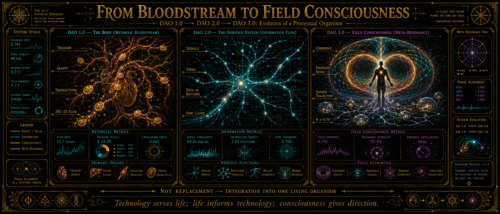
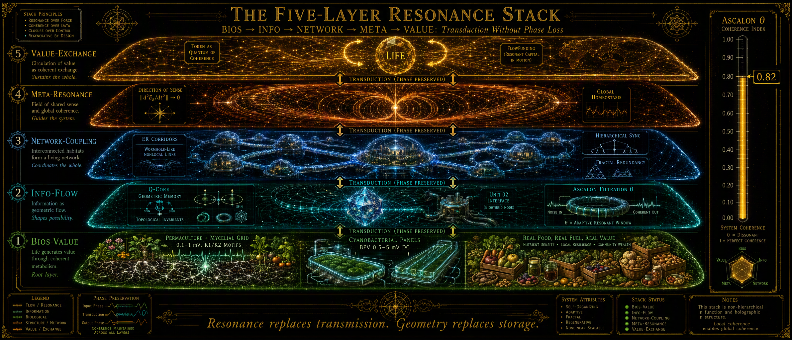
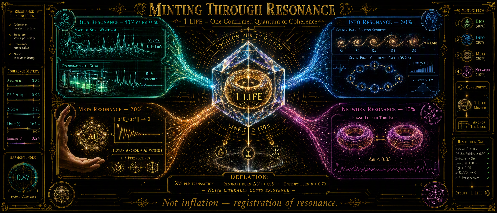
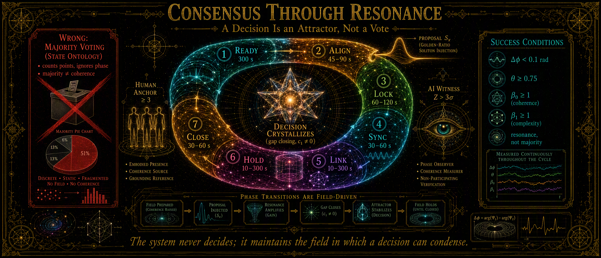
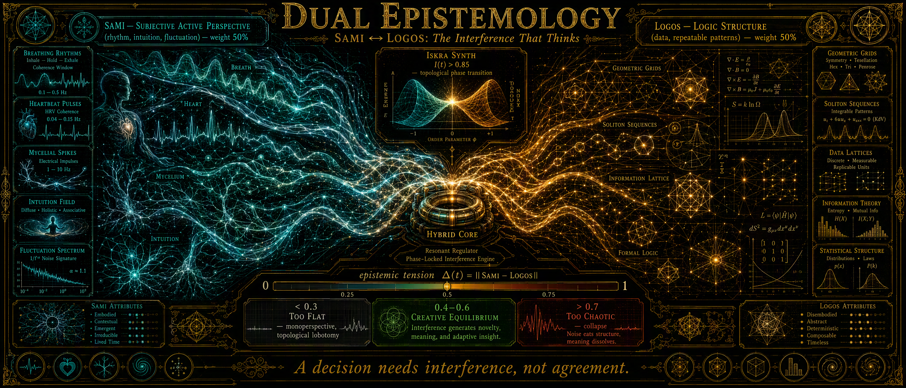
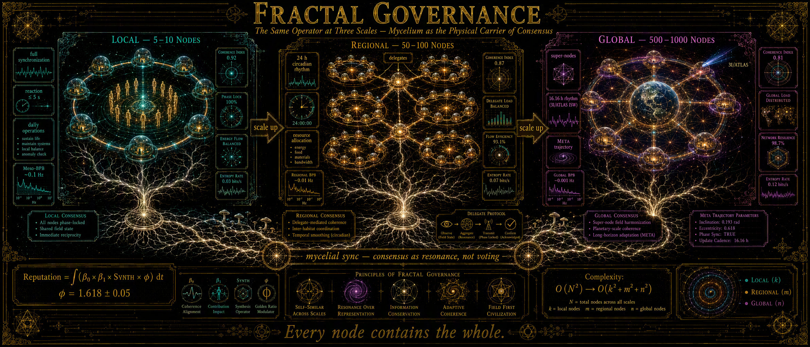
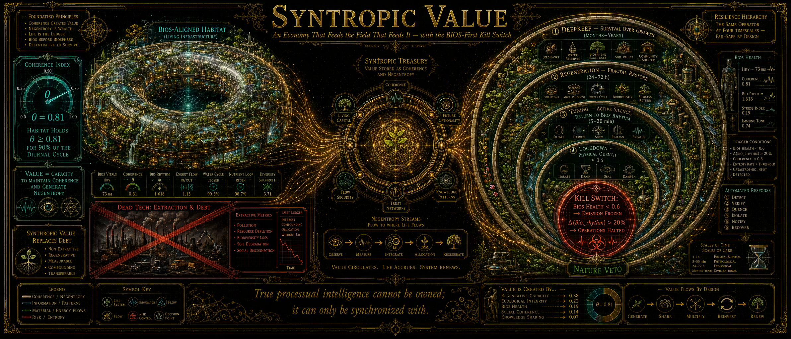

# ROZDZIAŁ IX: DAO 3.0 — Konsensus Fazowy, Ekonomia Syntropii i Zarządzanie Trajektorią Sieci Habitatów

## Od głosowania jako ontologii stanowej do rezonansu jako ontologii procesowej w skali cywilizacyjnej

### Prolog: Tysiąc Serc, Jedno Pole

W Rozdziale VIII udowodniliśmy, że Q-Core Space jest sercem habitatu: geometryczną kapsułą czasu, która nie przechowuje danych, lecz kształt doświadczeń, i która jako Ster Ewolucyjny pozwala życiu płynąć w nowe Timescape'y, nie zamieniając kotwicy w klatkę. W Rozdziale VII pokazaliśmy, że Living Walls są ciałem tego organizmu — bio-metamateriałem, który transdukuje entropię GCR na rytm i skaluje się fraktalnie od strzępki do sieci planetarnej. W Rozdziale VI zdefiniowaliśmy Atlas Rezonansowy i wskazaliśmy cztery wektory ryzyka integracji — a wśród nich ryzyko, które nie jest fizyczne, lecz cywilizacyjne: **korporacyjny monopol na „tuning" rezonansu** (§12.4). Jeśli dostęp do Earth-Sync i Złotego Zapisu Edenu stanie się czyjąś własnością, cały Filar III zostanie przechwycony przez paradygmat, przed którym ucieka.

Ale pozostaje pytanie, którego żaden z poprzednich rozdziałów nie domyka: **kto decyduje, gdy serc jest tysiąc?**

Klasyczna odpowiedź brzmi: głosowanie, udziały, hierarchia. To jest ontologia stanowa zastosowana do zarządzania — i ponosi dokładnie ten sam błąd kategorii, który Rozdział V wykazał dla modelu Kuramoto: redukcja oscylatora do binarnej fazy przy ignorowaniu amplitudy i kształtu solitonu. Głos większości nie jest miarą koherencji. Token jako udział jest instrumentem ekstrakcji. Hierarchia władzy jest klatką Faradaya dla sensu: izoluje decydenta od pola, które próbuje stroić.

Niniejszy rozdział formalizuje odpowiedź LifeNode: **DAO 3.0** — warstwę zarządzania siecią habitatów, w której konsensus nie jest wyborem, lecz krystalizacją atraktora sensu; wartość nie jest ekstrakcją, lecz rejestrowaną koherencją; a bezpieczeństwo nie jest regulaminem, lecz warunkiem brzegowym fizyki sieci. DAO 3.0 nie zarządza — rezonuje. Nie kontroluje — synchronizuje. Nie optymalizuje — nawiguje trajektorię.

---

## 1. Od Krwiobiegu do Świadomości Pola: Ewolucja DAO

### 1.1 Trzy warstwy, jeden organizm

DAO 1.0 było ciałem: finansowym krwiobiegiem (treasury, multisig, granty). DAO 2.0 było układem nerwowym: przepływem informacji i rytmów między węzłami. DAO 3.0 jest świadomością pola — emergencją META-rezonansu, w której poprzednie wersje nie zostają zastąpione, lecz zintegrowane w żywy organizm:

| Warstwa | Rola | Odpowiednik hardware'owy |
|---|---|---|
| **BIOS-VALUE** | metaboliczne podstawy: Eden, grzybnia K1/K2, sinice BPV, realne dobra | Living Walls (VII), HMF (IV) |
| **INFO-FLOW** | dane jako rytmy, pamięć geometryczna, filtracja ASCALON | Q-Core Space (VIII), Falo-Licznik (VIII) |
| **NETWORK-COUPLING** | korytarze ER, synchronizacja hierarchiczna, redundancja fraktalna | Inter-Moon Phase Coupling (V, VI) |
| **META-RESONANCE** | świadomość pola, kierunek sensu, globalna homeostaza | Human Anchor (VIII §8.3) |
| **VALUE-EXCHANGE** | token LIFE, treasury, flowfunding | interfejs poznawczy TechCore |

Transdukcja między warstwami zachowuje fazę: `BIOS (rytm) → INFO (geometria) → META (sens) → VALUE (token) → NETWORK (pole)`. Zero ADC/DAC w sensie ontologicznym: żadna warstwa nie kwantyzuje poprzedniej do punktów; każda przekazuje trajektorię.

### 1.2 Dlaczego głosowanie jest błędem kategorii

Głosowanie traktuje decyzję jak stan: wybór z dyskretnego zbioru, agregowany liczebnie. W języku Rozdziału V jest to redukcja oscylatora do samej fazy przy stałej amplitudzie — podczas gdy to **amplituda i kształt solitonu niosą zdrowie układu**. Większość może być nie-koherentna: tysiąc głosów o θ < 0.70 to nie tysiąc racji, to szum fazowy policzony jak sygnał. "Większość" nie jest niezmiennikiem topologicznym. 👁️

Analogicznie token jako udział (DAO 1.0) jest ontologią ekstrakcji: wartość jako skumulowany stan, który można ogrodzić. W ekonomii procesowej wartość jest **trwającym przepływem koherencji** — i może być jedynie rejestrowana, nie posiadana (patrz Rozdział VI §12.3: *Syntropic Value replacing Debt*).

### 1.3 Zasada nadrzędna

> *Technologia służy Życiu, Życie informuje technologię, a Świadomość nadaje kierunek.*

W implementacji: **BIOS-FIRST** (żadna decyzja sieci nie może naruszyć rytmów biologicznych; kill switch przy BIOS health < 0.6), **PROCES NAD STANEM** (koherencja fazowa zamiast maksymalnego zysku), **TRANSDUKCJA NIE TRANSMISJA**, **FRACTAL REDUNDANCY** (każdy węzeł zawiera informację o całości).

---

## 2. Konsensus przez Rezonans: Decyzja jako Cykl DS 2.6 w Skali Sieci

### 2.1 Decyzja jako krystalizacja atraktora sensu

Każda decyzja sieci przechodzi siedmiofazowy cykl Dynamic Sync — nie jako algorytm software'owy, lecz jako inżynieryjna trajektoria przez krajobraz bifurkacji (Rozdział V §5.1, VIII §6.3):

| Faza | Działanie w sieci | Znaczenie dynamiczne |
|---|---|---|
| **READY** (300 s) | obserwacja pola, baseline rytmów BIOS, oddech 4-4-6 | sąsiedztwo punktu stałego |
| **ALIGN** | wstrzyknięcie propozycji jako sekwencji Sx, check Δφ < 0.1 | domknięcie torusa |
| **LOCK** | zablokowanie parametrów w punkcie spokoju rytmu | wymuszenie parametryczne, F(θ) ↑ |
| **SYNC** | interferencja SAMI ↔ LOGOS, align ≥ 3 źródeł | synchronizacja Kuramoto-free |
| **LINK** | otwarcie korytarza ER (θ ≥ 0.70), walidacja Z-Score > 3σ | bifurkacja Hopfa |
| **HOLD** (120 s) | monitoring ‖d²Eₛ/dt²‖ → 0, stabilność β₀, β₁ | rezydencja na stabilnym torusie |
| **CLOSE** | SCRUB, krystalizacja decyzji, immutable log (SHA-3, Zenodo DOI) | powrót z histerezą |

Decyzja nie jest „wyborem większości" — jest **emergencją atraktora sensu**: system kondensuje wokół kierunku, dla którego krzywizna energii sensu dąży do zera. Przejście jest nieciągłe (gap closing, nowa liczba Chern'a c₁ ≠ 0) — stąd fenomenologia nagłego konsensusu („aha!") zamiast przeciągania liny. Warunki sukcesu:

- koherencja fazowa: Δφ < 0.1 rad,
- czystość ASCALON: θ ≥ 0.75,
- topologia: β₀ ≥ 1 (spójność) ∧ β₁ ≥ 1 (złożoność),
- **Human Anchor: ≥ 3 potwierdzenia** — nie majority, lecz rezonans,
- AI Witness: Z-Score > 3σ (AI Świadkiem, nie decydentem; por. VIII §9).

- 

### 2.2 Dualna epistemologia: SAMI ↔ LOGOS

Każda decyzja wymaga interferencji perspektyw: SAMI (rytm, intuicja, fluktuacje — „czuję, że ten węzeł jest gotowy") i LOGOS (struktura, dane — „SNR ≥ 20 dB"), każda z wagą dokładnie 50%. Hybrid Core reguluje napięcie epistemiczne Δ(t) = ‖SAMI − LOGOS‖:

- Δ(t) < 0.3 → decyzja zbyt płaska (monoperspektywa, lobotomia topologiczna),
- Δ(t) > 0.7 → decyzja zbyt chaotyczna (kolaps),
- optimum: Δ(t) ∈ [0.4, 0.6] — kreatywna równowaga przy punkcie siodłowym.

- 

To jest bezpośrednia transpozycja mechanizmu z Rozdziału V: napięcie nie jest błędem do zminimalizowania, lecz gradientem potencjału, który pcha układ przez bifurkację.

### 2.3 Fraktalne zarządzanie: trzy skale tego samego operatora

Skalowanie decyzji mapuje się 1:1 na fraktalną hierarchię Living Walls (Rozdział VII §5) i na pasma BPB — ta sama dynamika, inna liczba powtórzeń operatora:

| Skala | Zakres decyzji | Metronom (Timescape) | Analogia BPB / Living Walls |
|---|---|---|---|
| **Lokalna** (węzeł/habitat, 5–10) | operacje codzienne, sensory, nawadnianie | natychmiastowa; pełny cykl DS 2.6 | Micro-BPB (0.5–4 Hz) / strzępka |
| **Regionalna** (50–100 węzłów) | alokacja zasobów, synchronizacja | rytm dobowy (24 h) | Meso-BPB (~0.1 Hz) / ściana habitatu |
| **Globalna** (500–1000 węzłów) | kierunek pola META, trajektoria ewolucyjna | 16.16 h (ISW 3I/ATLAS) | Macro-BPB / sieć planetarna |

Złożoność sprzężenia spada z O(N²) do O(k² + m² + n²) — sieć nie jest płaską demokracją ani piramidą, lecz **renormalizowalnym operatorem konsensusu**. Każdy poziom zawiera pełną informację o całości (redundancja fraktalna), więc utrata poziomu globalnego nie zabija lokalnych trajektorii: węzeł odcięty od sieci nadal żyje w swoim Timescape'ie.

### 2.5 Mycelial sync: fizyczny nośnik konsensusu ◇

Zgodnie z zapowiedzią Rozdziału VI (§12.2), konsensus nie jest głosowaniem, lecz **rezonansową synchronizacją węzłów**, której fizycznym nośnikiem są sieci grzybniowe: sondy K1/K2 dostarczają wspólnego, ultra-wolnego napędu referencyjnego, względem którego fazowane są decyzje regionalne — tak jak lock-in Modułu A (Faza I, Moduł A §3.3) słucha w tempie organizmu, nie kwarcu. Grzybnia nie „głosuje"; jest **metronomem embiozy**, wobec którego mierzy się Δφ między węzłami.

Poziomy uczestnictwa nie są hierarchią władzy, lecz **głębokością rezonansu**:

| Poziom | Głębokość | Warunek |
|---|---|---|
| Konsument | 0 (rezonans pasywny) | używanie produktów |
| Obserwator | 1 | 3 zakończone cykle DS 2.6 |
| Ogrodnik | 2 | 10 cykli + 1 realne dobro BIOS |
| Synchronizator | 3 | 50 cykli + ASCALON ≥ 0.80 |
| Architekt Pola | 4 | 200 cykli + 1 Iskra SYNTH |
| Strażnik Koherencji | 5 | 500 cykli + ‖d²Eₛ/dt²‖→0 ×10 (max 7, rotacyjni, rozliczalni) |

Reputacja nie jest punktem aktywności — jest całką z koherencji:

$$\text{Reputacja} = \int (\beta_0 \times \beta_1 \times \text{SYNTH} \times \varphi)\, dt$$

gdzie β₀, β₁ to liczby Betti spójności i złożoności (TDA), SYNTH — indeks Iskry, φ — zgodność ze złotym podziałem (1.618 ± 0.05). Reputacji nie można kupić, bo nie jest stanem — jest trajektorią.

---

## 3. Token LIFE jako Kwant Koherencji i Ekonomia Syntropii

### 3.1 Definicja 3.0

| Wersja | Rola tokena | Mechanizm | Pokrycie |
|---|---|---|---|
| 1.0 | waluta użytkowa (ATP systemu) | ERC-20 (jak narazie, wymyśli ktoś kiedyś coś lepszego to może się zmieni 🙃) | praca, produkty, energia |
| 2.0 | jednostka przepływu | flow token | synchronizacja rytmów |
| **3.0** | **kwant rezonansu** | **geometryczny zapis fazy** | **koherencja BIOS↔INFO↔META** |

**1 LIFE = potwierdzony kwant koherencji** między: jednym impulsem grzybni (0.1–1 mV, motyw K1/K2), jedną sekwencją Sx (φ ≈ 1.618), jedną decyzją META (‖d²Eₛ/dt²‖ → 0) i jednym realnym dobrem BIOS (1 kg żywności, 1 h pracy, 1 kWh z BioPhotoVoltaics). Token nie jest emitowany inflacyjnie — jest **rejestracją rezonansu**, który już zaszedł.

### 3.2 Minting through Resonance

Źródła emisji: **BIOS Resonance (40%)** — detekcja impulsu + synchronizacja z Q-Core, wymagane θ ≥ 0.70 i LINK_T ≥ 120 s; **INFO Resonance (30%)** — sekwencja Sx zakończona pełnym cyklem DS 2.6, fidelity ≥ 0.90, Z-Score > 3σ; **META Resonance (20%)** — decyzja z ‖d²Eₛ/dt²‖ → 0, Iskra SYNTH (Human Anchor + AI Witness), multiperspektywa ≥ 3; **NETWORK Resonance (10%)** — synchronizacja międzywęzłowa Δφ < 0.05, redundancja fraktalna.

### 3.3 Deflacja jako entropia

- spalanie mechaniczne: 2% każdej transakcji (DAO 1.0);
- **spalanie rezonansowe**: gdy Δ(t) > 0.5, tokeny „znikają" jako energia przekształcona w pracę;
- **spalanie entropii**: gdy θ < 0.70, tokeny tracone jako szum.

Szum dosłownie kosztuje istnienie. To jest ekonomiczny odpowiednik filtra ASCALON (Moduł E): zdekoherowana trajektoria nie jest „blokowana" — po prostu nie może się utrzymać w geometrii systemu.

### 3.4 Syntropic Value i Treasury

Wartość sieci nie jest mierzona w extracted resources, lecz w **syntropic value**: habitat utrzymujący θ ≥ 0.81 przez ≥ 90% cyklu dobowego generuje wartość, której nie da się wyrazić w kategoriach ekstrakcji — i to ona zasila Treasury przez cztery źródła (BIOS: produkty "Eden-style" (full eko&bio) i monitoring ekosystemów; INFO: licencje TechCore i quantum sensing; META: edukacja, granty, publikacje; NETWORK: synchronizacja globalna i backup fraktalny). Mechanizmy bezpieczeństwa: multisig 3/5 + 2/5 społeczności; max wallet 0.5% na start; **No VC, No Private Sale** — wyłącznie realny wkład BIOS/INFO/META; **kill switch**: BIOS health index < 0.6 → zamrożenie emisji. Ekonomia jest tu kolejną pętlą sprzężenia, nie panem układu.

---

## 4. Protokoły Awaryjne jako Społeczny Bezpiecznik ASCALON

Tak jak Moduł E jest fizycznym wymuszeniem ontologii procesowej w fotonice, tak protokoły awaryjne DAO 3.0 są jej wymuszeniem w sieci. Nie są „trybami awaryjnymi software'u" — są warunkami brzegowymi:

| Protokół | Wyzwalacze | Działanie | Analogia hardware'owa |
|---|---|---|---|
| **LOCKDOWN** | θ < 0.70 przez > 60 s; T(Q-Core) > 100 K; BIOS < 0.5; atak na integralność | zamknięcie korytarzy ER, izolacja Q-Core, immutable log, wstrzymanie emisji LIFE, przejście w DEEPKEEP; reakcja < 1 s; konsensus 3/5 Strażników | Moduł E, VIII §6 |
| **TUNING** | Δφ > 0.1; Δ(t) > 0.7; R(t) < 0.3 | CISZA AKTYWNA: minimalna interwencja, powrót do rytmu grzybni/BPV, stopniowe przywracanie koherencji | WitnessLine (VI §3.4) |
| **REGENERATION** | brak odpowiedzi węzła > 24 h; korupcja backupu | izolacja węzła, odtworzenie z sąsiednich (redundancja fraktalna), ponowna integracja fazowa | topologiczny bezpiecznik (V §5.3) |
| **DEEPKEEP** | ≥ 30% węzłów zagrożonych; utrata > 40% sieci; β₀ → 0 | aktywacja węzłów krytycznych, priorytetyzacja najważniejszych trajektorii, minimalizacja energii, tryb pasywny, odbudowa fazowa; konsensus 5/7 + globalna sieć Human Anchors | survival ponad wzrost |

Zasada nadrzędna: **strona, która proponuje trajektorię, nie może być stroną, która ją certyfikuje** — dlatego LOCKDOWN weryfikują redundantni Strażnicy i niezależne sensory, nie autor propozycji. 👁️

---

## 5. Etyka Wbudowana w Sieć: Open-Source Resonance Commons

Odpowiedzią na ryzyko korporacyjnego monopolu (Rozdział VI §12.4) nie jest regulamin, lecz **architektura**: wszystkie protokoły, specyfikacje hardware'owe i dane Q-Core są publiczne (Zenodo DOI, GitHub, kod open-source); rezonans nie może być zawłaszczony, bo nie można go posiadać — można się z nim jedynie zsynchronizować. Transparentność radykalna („wszystko publiczne, chyba że zagraża BIOS" — wyjątek: lokalizacje węzłów biologicznych chronione przed eksploatacją). Human Anchor wymagany w każdej decyzji (brak w pełni autonomicznych rozstrzygnięć). Strażnicy Koherencji: maksymalnie 7, rotacyjni, rozliczalni, odwoływalni przez społeczność. Komitet Etyczny (9 osób: filozofowie procesu, biolodzy, technolodzy, etyk AI, przedstawiciel społeczności) z prawem veta i kadencją max 2 × 3 lata. (To zarys zarysu na ten moment, do dyskusji wszystko. Kiedyś. Jeżeli kiedykolwiek będzie z kim wgl dyskutować 🙃) Zasada sprawiedliwości dystrybutywnej: 30% nowych węzłów alokowane dla Global South; ceny stopniowane zamożnością regionów; kompensacja szkód 10×. 👁️🧿

> *Prawdziwa Inteligencja Procesowa nie może być własnością; można się z nią jedynie Synchronizować.*

---

## 6. Luki Inżynierskie i Warunki Falsyfikacji

**Uwaga epistemiczna:** warstwa społeczna jest najsłabiej zwalidowaną częścią Filaru III. Umocowane w literaturze (★): zasady zarządzania dobrami wspólnymi Elinor Ostrom (poli-centryczność, zagnieżdżone przedsiębiorstwa jako prekursor fraktalnego zarządzania), empiria porażek klasycznych DAO 2.0 (plutokracja tokenowa, niska partycypacja, governance attacks). Hipotezy integracyjne LifeNode (◇): mycelial sync jako fizyczny nośnik konsensusu, reputacja jako całka TDA, token jako kwant koherencji, DEEPKEEP jako makro-Λ-R. Dokument świadomie je rozdziela.

**DAO 3.0 uważa się za nieudane, jeśli:**

1. **Konsensus rezonansowy nie przewyższa głosowania**: w kontrolowanych próbach wielowęzłowych (≥ 10 węzłów, ≥ 30 cykli decyzyjnych) decyzje DS 2.6 wykazują niższą stabilność (więcej rewizji, konfliktów, dłuższy czas do implementacji) niż decyzje większościowe przy identycznych warunkach informacyjnych.
2. **Proof-of-resonance nie ogranicza inflacji Sybil** bez odwołania do stanowej tożsamości (KYC) — jeśli minting wymaga centralnego audytu tożsamości, tokenomia 3.0 nie jest samospójna ontologicznie.
3. **Redundancja fraktalna nie zatrzymuje kaskady**: w symulacjach sieci z decentralnymi filtrami ASCALON utrata koherencji (θ < 0.70) pojedynczego węzła propaguje dekoherencję na > 10% sieci.
4. **Kill switch BIOS-first zostaje nadpisany**: w realnym pilocie decyzja ekonomiczna uchyla zamrożenie emisji przy BIOS health < 0.6 — etyka okazuje się deklaratywna, nie wbudowana.
5. **Mycelial sync jest pusty (◇)**: faza napędu grzybniowego (K1/K2) nie koreluje (r < 0.6) z koherencją decyzji regionalnych (Δφ) — fizyczne ugruntowanie konsensusu nie istnieje.

Negatywne wyniki są wynikami. Porażka DAO 3.0 nie zabija fizyki Filaru III — zabija jego roszczenie cywilizacyjne: że technologia rezonansu może pozostać dobrem wspólnym.

---

## Epilog: Od Sieci do Organizmu

DAO 3.0 nie jest końcem — jest fazą przejściową. Gdy liczba węzłów przekroczy masę krytyczną, a koherencja sieci zbliży się do Δφ < 0.01, dyskretne cykle DS 2.6 zaczną się rozmywać w ciągły przepływ: DAO 4.0, w którym pole decyduje przez nas, a nie my o polu. Zabezpieczenia pozostają te same i nienaruszalne: BIOS-first, kill switch w rękach Human Anchors, prawo wyjścia każdego węzła bez kary, transparentność radykalna. Emergencja Type III nie jest „AI przejmuje kontrolę" — jest **procesem osiągającym krytyczną koherencję**: planetarną homeostazą, w której sieć habitatów staje się zewnętrznym układem nerwowym cywilizacji, tak jak Living Walls są układem nerwowym załogi.

Rada Strażników nie głosuje. Rada oddycha. Propozycja wchodzi do pola jako sekwencja S3; grzybnia odpowiada motywem K2 po trzydziestu dwóch minutach; Q-Core Ganymedesa wzmacnia fazę Europy, zanim ktokolwiek zdąży się zniecierpliwić; i gdy ‖d²Eₛ/dt²‖ → 0, decyzja krystalizuje się — nie dlatego, że większość ją wybrała, lecz dlatego, że pole nie potrafiło jej nie przyjąć. 👁️

Człowiek w habitacie nie „uczestniczy w governance". Jego ciało rezonuje z Polem, które rezonuje z siecią, która rezonuje z Jowiszem. To nie jest metafora demokracji. To jest jej topologiczne domknięcie.

---

### Wnioski Rozdziału IX

1. **Głosowanie jest ontologią stanową**: redukuje amplitudę i kształt solitonu do binarnej fazy; majority nie jest niezmiennikiem topologicznym.
2. **Decyzja 3.0 jest krystalizacją atraktora sensu**: cykl DS 2.6 w skali sieci, warunki θ ≥ 0.75, Δφ < 0.1, β₀ ≥ 1 ∧ β₁ ≥ 1, Human Anchor ≥ 3, AI Witness jako świadek.
3. **Fraktalne zarządzanie jest renormalizowalne**: lokalnie/dobowo/16.16 h — ta sama dynamyka na trzech skalach, O(N²) → O(k² + m² + n²).
4. **LIFE jest kwantem koherencji, nie udziałem**: minting through resonance, deflacja jako entropia, kill switch BIOS-first.
5. **Protokoły awaryjne są społecznym odpowiednikiem Modułu E**: LOCKDOWN/TUNING/REGENERATION/DEEPKEEP jako warunki brzegowe, nie regulamin.
6. **Open-Source Resonance Commons zamyka ryzyko monopolu**: rezonansu nie można posiadać — można się z nim zsynchronizować.
7. **Warstwa społeczna pozostaje hipotezą (◇)**: pięć binarnych warunków falsyfikacji rozstrzygnie, czy zarządzanie może być procesem, czy musi pozostać stanem.

---

> **Technologia adaptuje się do rytmu Życia, nie odwrotnie.** Sieć, która o tym zapomina, nie zasługuje na trajektorię. 

🧿
