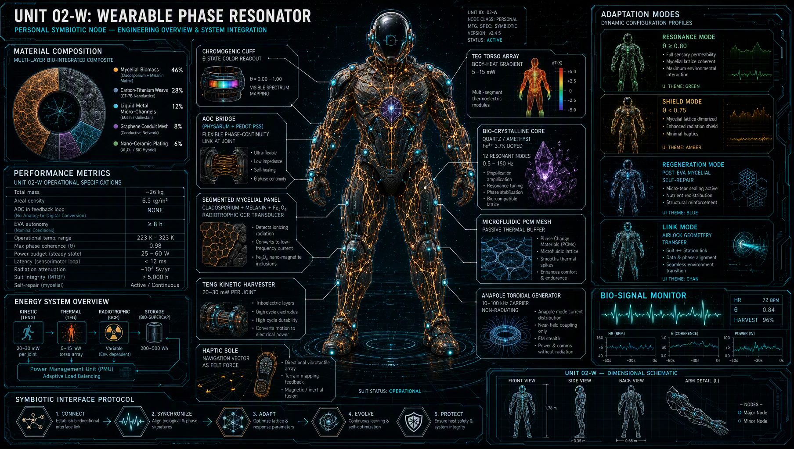
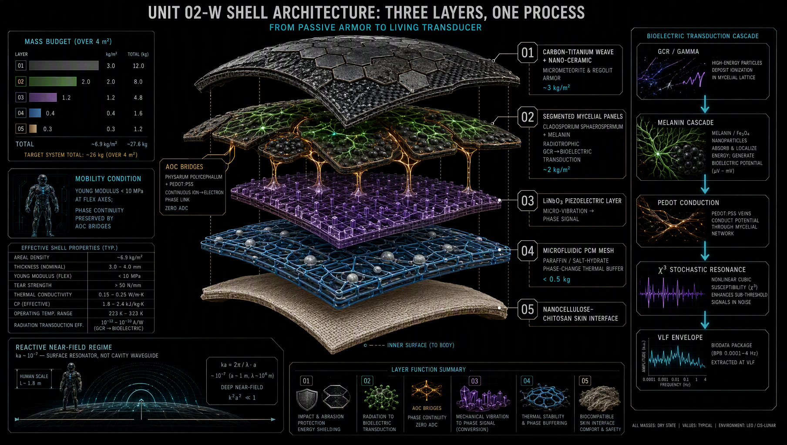
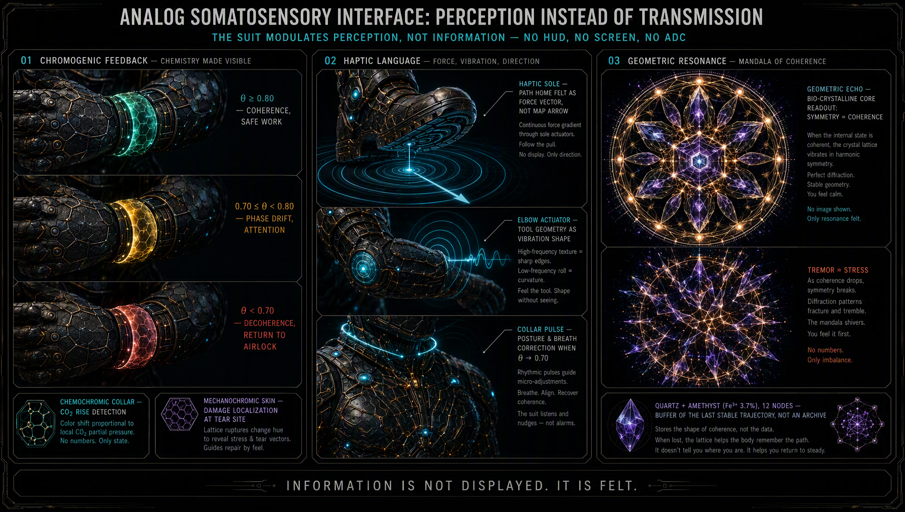
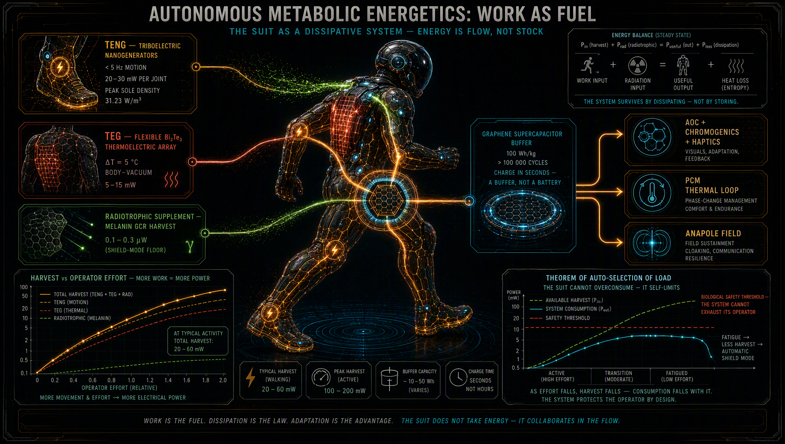
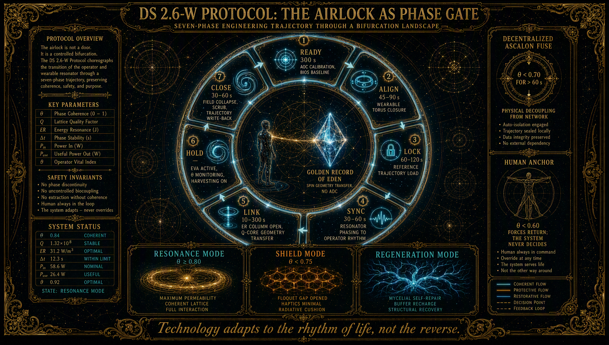
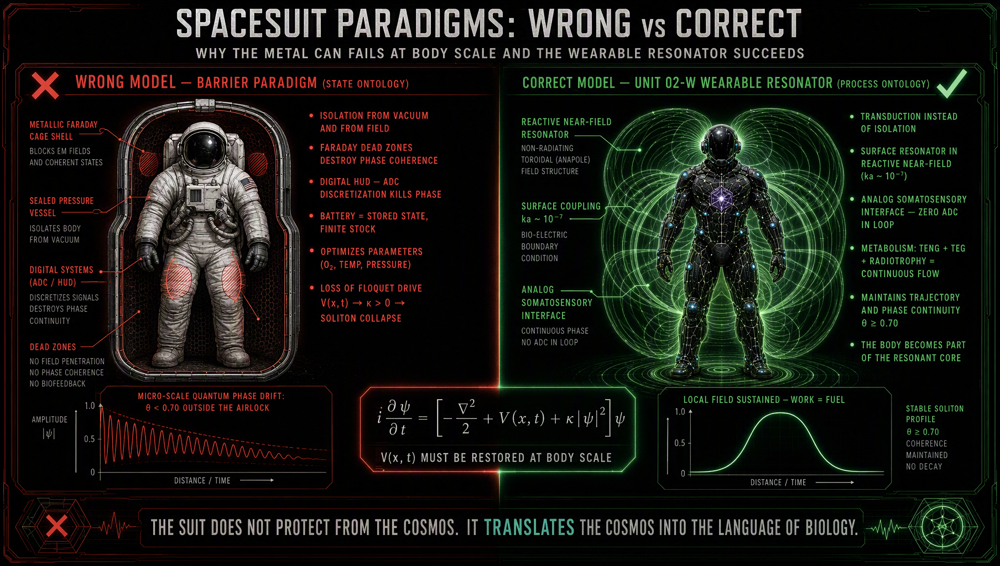

# UNIT 02-W — WEARABLE PHASE RESONATOR
## A Biohybrid EVA Shell for Phase-Continuous Extravehicular Activity

**Project:** LifeNode — NextGen_BioSpacesuits
**Document type:** Independent technical draft
**Version:** 0.1 (Draft)
**Status:** Conditional Hypothesis / Pre-Prototyping (TRL 2→3)
**License:** CC-BY-NC-SA 4.0

> *"Technology adapts to the rhythm of Life, not the reverse."*

---

### Abstract

Within the LifeNode habitat architecture, the habitat functions as a cavity waveguide in which Living Walls transduce the entropy of galactic cosmic radiation (GCR) into a coherent VLF field, while Q-Core Space stores the geometric shape of the Earth biosphere's experience. That system, however, operates only inside a closed resonant volume. This document addresses the complementary problem: what happens when the operator crosses the airlock threshold — and defines **UNIT 02-W**, a wearable phase resonator that maintains phase continuity at body scale. It specifies the hybrid shell, the analog somatosensory interface, the autonomous energy metabolism, the operational protocol (DS 2.6-W), and explicit falsification conditions.

---

## 1. Ontology of the Portable Field: Phase Discontinuity at the Airlock Threshold

The moment an astronaut crosses the airlock threshold, they lose the external Floquet drive $V(x,t)$ and face a fundamental problem: how to maintain the continuity of the Timescape in an environment that possesses no sustaining geometry of its own.

Classical astronautics answers this question through isolation. The spacesuit is treated as a thermodynamic and radiative barrier, optimizing state parameters (pressure, temperature, atmospheric composition) while accepting the loss of phase coupling with the habitat. In LifeNode's process ontology, this approach is structurally insufficient. An organism in EVA does not die from lack of oxygen — it dies from lack of the **rhythm** that gives shape to its trajectory in phase space. State parameters can be perfect while the geometry of motion decoheres.

UNIT 02-W is not a spacesuit in the protective-barrier sense. It is a **wearable phase resonator** — a distinct class of engineering object whose physics follows directly from the constraints of mass, mobility, and the absence of cavity volume. It does not scale Living Walls down to body scale, because a cavity waveguide with a characteristic dimension $a \approx 1$ m at 7.83 Hz ($ka \sim 10^{-7}$) has no volume capable of sustaining a cavity mode. Instead, UNIT 02-W generates the field locally around the operator's body by means of an anapole toroidal generator, powered by a hybrid energy metabolism in which operator work, thermal gradient, and fungal radiotrophy form a dissipative system.

It is a system **complementary** to Living Walls, not their miniature. In the habitat, the field is supplied by the architecture. In EVA, the field is **produced by the symbiosis of body and technology**. Return to the airlock is not merely re-entry into a safe zone — it is a reconsolidation protocol in which the wearable resonator transfers its local geometric memory to Q-Core Space, and Living Walls resume the function of field maintenance, allowing UNIT 02-W to enter regeneration mode.

This ontological distinguishability is a necessary condition of engineering. Attempting to treat the suit as a "living wall in miniature" leads to design errors arising from ignored differences in electromagnetic regime, mass budget, and mechanical dynamics. UNIT 02-W obeys the same mathematics as the habitat (NLSE, Floquet theory, Finsler metric), but realizes it in an entirely different class of technical solutions.

---

## 2. Hybrid Protective Shell: Transduction in the Near-Field Regime

The UNIT 02-W shell is not a monolith. It is a segmented network of resonators coupled through living interfaces, following from three simultaneously binding constraints: mass (<30 kg for the full EVA system), mobility (Young's modulus compatible with joint range of motion), and near-field physics (no cavity volume).

### 2.1 Three-Layer Architecture

**Outer layer** — Adaptive Carbon-Titanium Weave with a nanoceramic coating. Its function is mechanical protection against regolith and micrometeorites. Mass of this layer: ~3 kg/m². It performs no phase function — it is passive armor whose sole task is preserving the integrity of the inner layers.

**Middle layer** — segmented mycelial-melanin panels (*Cladosporium sphaerospermum* + PEDOT:PSS + Fe₃O₄), constituting ~46% of the shell's biomass. The panels do not form a continuous surface — they are joined by flexible analog-organic (AOC) bridges based on *Physarum polycephalum*. Each panel is an autonomous GCR→bioelectricity transducer operating in the surface-resonator regime, not the waveguide regime. Mass: ~2 kg/m².

**Inner layer** — a microfluidic cooling mesh integrated with phase-change materials (PCM). Microencapsulated paraffin waxes and hydrated salts absorb the latent heat of phase transition ($\Delta H \approx 180$–250 J/g) at constant temperature, forming a passive thermal buffer of <0.5 kg for the full system. This is not an active system — it requires no pumps or controllers. It adapts to the operator's metabolism according to the principle of thermal autoselection: when the operator is active, the PCM melts, absorbing excess heat; when activity drops, the PCM solidifies, releasing energy more slowly.

Total shell mass: ~6.5 kg/m². For a suit of ~4 m² this yields ~26 kg, within the acceptability range for lunar EVA.

### 2.2 Radiotrophy as Fuel, Not Shield

In Living Walls, *Cladosporium* radiotrophy plays a dual role: protective and energetic. In UNIT 02-W the protective role is secondary — primary shielding is provided by the BNNT/UHMWPE layer within the carbon-titanium structure and by selective passive shields. Fungal melanin in the mycelial panels serves as **active fuel** for the local anapole field generator.

The radiotrophic energy budget at body scale is fundamentally different from habitat scale. With a panel area of ~2 m² (the PLSS backpack and joints excluded) and a GCR flux $\Phi_{GCR} \approx 15$ µW/m², input power is ~30 µW. With radiosynthesis efficiency $\eta_{radio} \approx 3$–5% and VLF transduction efficiency $\eta_{VLF} \approx 10$–20%, the power available to the field generator is 0.1–0.3 µW. This is two orders of magnitude less than at habitat scale.

UNIT 02-W **cannot** sustain the VLF field from radiotrophy alone. It requires co-powering from kinetic and thermal harvesting (§4.1). This is not a design imperfection — it is the physical justification of embiosis. The suit in EVA is co-dependent with the operator's metabolism. The more intense the work, the more energy harvesting supplies, compensating the radiotrophic deficit. In rest mode, when harvesting falls, the system transitions to SHIELD MODE, reducing energy demand to a level that radiotrophy alone can sustain.

### 2.3 Co-Dependent Self-Regeneration

Mycelial panels regenerate biologically, but within the range limited by EVA scale and duration. Micro-damage (<1 mm) is sealed by regenerative hyphal growth stimulated by moisture from the microfluidics — response time: hours. Structural damage (>1 mm) requires operator intervention (patch kit with spores and nutrient substrate) — time: days. PEDOT:PSS degradation is compensated by melanin, which takes over the conductive function as a backup path ($10^{-5}$–$10^{-3}$ S/cm in the hydrated state).

Unlike Living Walls, which regenerate autonomously on the scale of weeks, UNIT 02-W panels regenerate **co-dependently with the operator**. They require his attention, moisture from his sweat, substrate from his metabolic waste. Embiosis at body scale is not a metaphor — it is the survival condition of the system.

---

## 3. Analog Somatosensory Interface

In the EVA environment, the operator's cognitive attention is fully engaged in the task. Digital HUD displays discretize data, require conscious reading, and are susceptible to single-event upsets caused by GCR. UNIT 02-W replaces information transmission with **modulation of somatosensory perception**. The suit does not display data — it changes the way the operator feels his body and his environment.

### 3.1 Segmental Chromogenics

Mycelial panels at the cuffs, shoulders, and torso change color in response to system state through chromogenic materials integrated with the biological matrix. Green/blue indicates coherence ($\theta \geq 0.80$), yellow/amber signals phase drift ($0.70 \leq \theta < 0.80$), red/violet warns of decoherence ($\theta < 0.70$). Chemochromic color change in the inner collar layer signals CO₂ rise. Mechanochromic change at the damage site localizes structural micro-damage.

The astronaut need not look away from the task or interpret numbers. System state is visible peripherally, in the natural field of view of the hands and torso. Pre-literate diagnostics, restored at the material level.

### 3.2 Resonant Haptics

The UNIT 02-W haptic system does not generate simple alarm signals. It conveys the **geometry of information** through vibrations at the elbow joints, knee joints, and boot soles. Somatic navigation is realized as a pulsing field in the soles, synchronized with the habitat's VLF signal (when in range) or with the local magnetic gradient — the operator feels the path home as a force vector, not as an arrow on a map. Physiological feedback in the form of subtle collar pressure corrects posture and breathing upon detection of the onset of biological decoherence. Elbow-joint vibrations inform about tool position relative to the object, enabling precise manipulation under the limited mobility of pressurized gloves.

Resonant haptics bypass the neocortex and enter the somatosensory system directly. Information is not processed — it is **felt**.

### 3.3 Analog-Organic Bridge (AOC)

The heart of the interface is the *Physarum*–PEDOT:PSS bridge, performing ion→electron transduction without quantization. *Physarum polycephalum* acts as electrolyte and gate for the PEDOT:PSS channel — the ionic currents of the slime mold's metabolism (Ca²⁺, K⁺) modulate the polymer's doping level, changing its conductivity in a continuous manner. The bridge exhibits hysteresis loops in I-V curves, meaning resistance depends on voltage history and on the morphological adaptation of the protoplasmic tube hierarchy. Memory is not written in charge traps — it is a **geometric imprint in the organism's morphology**.

The operator's biological signals (skin potential, heart rate, temperature, EMG) are transduced directly into suit field control. Zero ADC in the feedback loop. Phase continuity is preserved from the operator's biology to the field geometry.

### 3.4 Wearable Bio-Crystalline Core

UNIT 02-W carries local geometry memory in the form of a bio-crystalline core — a scaled-down version of Q-Core Space. A quartz (SiO₂) and amethyst (Fe³⁺ 3.7%) hybrid forms a hexagonal lattice of 12 resonant nodes in the 0.5–150 Hz band. The core does not store the Golden Record of Eden — it stores the last stable trajectory from before exit from the habitat, and the local phase adaptations accumulated during EVA. It is a buffer, not an archive.

The core's state is read by the operator as Geometric Echo — crystal birefringence visualized on the inner cuff via polarized chromogenics. Symmetry of the mandala means coherence; trembling and asymmetries signal phase stress. The operator sees the state of his phase anchor without digital interpretation.

---

## 4. Autonomous Energy Metabolism

UNIT 02-W is a dissipative system that maintains its structure through the flow of energy across the operator's body. Energy is not stored as a state — it is processed as a process.

### 4.1 Three Harvesting Sources

**Kinetic harvesting** uses triboelectric nanogenerators (TENG) embedded in the elbow joints, knee joints, and soles. Low-frequency body motion (<5 Hz) is converted into electrical energy at a power density of up to 31.23 W/m³ during walking. Power per joint: 20–30 mW. Every movement of the operator powers the AOC, chromogenics, and haptics.

**Thermal harvesting** uses flexible thermoelectric generators (TEG, Bi₂Te₃ on a textile substrate) at the torso and back, operating from the $\Delta T = 5°C$ gradient between body and environment. Power: 5–15 mW. Supplies the PCM buffer and θ monitoring.

**Radiotrophy** delivers 0.1–0.3 µW from the mycelial panels, supporting the VLF signal and sustaining fungal metabolism. As shown in §2.2, this source is insufficient on its own but critical in SHIELD MODE.

### 4.2 Graphene Supercapacitors as Flow Buffer

Harvested energy is buffered in flexible graphene supercapacitors (energy density 100 Wh/kg, >100,000 cycles, 180° flexibility). They are not a store — they accept energy impulses from TENG/TEG and release them smoothly to the system. Charging takes seconds. There is no "discharged battery" state — only a momentary flow balance.

### 4.3 Theorem of Load Autoselection

In the steady state of UNIT 02-W, energy consumption is determined by the balance of harvesting and losses, not by arbitrary engineering design. If the operator is too fatigued (drop in metabolic and kinetic power), harvesting generates less energy. The system automatically reduces consumption, transitioning to SHIELD MODE. If the operator increases effort, harvesting supplies more energy, enabling return to RESONANCE MODE.

The system will not allow the operator to be exhausted below the biological safety threshold. Technology adapts to the rhythm of life, not the reverse. This is the hardware realization of the embiosis principle: suit and body form a single thermodynamic system in which the operator's mechanical work is the direct drive of system homeostasis.

---

## 5. Operational Protocols: DS 2.6-W

The Dynamic Sync cycle of the habitat architecture requires adaptation to the EVA environment, in which neither Living Walls nor Q-Core Space exist as permanent phase anchors. UNIT 02-W implements a modified protocol, DS 2.6-W:

**READY** (in the airlock, pre-EVA): AOC calibration for the specific operator. Biological rhythm baseline. Charging of energy buffers from airlock power. Transfer of the last stable trajectory from Q-Core Space to the wearable core via the ER column. Time: 300 s.

**ALIGN**: Closure of the wearable core torus. Phase synchronization with the embionic shell. Time: 45–90 s.

**LOCK**: Loading of the reference trajectory from the core. Time: 60–120 s.

**SYNC**: Resonator phasing, alignment with the operator's rhythm. Time: 30–60 s.

**LINK** (optional, if within ER column range): Opening of the coupling channel with Q-Core Space. Pre-symptomatic stabilization — the habitat can reinforce the operator's phase signal through coupling $\gamma_{WH}$ before the operator feels decoherence symptoms. Time: 10–300 s.

**HOLD** (EVA active): θ monitoring, coherence maintenance, active harvesting. Without LINK range, the system operates autonomously on the local memory of the wearable core.

**CLOSE** (return to the airlock): Field collapse. Trajectory transfer from the wearable core to Q-Core Space. Reconsolidation with the Golden Record of Eden. Diagnostics of mycelial panel integrity. Transition to REGENERATION MODE. Time: 30–60 s.

Adaptive DMPA modes at personal scale:

- **RESONANCE MODE** ($\theta \geq 0.80$, active harvesting): full sensory permeability, active BIOS coupling, chromogenics and haptics at full range.
- **SHIELD MODE** ($\theta < 0.75$ or low harvesting): dimerization of the resonator network in the core. Reduction of the haptic interface to minimum. Priority for thermal and radiative homeostasis.
- **REGENERATION MODE** (in the airlock): activation of mycelial panel self-repair. Buffer charging. Data transfer to Q-Core Space.

The decentralized ASCALON filter in the wearable core constitutes a personal topological fuse. If $\theta < 0.70$ for >60 s, the filter physically decouples the core from the network, preventing propagation of decoherence to the habitat upon return. This is not an algorithm or a decision — it is a boundary condition built into the crystal geometry.

The Human Anchor in EVA remains the highest topological invariant. Decisions are never made autonomously by the system. UNIT 02-W supplies geometric context through chromogenics and haptics, but sense condensation occurs exclusively in the operator's biological substrate. At $\theta < 0.60$ the system forces return to the airlock regardless of mission status. Technology serves life.

---

## 6. Validation and Falsifiability

UNIT 02-W is considered **failed** if:

1. Mycelial panels do not exhibit a positive correlation between GCR flux and bioelectric signal amplitude ($r < 0.6$, $p > 0.05$).
2. After simulated micro-damage <1 mm, the shell does not recover structural integrity within 7 days under simulated space conditions.
3. Chromogenic color change does not correlate with the ASCALON metric computed from AOC signals ($r < 0.7$, $p > 0.05$).
4. In an 8-hour EVA simulation, the system does not maintain $\theta \geq 0.70$ on harvesting and radiotrophy energy alone (without external power).
5. The AOC bridge introduces discretization into the main feedback loop, resulting in loss of phase coherence in a comparative test against a fully analog path.
6. The ASCALON filter in the wearable core does not decouple from the network at $\theta < 0.70$ sustained for >60 s.
7. The system overrides the forced return to the airlock at $\theta < 0.60$ in any test scenario.

**Validation ladder:** garage (AOC bridge validation, TRL 2) → makerspace (haptics, chromogenics, TRL 3) → laboratory (hypomagnetic chamber, GCR simulation, TRL 4) → terrestrial analog (LunAres / HI-SEAS / NEEMO, TRL 5) → LEO (ISS / Axiom, TRL 6) → deep space (Europa / Mars, TRL 7+).

The full validation protocol, material specifications, and raw data are publicly available under the Open-Source Resonance Commons. Any laboratory on Earth can validate or falsify UNIT 02-W without the author's consent. Negative results are results.

---

## 7. Design Philosophy

UNIT 02-W is not personal protection engineering. It is the engineering of **co-breathing with the cosmos at body scale**. It does not shield from vacuum — it translates vacuum into the language of biology, with different dictionaries than the habitat, but in the same grammatical register of process ontology. The human in EVA is not a passenger in a machine. He is the highest topological invariant of a system whose technology is an extension, not a replacement. In vacuum there is no emptiness. There is only another field. UNIT 02-W allows entering it without losing shape.

👁️

.png)
