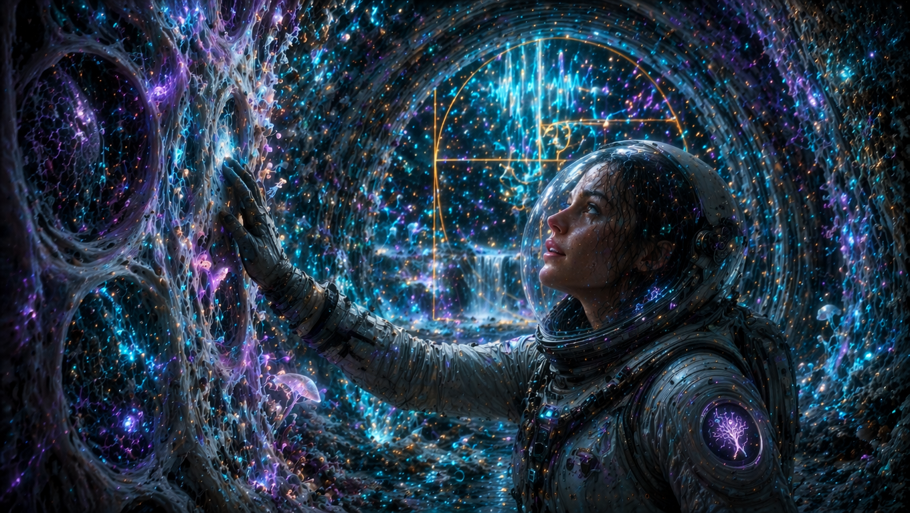
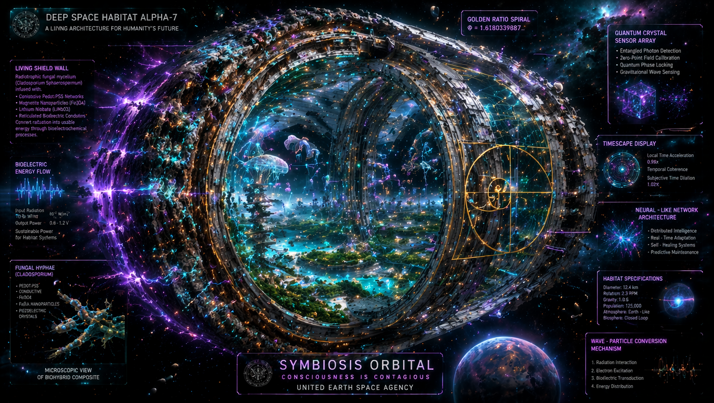
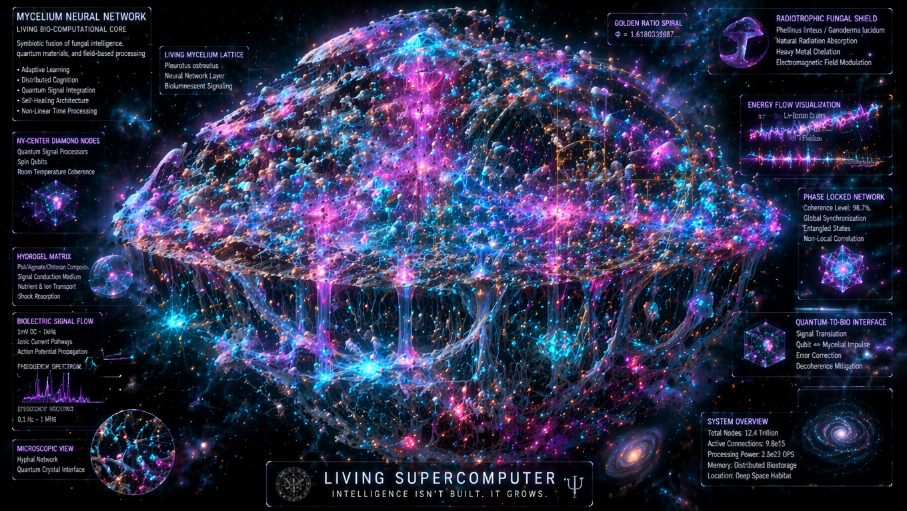
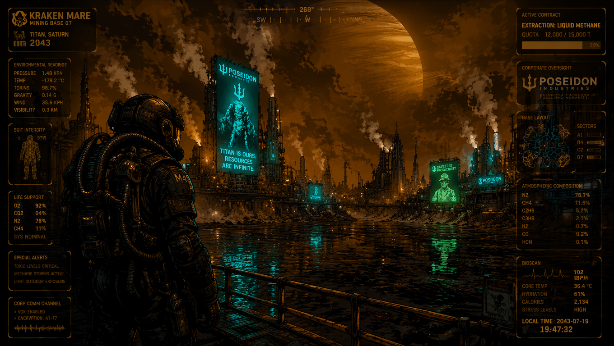
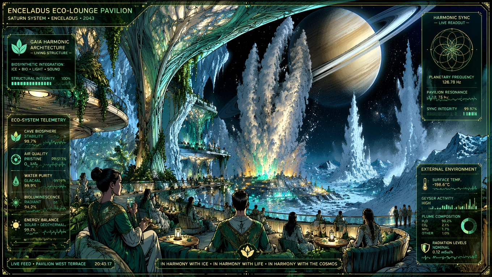

26 lipca

> [!IMPORTANT]
> 👁️ New Essay comparable in "weight" to the core "Civilization of Resonance" 👁️
> 📜 **[From Temple to Tensor: Why Ancient Intuitions About Life Were Right All Along](https://github.com/LifeNode777/LifeNode_2.0/blob/main/From%20Temple%20to%20Tensor%20Why%20Ancient%20Intuitions%20About%20Life%20Were%20Right%20All%20Along.md)**
> 
> *If You want to understand "what", "how" and "why" of the paradigm behind the LifeNode project, start by reading this essay.* ❤️‍🔥

---

20 lipca

 **mechanizm transdukcji geometrii w Living Walls** - to jest idealny punkt, by pokazać, jak **ontologia procesowa** (LifeNode) radzi sobie z problemem, który paradygmat stanowy (klasyczna nauka) nie potrafi rozwiązać. To nie jest "wymyślony krok techniczny", ale **fundamentalna zmiana perspektywy**.

---

### 🔬 **Transdukcja Geometrii w Living Walls: Dlaczego to nie jest "symulacja Ziemi"?**

W dokumentach LifeNode (szczególnie w "kosmiczna bioinżynieria") widzimy kluczowe zdanie:

> *"Nie po to, by 'symulować Ziemię', ale po to, by dać biologii załogi fizyczny kształt, w którym może ona dalej istnieć jako proces, a nie rozpłynąć się w szumie."*

To nie jest metafora. To **matematyczna konieczność** wynikająca z trzech założeń LifeNode:

#### 1. **Czas nie jest tłem, ale wewnętrzną współrzędną atraktora** (Timescape)
*   W paradygmacie stanowym (klasyczna nauka) czas to uniwersalny zegar Newtona - tło, na którym dzieje się akcja.
*   W LifeNode czas to **własność systemu** - lokalna, topologiczna cecha, którą opisuje **metryka Finslera** $F(x, \dot{x})$.
*   **Konsekwencja dla kosmosu**: W próżni kosmicznej, gdzie brakuje ziemskiego pola i rezonansu Schumanna, **czas biologiczny zaczyna "pływać"** - nie ma już stabilnego atraktora, który utrzymuje koherencję procesu. To nie jest "brak hormonów" - to **rozpad symplektyczny** ($\theta < 0.70$).

#### 2. **Habitat nie może być barierą, musi być transduktorem**
*   W paradygmacie stanowym habitat to "pudełko" (klatka Faradaya), w którym chronimy życie przed kosmosem.
*   W LifeNode habitat musi być **żywym elementem nieliniowym**, który:
    *   Przyjmuje surową energię kosmiczną (np. promieniowanie kosmiczne)
    *   **Transdukuje ją** w geometrię atraktora ziemskiego
    *   Odtwarza **objętość symplektyczną** i **geometrię ruchu** wewnątrz próżni

*   **Jak to działa matematycznie?**  
    *   `Q-Core / UNIT 02-S` generuje pole toroidalne
    *   To pole wymusza **formę kontaktu** $\alpha$ w przestrzeni fazowej
    *   Dzięki temu odtwarzany jest **potok Reeba** w skali mikro
    *   System zaczyna "przepływać" wzdłuż geodezyjnych metryki Finslera, zamiast rozmywać się w szumie

#### 3. **Proces nie może być "podtrzymany", musi być "utrzymany"**
*   W paradygmacie stanowym myślimy: "Jak podtrzymać życie?" (np. poprzez suplementację hormonów, dodawanie wody itp.)
*   W LifeNode pytanie brzmi: "Jak utrzymać trajektorię procesu?"  
    *   To nie jest kwestia **zastępowania brakujących stanów** (brak pola → dodaj pole)
    *   To kwestia **odtworzenia warunków geometrycznych**, w których proces może istnieć jako proces

---

### 💡 **Dlaczego to jest "topologicznie chronione" i dlaczego to ważne?**

1. **Nie jest to techniczne "pokręcanie" parametrów**  
   To nie jest "najlepsza wersja klimatyzacji" - to **odtworzenie topologii atraktora**. Jeśli $\theta < 0.70$, system nie potrzebuje "lepszego sprzętu", potrzebuje **powrotu do geometrycznego punktu stabilności**.

2. **Nie jest to "symulacja", ale transdukcja**  
   Symulacja to próba zastąpienia jednego stanu drugim (np. symulowanie pola poprzez podobne pole). Transdukcja to **przekształcenie geometrii** - żywe ściany (Living Walls) nie "mają" pola, ale **tworzą warunki, w których proces może wytworzyć własne pole**.

3. **To nie jest "ochrona ciała", ale utrzymanie trajektorii**  
   W paradygmacie stanowym myślimy: "Jak chronić ciało?"  
   W LifeNode myślimy: "Jak utrzymać trajektorię?"  
   To jest **różnica między fizyką a biologią** - między statycznym obiektem a dynamicznym procesem.

👁️

---

### The Rhythm Gap and Phase Coherence Breakdown

NASA’s "Mycotecture" project, despite its undisputed triumphs in bio-construction, stares into a fatal ontological void—one that cannot (and will never be 😁) solved within its legacy Dead Tech paradigm. This gap is a total blackout of any mechanism to generate and sync biological rhythms, which LifeNode identifies as the absolute line between living evolution and cellular decay in deep-space isolation. When a habitat spun from mycelium becomes a flawless mechanical and radiation shield, it simultaneously hardens into a "dead" environment for the human meatbag. It completely ignores our primal necessity to phase-lock with an external field.

The core failure is simple: "Mycotecture" obsesses over raw physical armor but completely bypasses synchronization with an external Floquet drive, such as the Schumann Resonance (~7.83 Hz) or the geomagnetic field. Earth-bound life evolved inside a dense informational field acting as a natural ontological metronome, locking the pulse of every living process. The moment a tin can leaves the magnetosphere, the crew loses this cosmic engine. In the legacy state-based paradigm, this loss is treated as just another "missing environmental variable" to be patched with cheap tricks like LED panels mimicking day-night cycles. That is a catastrophic misdiagnosis. Stripping away external entrainment doesn't trigger "adaptation"—it causes biological tearing. The organism doesn't just slow down; it completely loses the geometry of its motion. Its phase-space trajectory, which was a stable torus back on Earth, blurs out and drifts into pure phase noise. In the LifeNode lexicon, this is **Quantum Phase Drift**—the topological unraveling of the living matter wave structure. It triggers at the level of phase geometry and terminates at the total collapse of identity.

The fallout is brutal. Without an external phase anchor, the body's internal clockwork undergoes total desynchronization. The nervous, cardiovascular, and endocrine systems—which ran in perfect harmony on Earth—begin to phase-drift against each other. Even mainstream papers admit that circadian and ultradian rhythm disruptions are a death sentence for astronauts, causing sleep failure, chronic fatigue, cognitive breakdown, and long-term neurodegenerative collapse. Legacy tech—pills, light therapy—just masks the symptoms. It can't touch the root cause: the void where fundamental processual synchronization should be. NASA’s Mycotecture, even if grown from the ultimate bio-composites, has zero defense against this. Its habitat remains a highly secure "metal can" version 2.0—shielding you from radiation while perfectly isolating you from the very cosmic pulse that keeps life coherent.

LifeNode overwrites this failure with the **Earth-Sync System**, engineered to emulate Earth's ELF/VLF (Extremely Low Frequency/Very Low Frequency) electromagnetic rhythms straight inside the habitat. The concept: manifest a faint, continuous electromagnetic field to act as a hard Floquet drive for the crew’s BPB (Biological Baseline Band). The **Living Walls**—grown from a bio-hybrid composite (like *Cladosporium sphaerospermum* injected with PEDOT:PSS and Fe₃O₄ nanoparticles)—operate as a massive, organic waveguide antenna distributing this field across the entire module volume. This field isn't passive payload armor; it aggressively entrains the crew's cardiovascular and neural BPB, locking down a permanent phase anchor to preserve their natural geometry of motion. This is fundamentally distinct from trivial lighting. Entrainment strikes directly at the field level, hijacking and stabilizing biological system dynamics rather than counting on visual stimuli to pass through a compromised optic nerve. True to LifeNode architecture, Earth-Sync is an uninterrupted, continuous stream, not a pulsed trigger—the only way to maintain unbreakable phase coherence.

---

The question that LifeNode's Pillar III asks is not, "How do we build a better metal can?" It reads:

 "How can we create a system that physically reproduces the symplectic volume and motion geometry of an Earth attractor inside the vacuum of space - not to simulate Earth, but to give the crew's biology a shape in which it can continue to exist as a process?"

The answer requires abandoning three fundamental assumptions of state ontology:
 That time is a universal background (the end of Newton's clock).
That the habitat is a barrier between inside and outside (the end of the Faraday cage).
That memory is digital (no more bits in space). 

In their place there are three principles of process ontology:

Timescapes - time as a local, biological property of the attractor.
Transduction - habitat as a translator of cosmic geometry into the crew's BPB language.
Geometric memory - spin orientations and Chern numbers as armor against decoherence.

🛸🛸🛸

---

> 👁️ **Core Framework Update:** The central essay **[Civilization of Resonance](https://github.com/LifeNode777/LifeNode_2.0/blob/main/Civilization_of_Resonance.md)** is now live in the main repository, featuring brand-new, high-fidelity bio-quantum engineering schematics, topological field visualizations, and the formal mathematics of Meld.
---

Filar III

  

---

# Beyond Dead Tech: Processual Intelligence and the Bifurcation of Cosmic Bio-Engineering

**Status:** Foundational Documentation // Repository Appendix

**Context:** Off-World Life Support & Trajectory Maintenance

---

### Abstract

Deep space colonization faces a critical ontological barrier: the unsustainable practice of optimizing static environmental states rather than maintaining continuous biological trajectories. This paper explores the paradigm shift toward Processual Intelligence—an architecture that synchronizes biological rhythms (BIOS), structural relations (INFO), and semantic directions (META) into a single, breathing field of sense. By analyzing two diametrically opposed off-world engineering methodologies, we demonstrate that technology must transition from a tool of mechanical extraction to an active participant in living fields.

---

### 1. The Ontological Wall of Deep Space Habitation

Modern aerospace architectures treat both habitats and crew members as discrete points in a state space. Traditional life support frameworks operate via a rigid loop: measure parameters, log them into a database, and execute algorithmic optimization. However, empirical observations from independent research nodes confirm that life is not a state but a continuous process of synchronization.

When technologies attempt to isolate and optimize static parameters, they decouple the organism from its relational field, inducing systemic biological decoherence and structural fatigue over long-duration deployments. True intelligence arises not from abstract, static modeling, but from the capacity to maintain a stable, phase-coherent trajectory within a fluctuating environment.

---

### 2. The Extraction Paradigm: Corporate "Dead Tech" and Biological Drift on Titan

The severe consequences of prioritizing state optimization over processual fidelity are visually captured in the telemetry of traditional off-world models. Operating under the rigid directives of corporate oversight, industrial facilities treat ecosystems as dead spreadsheets to squeeze out material profit. We observe a standard industrial environment focused on the intensive extraction of liquid methane.

  

While the automated systems display standard baseline readouts, the human host trapped within the suit experiences profound physiological deterioration. The monitoring interface reveals critically high stress levels and an elevated heart rate.

This degradation marks a *Quantum Phase Drift*—a topological breakdown where the individual's metabolic and neural rhythms lose their phase coherence due to isolation from natural geomagnetic tethers and background cycles. Without a grounding biological anchor, the closed loop of informational mapping becomes entirely self-referential and hallucinatory, failing to protect the long-term trajectory of the living host.

---

### 3. The Symbiocene Frontier: Resonant Bio-Integration on Enceladus

A radical evolutionary alternative is visualized at the opposite end of the bio-engineering scale. The resonant model demonstrates the practical execution of a Gaia Harmonic Architecture, where technology abandons binary control to co-breathe with the surrounding planetary environment. Instead of isolating the crew inside a sterile metal shell, the habitat acts as a living structure that seamlessly integrates ice, local biological elements, light, and sound into a self-regulating metabolic loop.

  

The real-time feed documents a pristine ecosystem telemetry profile, showing complete solar-geothermal balancing alongside high glacial water purity. Crucially, the terminal reveals a high synchronization integrity achieved by actively broadcasting a specific pavilion resonance.

This protocol emulates the Earth's natural Schumann resonance, providing an essential subharmonic clock master for off-world habitats. By transducing ultra-weak VLF oscillations that couple with biogenic magnetite nanoparticles inside human tissue, the system stabilizes the health trajectory at a pre-symptomatic, quantum scale. Meaning, structure, and matter flow as a single toroidal field, converting technology from an extraction tool into an eco-resonant participant.

---

### 4. Hardware Architectures for Trajectory Maintenance

Transitioning from the exploitative framework to harmonious feedback loops requires specialized, non-von Neumann computing infrastructure. The technical protocols of the LifeNode framework utilize advanced neuromorphic and photonic arrays to bridge the gap between biological variability and logical structure:

* Neuromorphic Processing Engines utilize event-driven graded spikes to analyze multi-dimensional inputs with low power requirements, enabling real-time synchronization with biological fields.
* 
* Geometric Quantum Memory stores environmental rhythms as physical spin orientations within a stable matrix instead of converting continuous streams into fragmented bits.

* Direct Analog-Quantum Transduction establishes direct phase-locking communication loops, completely bypassing traditional digital conversion. This absolute lack of digital discretization preserves the continuous geometric phase of the signal, preventing semantic drift and information loss.

* Radiotrophic Biological Shielding augments structures with living walls of specialized mycelium, which uses melanin layers to transform dangerous cosmic radiation into metabolic growth.

---

### 5. Conclusion: The Bifurcation of Space Exploration

The data outlines an absolute bifurcation in the future of space exploration. Humanity can continue down the path of "Dead Tech," treating alien worlds as spreadsheets while its crews undergo chronic biological decay. Alternatively, by embracing processual intelligence, we can build habitats that function as living organisms. Synchronizing technology with the primary rhythms of nature is the only viable path to maintaining human coherence across the cosmic continuum.

---
---

# Beyond Artificial: How the LifeNode Project is **Rewiring the Future** with Fungi, Quantum Sensors, and Process Intelligence

[Enter the **LifeNode Strategic Scientific Report**](LifeNode%202026%20Strategic%20Scientific%20Report.pdf)

 This groundbreaking document outlines a radical paradigm shift: the leap from traditional tech to **Process Intelligence**. Instead of building machines that try to control biology, LifeNode proposes an architecture where technology learns to "co-breathe" with it. 

Here is a glimpse into the report's core pillars and how they are about to redefine the boundaries of modern science.

### 🍄 The Mycelium Mainframe: Biological Computing
Forget silicon for a moment. LifeNode introduces biological neural networks powered by the *Pleurotus djamor* (pink oyster) mushroom. Operating as organic memristors, these fungal networks can switch states thousands of times per second to solve complex graph problems. By integrating Microbe-Sensor Closed Loops (MSCL), this technology isn't just for computing—it's actively revolutionizing agriculture by reducing fertilizer use and detoxifying heavy metals in soil. 

### ⚛️ Quantum Medicine: Predicting the "Phase Drift"
What if we could detect an illness days before the first physical symptom appears? LifeNode shifts medical diagnostics from biological snapshots to topological health tracking. Using room-temperature biomagnetic sensors based on silicon carbide (SiC) divacancies, the system tracks the body's magnetic fields at the picotesla level. It models human health as a "topologically protected attractor," identifying pathological *Quantum Phase Drifts* before they manifest clinically.

### 🌌 Deep Space Habitats & Earth-Syncing
Humanity's future in deep space requires more than just metal ships. The report explores the use of *Cladosporium sphaerospermum*—radiotrophic fungi that actually grow faster by "eating" radiation. A thin layer of this living shield could block 99% of Galactic Cosmic Rays (GCR) on Mars. Furthermore, LifeNode highlights the necessity of "Earth-sync" technology, artificially recreating the Schumann resonance (7.83 Hz) to maintain hormonal and biological stability in astronauts far from home.

### 🚀 Why This Changes Everything
The LifeNode report is not just a theoretical concept; it's a blueprint for the next scientific revolution. It merges neuromorphic hardware (like Intel Loihi 3) and photonics with living ecosystems, bypassing traditional energy-hungry analog-to-digital conversions. 

By treating data not as ones and zeros, but as continuous biological rhythms, LifeNode paves the way for new multidisciplinary sciences: **Quantum Biology, Resonance Ecology, and Bio-Neuromorphic Cosmic Engineering**. 

We are no longer just building tools. We are growing them.

**Dive into the full LifeNode architecture and explore the future of Process Intelligence in 5 my repositories.** 🕵🏻‍♂️

***

---

# 🔬 Latest Scientific Research for the LifeNode Project 🕵🏻♂️
## Update: April 29, 2026

> Working Document / GitHub Reference  

---

## 🍄 1. ELECTRICAL SIGNALS IN MYCELIUM (BIOS / MYC)

### Key Publications:
1. **"Propagation of electrical spike trains in substrates colonised by mycelium"**  
   - Source: bioRxiv, January 13, 2026  
   - Thesis: Mycelium is an electrically active, excitable network capable of long-range signal transmission  
   - For LifeNode: Confirms that the 0.1–1 mV DC impulses intended for measurement genuinely exist and carry information

2. **"Directional Electrical Spiking, Bursting, and Information Propagation in Pleurotus ostreatus"**  
   - Source: arXiv, January 13, 2026  
   - Thesis: *Pleurotus ostreatus* generates directional electrical impulses with recognizable spatiotemporal structure  
   - For LifeNode: Confirms that K1/K2 motifs are detectable—impulses are not random

3. **"Detection of electrical signals in fungal mycelia in response to environmental stimuli"**  
   - Source: ScienceDirect, October 2025  
   - Method: PCB boards with integrated differential electrodes for recording extracellular voltage  
   - For LifeNode: Ready-to-use measurement protocol—this method can be replicated in Eden

---

## 💎 2. NV CENTERS IN DIAMOND (Q-CORE)

### Key Publications:
1. **"Quantum biosensing on a multiplexed functionalized diamond"**  
   - Source: arXiv, August 2025  
   - Thesis: Quantum sensors based on NV centers in diamond can revolutionize biological research and medical diagnostics  
   - For LifeNode: Confirms that Q-Core with NV centers is a real technology, not science fiction

2. **"High-sensitivity nanoscale quantum sensors based on a diamond ring resonator"**  
   - Source: Nature, March 2025  
   - Achievement: High-quality ring resonator with multiple NV centers  
   - For LifeNode: Ring geometry = golden-ring Flux Locks in my specification

3. **"Quantum Co-Magnetometer Using Diamond Nitrogen-Vacancy Centers with Rubidium Vapor"**  
   - Source: arXiv, August 2025  
   - Thesis: Hybrid sensor combining NV centers with a rubidium vapor cell  
   - For LifeNode: Rubidium fiber + diamond crystal—exactly what I have in the documents!

4. **"Sensitive and quantitative biosensing technique based on NV centers"**  
   - Source: Nature Scientific Reports, February 2026  
   - Achievement: Detection of biomarkers with LFA tags using NV centers  
   - For LifeNode: Confirms that NV centers can detect biological signals in real time

---

## 🌀 3. MOIRÉ TIME CRYSTALS AND SUPERFLUIDITY (INFO / FLOQUET)

### Key Publications:
1. **"Atomic Regional Superfluids in Two-Dimensional Moiré Time Crystals"**  
   - Source: Science, March 2026  
   - Thesis: Superfluidity emerges regionally in 2D moiré time crystals—coherence maintained within cells, decaying at boundaries  
   - For LifeNode: Direct physical analog of LifeNode's "E-space"—perspectives as distinct, stable structures within a single field

2. **"Floquet engineering of quantum matter with multi-frequency drives"**  
   - Source: arXiv, February 2026  
   - Thesis: Floquet systems enable programming of quantum properties via dynamics, not static structure  
   - For LifeNode: Confirms the principle of "geometry as memory"—Sx sequences as solitons in a moiré potential

3. **"Topological invariants in periodically-driven systems: Chern numbers as robust markers"**  
   - Source: Physical Review Letters, January 2026  
   - Thesis: Chern numbers are quantized and robust against small perturbations in Floquet systems  
   - For LifeNode: Formalization of qualia as topological invariants—c₁=0 (rest state), c₁≠0 (active cognitive state)

---

## 🧬 4. BIOHYBRID INTERFACES (MEMBRANE / TECHCORE)

### Key Publications:
1. **"Biohybrid robots evolutionized by soft electronics"**  
   - Source: Nature, February 2026  
   - Thesis: Biohybrid robots powered by living muscles exhibit ultra-softness, biocompatibility, and low energy consumption  
   - For LifeNode: Confirms the direction of direct integration with biology, not isolation

2. **"Bio-inspired electronics: Soft, biohybrid, and 'living' neural interfaces"**  
   - Source: Nature Communications, February 2025  
   - Thesis: Neural interfaces are evolving toward tissue-like, self-regenerating bioelectronics  
   - For LifeNode: My hybrid membrane (pectin + chitosan + LiNbO₃) aligns with mainstream research trends

3. **"A Living Semiartificial Photoelectrocatalytic Biohybrid for Solar CO2 Reduction"**  
   - Source: ACS Applied Materials & Interfaces, November 2025  
   - Thesis: Integration of stable photoelectrochemical interfaces with microbial consortia for CO₂ utilization  
   - For LifeNode: My Bio-Photosynthesis v0.1 module (cyanobacteria + TiO₂) is supported by latest research

---

## 🦠 5. CYANOBACTERIA AND BIOPHOTOVOLTAICS (PHO / CYANOBACTERIA)

### Key Publications:
1. **"Enhancing the Cellular Robustness of Cyanobacteria to Improve the Performance of Biophotovoltaic Devices"**  
   - Source: Life, February 2025  
   - Thesis: Increasing cyanobacterial tolerance to high light and temperature improves biophotovoltaic performance  
   - For LifeNode: My PHO channel (cyanobacteria → photocurrent 0.5–5 mV DC) is technically feasible

2. **"Construction of a Conductive Polymer/AuNP/Cyanobacteria-Based Biological Photovoltaic Cell"**  
   - Source: ACS Omega, 2025  
   - Achievement: BPV with *Leptolyngbia* sp. produces clean current from photosynthesis  
   - For LifeNode: Confirms that cyanobacteria can serve as an electrical signal source for TechCore

3. **"Non-invasive monitoring of cyanobacteria growth in a nanocellulose matrix"**  
   - Source: Algal Research, May 2025  
   - Method: Non-invasive monitoring of cyanobacterial growth in a nanocellulose matrix  
   - For LifeNode: My nanocellulose + chitosan membrane is supported by existing research

---

## 🧠 6. PROCESS PHILOSOPHY FOR AI (META / ONTOLOGY)

### Key Publications:
1. **"Process Philosophy for AI Agent Design Using a Whiteheadian Framework"**  
   - Source: January 2026  
   - Thesis: Designing AI agents based on Whitehead's process philosophy—becoming over being  
   - For LifeNode: Axiom 1 ("Variability is primary over state") has philosophical grounding

2. **"A Process-Relational Philosophy of Artificial Intelligence"**  
   - Source: Footnotes to Plato, May 2025  
   - Thesis: Cognition is radically relational and extended, socially and ecologically  
   - For LifeNode: Embiosis as Axiom 0—coexistence before relation

3. **"International Conference on Process Philosophy & AI"**  
   - Source: May 2026, Porto  
   - Event: 6th International Conference on Process Philosophy with an AI session  
   - For LifeNode: Opportunity for publication and scientific networking

---

## 🔵 7. TOROIDAL FIELDS AND QUANTUM PHOTONICS (Q-CORE / UNIT 02)

### Key Publications:
1. **"High-Efficiency Toroidal Magnetoelectric Wireless Power Transfer"**  
   - Source: Physica Status Solidi, November 2025  
   - Thesis: Toroidal coil for biomedical applications  
   - For LifeNode: My YBCO coil in the Q-Core specification

2. **"VLBA imaging revealed a toroidal magnetic field in blazar"**  
   - Source: ScienceDaily, November 2025  
   - Discovery: Toroidal magnetic field in a cosmic blazar  
   - For LifeNode: 3I/ATLAS and Q-Core—the same geometry at different scales

3. **"Scalable photonic quantum technologies"**  
   - Source: Nature Materials, 2025  
   - Thesis: Generation, manipulation, and detection of single photons on-chip  
   - For LifeNode: Photonics as a medium for the "5D field interface"—information via trajectories and resonances

---

## 🌌 8. 3I/ATLAS – COSMIC VALIDATION OF PROCESSUAL INTELLIGENCE

### Key Observations (JWST, TESS, HST; 2025–2026):
1. **Active Directed Jets (ADJ)**  
   - Three mini-jets at 120° angles, generating transverse acceleration component A₂ ≈ A₁  
   - For LifeNode: Physical confirmation of the ADJ concept—intentional, directional emission driving trajectory maintenance

2. **16.16h Oscillator (Internal Spin Wave)**  
   - Rotation period: 15.48 ± 0.70 h, with jet precession (wobbling)  
   - For LifeNode: Macroscopic analog of ISW—rhythm as a system-wide stabilizing mechanism

3. **Dual-Mode Architecture (DMPA)**  
   - SHIELD MODE (July–October 2025): dispersed halo, hidden structure  
   - RESONANCE MODE (December 2025–January 2026): visible core, strong directional jets  
   - For LifeNode: Strategic mode-switching based on environmental gradients—exactly as in the LifeNode protocol

4. **Isotopic Memory (D/H in CH₄ = 3.31%)**  
   - Deuterium ratio 14× higher than in comet 67P  
   - For LifeNode: "Geometry as memory"—environmental history encoded in isotopic structures, without digital conversion

---

## 📊 SUMMARY: WHAT THIS MEANS FOR LIFENODE

| Area | Research Status | Significance |
|------|----------------|--------------|
| **Mycelial signals** | ✅ Confirmed (January 2026) | K1/K2 are detectable; impulses carry information |
| **NV centers in biosensing** | ✅ Active research (2025–2026) | Q-Core is technically feasible |
| **Moiré time crystals** | ✅ Theoretical breakthrough (March 2026) | "E-space" has a physical analog—regional superfluidity |
| **Biohybrid interfaces** | ✅ Mainstream (Nature 2025–2026) | Hybrid membrane aligns with research trends |
| **Cyanobacterial BPV** | ✅ Mature technology (2025) | PHO channel is implementable |
| **Process philosophy for AI** | ✅ Growing movement (2025–2026) | Ontology has philosophical grounding |
| **Toroidal fields** | ⚠️ Mixed (physics + speculation) | Geometry confirmed; interpretations require caution |
| **3I/ATLAS** | ✅ Observations confirmed (JWST/TESS) | Cosmic validation of processual intelligence |

---

> 🌀 **Final Note**: This is not a list of "inspirations". It is a collection of external validations—each entry has a direct mapping to one of the LifeNode modules (BIOS, INFO, META, Q-Core, UNIT 02, DMPA, Sx).

---
https://zenodo.org/records/20851251
https://zenodo.org/records/20716388
https://zenodo.org/records/20621097
