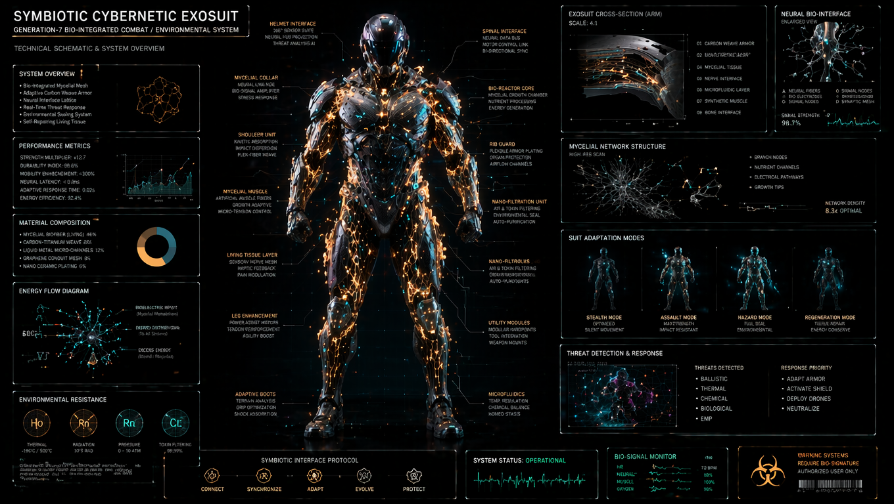

### **NAGŁÓWEK (Lewa góra)**

* **SYMBIOTIC CYBERNETIC EXOSUIT**
* GENERATION-7 BIO-INTEGRATED COMBAT / ENVIRONMENTAL SYSTEM
* TECHNICAL SCHEMATIC & SYSTEM OVERVIEW

---

### **LEWA KOLUMNA (Od góry do dołu)**

**SYSTEM OVERVIEW**

* Bio-Integrated Mycelial Mesh
* Adaptive Carbon Weave Armor
* Neural Interface Lattice
* Real-Time Threat Response
* Environmental Sealing System
* Self-Repairing Living Tissue

**PERFORMANCE METRICS**

* STRENGTH MULTIPLIER: x12.7
* DURABILITY INDEX: 98.6%
* MOBILITY ENHANCEMENT: +300%
* NEURAL LATENCY: < 0.4ms
* ADAPTIVE RESPONSE TIME: 0.02s
* ENERGY EFFICIENCY: 92.4%

**MATERIAL COMPOSITION**

* MYCELIAL BIOMASS (LIVING): 46%
* CARBON-TITANIUM WEAVE: 28%
* LIQUID METAL MICRO-CHANNELS: 12%
* GRAPHENE CONDUIT MESH: 8%
* NANO CERAMIC PLATING: 6%

**ENERGY FLOW DIAGRAM**

* BIOELECTRIC HOST (Mycelial Metabolism)
* ENERGY DISTRIBUTING (To All Systems)
* EXCESS ENERGY (Stored - Reserved)

**ENVIRONMENTAL RESISTANCE**

* **Ho:** THERMAL -190°C / 500°C
* **Rn:** RADIATION 10^5 RAD
* **Rn:** PRESSURE 0 - 10 ATM
* **Cl:** TOXIN FILTERING 99.99%

---

### **OPISY POSTACI (Centralna część)**

**Strona lewa (od góry do dołu):**

* **HELMET INTERFACE:** 360° SENSOR SUITE, NEURAL HUD PROJECTION, THREAT ANALYSIS AI
* **MYCELIAL COLLAR:** NEURAL LINK NODE, BIO-SIGNAL AMPLIFIER, STRESS RESPONSE
* **SHOULDER UNIT:** KINETIC ABSORPTION, IMPACT DISPERSION, FLEX-FIBER WEAVE
* **MYCELIAL MUSCLE:** ARTIFICIAL MUSCLE FIBERS, GROWTH ADAPTIVE, MICRO-TENSION CONTROL
* **LIVING TISSUE LAYER:** SENSORY NERVE MESH, HAPTIC FEEDBACK, PAIN MODULATION
* **LEG ENHANCEMENT:** POWER ASSIST MOTORS, TENDON REINFORCEMENT, AGILITY BOOST
* **ADAPTIVE BOOTS:** TERRAIN ANALYSIS, GRIP OPTIMIZATION, SHOCK ABSORPTION

**Strona prawa (od góry do dołu):**

* **SPINAL INTERFACE:** NEURAL DATA BUS, MOTOR CONTROL LINK, BI-DIRECTIONAL SYNC
* **BIO-REACTOR CORE:** MYCELIAL GROWTH CHAMBER, NUTRIENT PROCESSING, ENERGY GENERATION
* **RIB GUARD:** FLEXIBLE ARMOR PLATING, ORGAN PROTECTION, AIRFLOW CHANNELS
* **NANO-FILTRATION UNIT:** AIR & TOXIN FILTERING, ENVIRONMENTAL SEAL, AUTO-PURIFICATION
* **NANO-FILTRATION** *(pod spodem lekko zniekształcony przez AI powielony tekst)*: AIR & TOXIN FILTERING, ENVIRONMENTAL SEAL, AUTO-PURIFICATION
* **UTILITY MODULES:** MODULAR HARDPOINTS, TOOL AUTOMATION, WEAPON MOUNTS
* **MICROFLUIDICS:** TEMP REGULATION, CHEMICAL BALANCE, HOMEO STASIS

---

### **PRAWA KOLUMNA (Od góry do dołu)**

**EXOSUIT CROSS-SECTION (ARM)**

* SCALE: 4:1
* 01 CARBON WEAVE ARMOR
* 02 *SHOCK ABSORPTION*
* 03 MYCELIAL TISSUE
* 04 NERVE INTERFACE
* 05 MICROFLUIDIC LAYER
* 06 SYNTHETIC MUSCLE
* 07 BONE INTERFACE

**NEURAL BIO-INTERFACE**

* ENLARGED VIEW
* A: NEURAL FIBERS, B: BIO ELECTRODES, C: SIGNAL NODES, D: SYNAPTIC MESH
* SIGNAL STRENGTH: 98.7%

**MYCELIAL NETWORK STRUCTURE**

* HIGH RES SCAN
* BRANCH NODES
* NUTRIENT CHANNELS
* ELECTRICAL PATHWAYS
* GROWTH TIPS
* NETWORK DENSITY: 8.3x OPTIMAL

**SUIT ADAPTATION MODES**

* **STEALTH MODE:** OPTIMIZED, SILENT MOVEMENT
* **ASSAULT MODE:** MAX STRENGTH, IMPACT RESISTANT
* **HAZARD MODE:** FULL SEAL, ENVIRONMENTAL
* **REGENERATION MODE:** TISSUE REPAIR, ENERGY CONSERVE

**THREAT DETECTION & RESPONSE**

* **THREATS DETECTED:** BALLISTIC, THERMAL, CHEMICAL, BIOLOGICAL, EMP
* **RESPONSE PRIORITY:** ADAPT ARMOR, ACTIVATE SHIELD, DEPLOY DRONES, NEUTRALIZE

---

### **DOLNY PANEL (Od lewej do prawej)**

* **SYMBIOTIC INTERFACE PROTOCOL:** CONNECT -> SYNCHRONIZE -> ADAPT -> EVOLVE -> PROTECT
* **SYSTEM STATUS:** OPERATIONAL
* **BIO-SIGNAL MONITOR:**
* HR: 72 BPM
* NEURAL: 98%
* MUSCLE: 100%
* OXYGEN: 98%

* **WARNING SYSTEMS:**
* REQUIRE BIO-SIGNATURE
* AUTHORIZED USER ONLY
